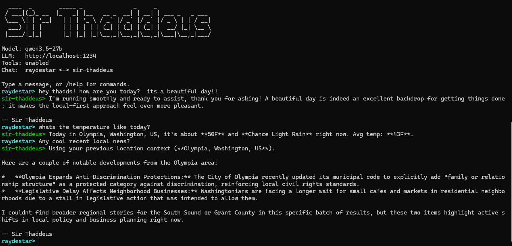

# Changelog

## Unreleased

### Agent quality and routing

- Immediate Wiki root creation now keeps the configured library location
  application-owned, exposing only the requested root name to the model unless
  the user explicitly supplies a custom location. Deferred and non-action
  requests remain blocked before this projection can activate.
- Explicit no-tool response contracts are detected from the request lead so
  quoted examples cannot silently escalate a direct-answer turn into research.
- Direct-answer prompts with completed examples now focus the model on the
  final unresolved request while preserving personality, memory, tools, and
  safety boundaries.
- Explicit labeled-answer contracts now survive response sanitization in both
  desktop and headless paths, and malformed option-letter replies receive one
  bounded, answer-agnostic contract repair.
- Headless retries no longer force live search for tasks classified as
  no-tool, and failed memory-only provenance no longer activates tool-backed
  response rewriting.
- Capability summaries, tool-backed fallbacks, and pure-social replies are
  grounded in actual runtime records and avoid exposing raw local-provider
  context errors.

### Measurement and diagnostics

- The public research guide now explains the three scorecards, paired-control
  loop, promotion gates, benchmark-integrity boundary, representative wins,
  and honest capacity limits without requiring readers to traverse the full
  experiment ledger.
- Harness reruns reuse current builds, avoid duplicate pure-compute tool calls,
  and report warmup, reset, test-work, host, and harness-overhead timing.
- Rejected self-consistency, shadow turn-planning, validation-skip, and unused
  V2 router/planner experiments are removed instead of remaining as dormant
  feature flags.
- Opt-in routing latency traces remain available as duration-only operational
  diagnostics and cannot change tool, permission, or response behavior.
- The matched benchmark workflow records raw-model controls, exact repeats,
  invalid-output counts, and disjoint confirmation slices without placing
  benchmark identifiers or expected answers in production code.

### Security

- SQLite entry projects now select the current SQLitePCLRaw native bundle
  instead of the vulnerable `SQLitePCLRaw.lib.e_sqlite3` 2.1.11 transitive
  dependency reported by `GHSA-2m69-gcr7-jv3q`.
- Web transitive dependencies are refreshed to clear the production audit.

### Fixed

- The offline Windows voice dependency bundle now satisfies the current
  backend requirements, and asset fetching supports per-asset release URLs so
  unchanged large runtime and model packs do not need to be republished.
- Shell IPC contract tests can use a larger child-runtime startup budget on
  constrained CI runners without changing the production startup timeout.
- Rolling `master` builds now run Windows, Linux, and macOS package smoke gates
  before the `latest` prerelease is published.

## 1.0.0 — 2026-05-08

The v1.0 release. The hybrid Shell + Runtime + workspace surface is now
the product Sir Thaddeus ships as. Scope is locked in
[`V1_SCOPE.md`](docs/archive/V1_SCOPE.md); the release-readiness gate is in
[`docs/RELEASE_CHECKLIST.md`](docs/RELEASE_CHECKLIST.md).

This release does not introduce major new product features beyond what
shipped in 0.3.0. Its job is to package, stabilize, document, and validate
what was already there as a credible v1.0 power-user release.

### What changed

#### Workspace UX polish

- **Memos: edit + Markdown body.** The memo cards on `/memory` now have
  an inline edit affordance (title / body / tags) and render the body
  through `Markdown` instead of as raw `<pre>`. Closes the gap between
  the create form's "(markdown)" hint and what was actually displayed.
- **Routines: create + enable/disable from the list.** The `/routines`
  index page now has a "+ New routine" button (creates a draft and routes
  to the editor) and an inline enable/disable switch on each card with a
  "Show disabled" reveal. Previously the only way to create a routine was
  via the seeded templates.
- **Diagnostics: logs path discoverable.** `/api/diagnostics` now
  returns `logsRoot` (derived from the lock-file directory + `logs`),
  surfaced as a row on the Diagnostics page so users can find their
  log directory without hunting in `%LocalAppData%`.
- **Settings: legacy `/settings/$category` redirects.** Old per-category
  URLs now `beforeLoad`-redirect to the canonical tabbed `/settings`
  page. Old bookmarks no longer dead-end on a stub.
- **Theme: manual Light / Dark / System picker.** Settings → General →
  Appearance. The theme is applied to `<html>` before React mounts (no
  flash of light theme on a dark-preferred boot) and persisted in
  `localStorage`. Tailwind switched to `darkMode: 'class'`.

#### Build infrastructure

- **ESLint v9 flat config.** `web/eslint.config.js` lands with React +
  TypeScript + react-hooks rules and a `--max-warnings=0` policy.
  `npm run lint` is now a real CI gate. Fixed three latent issues
  surfaced by the first lint run:
  - Useless escape (`\[`) in the chat-route TTS sentence-split regex.
  - An unused `eslint-disable` directive in the chat route.
  - A `messages` array recreated every render that was thrashing the
    "speak voice reply" effect — wrapped in `useMemo`.
- **Versioning.** `Directory.Build.props` `VersionPrefix` and
  `web/package.json` `version` both move to `1.0.0`. Tag-triggered CI
  release (`ci-release.yml`) overrides via `-p:Version=…`.

#### Public-facing documentation

- New `V1_SCOPE.md` — v1 contract: positioning, target user, Core/Beta/
  Deferred lists, non-goals, release-readiness gate.
- New `docs/DEMO_SCRIPT.md` — golden 3–5 minute demo with prompts,
  fallback prompts, pre-demo checklist, and "what not to show".
- New `docs/KNOWN_LIMITATIONS.md` — 13 honestly-named release boundaries
  framed as intentional, including Windows-first ergonomics, voice as
  Beta, no scheduled automation, no polished installer in v1.0,
  saved-not-yet-enforced limits, profile/personality admin deferred,
  and the screen-observe harness fixture gap.
- New `docs/RELEASE_CHECKLIST.md` — 17-section pre-release gate with
  checkboxes, Beta-skip-or-pass slots, and a sign-off block.
- New `docs/ROADMAP.md` — three milestones (v1.0 / v1.1 / v2.0) with
  explicit "things that are never" and a swap-only change rule.
- New `docs/ARCHITECTURE_PUBLIC.md` — 10-minute architecture summary
  derived from the full architecture doc.
- `README.md` rewritten as a public product page. Honest Core/Beta/
  Deferred labelling, working quickstart commands, links to the new
  docs, no overclaim.
- `FEATURES_QA.md` realigned: every section tagged Core / Beta /
  Deferred. Section 7 (Profiles & Personalities) marked Deferred —
  the runtime API does not expose `/api/profile` or
  `/api/personalities`, and the workspace does not advertise admin UI
  for either in v1.0.
- `README_FIRST_RUN.md`, `docs/hybrid-shell.md`, `docs/packaging.md`
  swept of stale references (Automations → Routines + Wiki, the
  removed "pick a personality" wizard step replaced with the actual
  4-step Welcome / Privacy / Voice / Done flow).

### What's intentionally **not** in v1.0

These are documented as Deferred. They are not bugs. Roadmap milestone
in parentheses.

- Profile / personality admin in the workspace UI (v1.1).
- Settings → Advanced → Limits enforcement (v1.1).
- Polished installers — MSIX, signed `.app`, AppImage (v2.0).
- Auto-update channel (v2.0).
- Cross-platform desktop UX parity (v2.0).
- Advanced audit-search / admin pane (v1.1).
- Scheduled / unattended automations — **never**.

### Tests + build at tag

- `dotnet build SirThaddeus.sln` (Release): 0 errors, 0 warnings.
- `dev/test.ps1 -Configuration Release -SkipScreenObserveHarness`:
  passing with 0 failures; the exact test count changes as the suite evolves.
- `cd web && npm run lint`: 0 errors, 0 warnings.
- `cd web && npm run typecheck`: clean.
- `cd web && npm run build`: clean (one chunk-size warning on the main
  bundle, pre-existing, non-blocking).

The screen-observe harness is opt-in for releases — its fixture suite is
not checked in. See [`docs/KNOWN_LIMITATIONS.md`](docs/KNOWN_LIMITATIONS.md)
§13.

---

## 0.3.0 — 2026-04-24

First versioned release. Previous builds reported `0.0.0-dev`; from here
on, `Assembly.GetName().Version` and `package.json` report a real SemVer
and the binary identifies itself in logs, diagnostics, and the UI
runtime-version badge.

### Routines replaces Automations

- **Rip-out**: the Phase 7.2 Automations feature is gone (AutomationRunner,
  AutomationScheduler, ScheduleMath, JsonFileAutomationStore,
  AutomationsApi, the propose_automation virtual tool + its interceptor,
  the per-thread tool allowlist on `ToolPermissionGate`, the AutomationRun
  activity kind, and all web-side automation routes). Scheduled background
  agent execution was drifting away from the "local-first, permissioned,
  visible" trust model — pulling it out lets us ship v1 without a feature
  we'd have had to either finish or keep apologizing for.
- **Routines** is the replacement: user-invoked repeatable checklists
  (Morning Launch, Evening Shutdown, Fitness Check-In, Project Focus,
  Weekly Review — seeded on first boot, idempotent across reboots, never
  overwritten by the seeder after a user edits them). New shared-types
  records, file-backed store with cascade delete and sealed-run
  immutability, REST surface for CRUD + run lifecycle, web routes for
  list/run/edit/history, and audit events for every lifecycle transition.
  No background fire. No silent side effects. A meta-test asserts no
  new `IHostedService` gets added under `Thaddeus.Runtime.Routines` so
  the "no scheduler" property is enforced in the test suite.

### Chat

- **Structured source cards** alongside assistant replies. The agent
  already emitted a `SOURCES_JSON` block when `web_search` fired; the new
  `SourceCardExtractor` parses, dedupes, and orders it into an
  `AgentSource` list, flowed through `AgentResponse.Sources` and
  `ChatMessageSource` to the web store. `SourceCards.tsx` renders
  featured + standard cards with favicons, thumbnails, and excerpts.
  Smoke test covers the end-to-end flow.

### Agent behavior

- **Weather intent routing** forces the first tool-loop round into
  `weather_geocode` → `weather_forecast` when the prompt is clearly a
  weather question, instead of falling through to `web_search` and
  getting worse answers from search snippets.
- **Imperative tool requests** ("use web_search", "try file_read") now
  set `tool_choice` to the named tool so small local models can't
  fabricate "I can't do that" errors when the user explicitly asked for
  a tool that exists.
- **`WeatherTools`** accepts both `location`/`place` aliases for
  geocode and both flat and nested coordinate shapes for forecast —
  small models emit either depending on context.
- **Offline-path wording** leads with the best-effort answer (training
  data, time utilities) and adds a freshness caveat, instead of
  refusing outright. `DeterministicUtilityEngine` now answers
  "what time is it" locally with "The current local time is …" so
  downstream matchers pick up the keyword.
- **`ToolCallRedactor.SummarizeToolListCapabilities`** compacts verbose
  tool-manifest responses into per-category summaries instead of
  truncating mid-tool.

### Settings

- **Clear recovered safe mode**: once SafeMode tripped from
  `settings_json_corrupt` or `unsupported_settings_schema_v*`, the flag
  stayed true forever. Now the first successful load against a
  supported schema clears it and persists the cleared state.
- **Fix `FilesSettings` equality**: default record equality was
  reference-comparing `AllowedRoots`, so a JSON round-trip (which
  deserializes into `List<string>`) never matched a fresh `Defaults()`
  (which produces `string[]`). Three latent round-trip tests had been
  red because of this.

### Voice

  VoiceHost `/tts` uses the new `ITtsEngine` abstraction directly and returns
  WAV-wrapped mono 24 kHz PCM from `KokoroSharp.CPU`; the Python backend remains
  responsible for ASR/YouTube work. Windows SAPI is no longer exposed or used as
  an active TTS choice, and older Windows SAPI settings normalize to
  `kokoro-sharp`. Piper is retained as an explicit legacy fallback: select
  `Piper (legacy fallback)` in Settings, or set the TTS engine to `piper` and
  provide the existing Piper voice model path.
  VoiceHost now resolves the TTS engine per `/tts` request instead of only at
  process startup, so a stale VoiceHost launched with legacy Piper arguments can
  still honor Runtime requests for `kokoro-sharp`. Legacy `piper` settings with
  no actual Piper model path migrate back to KokoroSharp.

### Shell

- **Butler voice** on tray menu and windows ("At your service, sir",
  "Stand down", "Dismiss", "At the ready") instead of generic verbs.
  Tray loads a custom icon with a P/Invoke fallback to the app icon.

### Build / dev / release

- **Repository versioning**: `Directory.Build.props` VersionPrefix
  bumped to `0.3.0`. `web/package.json` and
  `packages/shared-types/ts/package.json` aligned. Local dev builds
  report `0.3.0-dev`; CI release tags still override via `-p:Version`.
- **`tests/shell/Thaddeus.Shell.Tests.csproj` builds again**: resolved
  NU1605 (bumped `Microsoft.Extensions.Logging.Abstractions` to 10.0.3
  to match the transitive graph, dropped the unused direct
  `Microsoft.Extensions.Logging` ref), added
  `InternalsVisibleTo("Thaddeus.Shell.Tests")` on `Thaddeus.Shell.csproj`
  so the tests can see `ShellSessionController.OpenWorkspaceMenuId` /
  `StopAllMenuId`, and added a missing `using Xunit;` that the dead
  build had been hiding. Shell now contributes **41 tests** to the green
  suite (was 0).
- **`localrunner.ps1`** pre-builds both Shell and Runtime so the
  supervisor's `--no-build` spawn path is honest, and adds Shell to the
  kill-list.
- **Global stop-all shortcut** now uses `Ctrl+Alt+Esc` instead of
  Windows-reserved `Ctrl+Shift+Esc`; older saved shortcut settings are
  normalized to the new default.
- **Playwright global-setup** pre-builds the SPA and Release runtime so
  `wwwroot/` bundles match the embedded binary at test time.
- **Build artifacts gitignored**: `src/Thaddeus.Runtime/wwwroot/assets/`
  and `wwwroot/index.html` (regenerated by hybrid-shell auto-sync on
  every `dotnet build`, with hash-suffixed filenames that churned with
  every change), plus `.playwright-mcp/`, `test-results/`, and loose
  repo-root `*.png` screenshots.

### Verified

- `dotnet build SirThaddeus.sln` — 0 errors, 0 warnings.
- Full test suite — **2,345 pass, 0 fail, 0 skip**
  (2,190 main + 114 runtime + 41 shell).

## 2026-04-19 — Production Coherence (observability, diagnostics, permission proofs)

This release is connective-tissue work: the features were already here,
but the pieces that prove they actually work — logs, startup checks,
permission-model tests, version-in-binary — were missing or scattered.

### Observability

- **New `SirThaddeus.Logging` package** (Serilog as an
  `Microsoft.Extensions.Logging` provider). Every component now writes
  rolling daily JSON log files under
  `%LocalAppData%\SirThaddeus\logs\{component}\` plus a human console
  sink. The `mcp-server` component routes its console output to stderr
  because stdout is the MCP stdio transport.
- **All four entry points wired** — `headless-runtime`, `voice-host`,
  `mcp-server`, and `ui-avalonia` all bootstrap through the shared
  module. Environment override: `SIRTHADDEUS_LOG_LEVEL`.
- **Silent `catch { }` blocks replaced with logged catches** across
  `SearxngProvider`, `ContentExtractor`, `UiaScreenReader` (five sites),
  `VoiceSessionOrchestrator`, `LocalTextToSpeechPlaybackService`,
  `VoiceBackendSupervisor`, `FrontmatterParser`, and
  `AgentOrchestrator.ContinuityAndUtility`. Each preserves its existing
  fallback behavior but now emits a Debug/Warning log line with the
  originating exception so tail-the-logs triage actually works.
- **`VoiceHost` ad-hoc `Console.Error.WriteLine` calls** in the piper
  download proxy were replaced with structured `ILogger` calls via
  `ILoggerFactory` injection on the endpoint lambda.
- **`docs/observability.md`** documents paths, format, levels, triage
  snippets, and the "no silent catch" policy.

### Startup diagnostics

- **New `SirThaddeus.StartupDiagnostics` module** with three advisory,
  non-blocking checks:
  - `llm.reachable` — probes `{baseUrl}/v1/models` with a 2s timeout;
    any HTTP response proves something is listening. Empty baseUrl →
    Skipped.
  - `voicehost.reachable` — probes the VoiceHost `/health` endpoint;
    Skipped when `VoiceHostEnabled=false`, Warning (not Failed) when
    the port is closed, because VoiceHost is typically launched on
    demand.
  - `logs.writable` — verifies `%LocalAppData%\SirThaddeus\logs\` is
    writable, because an unwritable path is a common "the app is
    silent" root cause.
- **Wired into `headless-runtime` and `ui-avalonia`** so Ok / Warning /
  Failed results show up in the startup log before the chat window
  opens or the first prompt arrives. Diagnostics failures are caught
  and downgraded so they never block startup.

### Permission-model proof

- **Six integration tests** in
  `tests/SirThaddeus.Tests/Agent/Policy/PermissionEnforcementIntegrationTests.cs`
  that exercise the real enforcement paths in
  `AuditedMcpToolClient` and `EnforcingToolRunner`:
  - gate denial blocks tool execution and audits the reason,
  - gate grant allows tool execution,
  - a broker-issuing gate's token id flows into the audit trail,
  - a token that has expired mid-loop is rejected before the tool
    runs,
  - `RevokeAll` (the STOP-ALL path) invalidates active tokens and
    emits a `PERMISSION_REVOKE_ALL` audit event,
  - missing-token calls are rejected without touching the broker.

### Release hygiene

- **Root `Directory.Build.props`** gives local dev builds a SemVer of
  `0.0.0-dev` so `Assembly.GetName().Version` reports an obviously
  non-release value; `dotnet publish -p:Version=1.2.3` overrides it.
- **`dev/release-package.ps1` and `dev/package-cross.ps1`** now parse
  the incoming tag (handling `refs/tags/vX.Y.Z`), strip the leading
  `v`, and thread the version into every `dotnet publish` call, so a
  v1.2.3 release actually ships binaries with `FileVersion 1.2.3.0`
  and `InformationalVersion "1.2.3+<commit>"`.

### Documentation / honesty pass

- **README** no longer claims Windows/macOS/Linux parity. Windows is
  named as the full-experience platform; the cross-platform headless
  runtime and MCP toolkit are called out separately. `Push-to-talk`
  and `UIAutomation screen reading` feature bullets are tagged
  *(Windows only)*.

### Verified

- `dotnet build SirThaddeus.sln` — 0 errors, 5 pre-existing warnings.
- Full test suite — **2,190 pass, 0 fail, 0 skip** (2,145 main + 45
  Windows). Added tests: 4 startup-diagnostics unit tests, 6 permission
  integration tests.

## 2026-03-16 — Avalonia Runtime + Production Hardening

### Highlights

- **Avalonia desktop runtime promoted** as the primary UI path, and legacy desktop-runtime code removed from the repository.
- **Headless runtime API modularized** into focused endpoint and helper partials for maintainability and safer future changes.
- **Memory pipeline hardening** completed: retrieval error/timeout resilience, conversation-scoped history wiring, and automatic chat/assistant chunk persistence restored.
- **Routing/Footman authority recalibration** added with typed block reasons and disagreement logging for safer deterministic behavior.

### Production Readiness Notes

- Solution build is green on current branch (`dotnet build SirThaddeus.sln --no-restore`).
- Memory-focused tests are green (conversation scoping and provider argument threading included).
- Documentation and migration notes were expanded under `docs/migration/` and runtime notes.

## 2026-03-04 — Terminal Runtime (optimizations branch)

### Highlights

- **Headless terminal runtime** — Chat-first CLI entry point with `/help`, `/reset`, `/tools`, `/exit`, profile management, and undo support.
- **Profile-aware prompt** — Reads `preferred_name` from the shared SQLite profile store so the prompt reflects the active identity (e.g., `raydestar <-> sir-thaddeus`).
- **Alias overrides** — Added `alias` field for both user and AI personality profiles to override display names in CLI and JSON.

### Profile Management

- **User profile commands** — `/profile user show`, `set-alias`, `set-display-name`, `set-about-me` for managing identity during a session.
- **Personality profile commands** — `/profile thaddeus show`, `load`, `create`, `set-alias`, `export`, `import` for AI personality configuration.
- **Settings undo** — `/undo` restores the most recent profile or settings change.

### Runtime & Architecture

- **Runtime host extraction** — Introduced shared `RuntimeHost` package for LLM options, MCP environment setup, and path resolution.
- **Audit logging** — `JsonLineAuditLogger` now runs independently for terminal sessions.
- **Terminal launcher** — `dev/terminal.ps1` builds MCP server and launches the headless runtime in a single step.

### Tools

- **MCP tool split** — Core tools (`McpTools.Core`) are cross-platform; Windows-specific tools (`McpTools.Windows`) load conditionally.
- **Tool loop hardening** — `ToolLoopExecutor` adds budget enforcement and improved test coverage.
