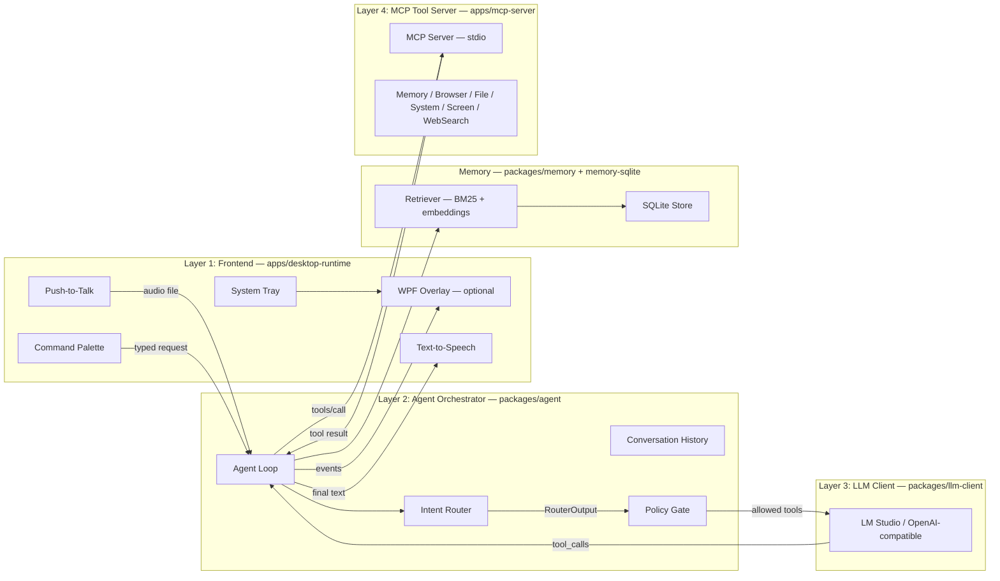

# Sir Thaddeus

Local-first Windows agent runtime: **desktop UI is optional**, the runtime is designed to run **tray-only/headless**, talk to a **local LLM (LM Studio / any OpenAI-compatible server)**, and execute actions through an **MCP tool server**.

## What exists right now

- **Layered architecture**: Frontend (WPF/tray/hotkeys) → Agent orchestrator → LLM client → MCP server (stdio JSON-RPC).
- **Command Palette** with three tabs: **Chat**, **Memory Browser**, and **Profile/Nuggets**.
- **Memory system**: facts, events, and text chunks stored in SQLite with hybrid BM25 + optional embeddings retrieval.
- **Shallow memory personalization**: Profile Cards for the user and people they mention, plus Memory Nuggets (atomic personal facts) injected into context at greeting and in-conversation.
- **Tool routing pipeline**: Intent Router → Policy Gate → Executor → Post-hooks. Prevents tool hallucination and enforces strict allowlists.
- **Web search**: DuckDuckGo HTML, Google News RSS, and SearXNG providers with smart query extraction.
- **Conflict detection**: Memory storage checks for duplicates, single-vs-multi-valued predicates, and antonym contradictions before writing.
- **Headless mode**: `--headless` starts without the overlay window (tray + hotkeys + background agent still run).
- **PTT → agent → TTS pipeline**: transcription is still a placeholder, but the end-to-end pipeline is testable.
- **Audit log is always-on**: `%LOCALAPPDATA%\SirThaddeus\audit.jsonl`.

## Architecture (4 layers)



### Layer responsibilities

| Layer | Project(s) | Responsibility | Talks to |
|---|---|---|---|
| **Frontend** | `apps/desktop-runtime` | Hotkeys, tray, overlay, PTT capture trigger, TTS output, Chat/Memory/Profile UI | Agent orchestrator (in-process) |
| **Agent** | `packages/agent` | Conversation loop, intent routing, policy gate, tool execution orchestration | LLM client + MCP client |
| **LLM client** | `packages/llm-client` | OpenAI-style `/v1/chat/completions` + `/v1/embeddings` calls | LM Studio HTTP server |
| **Memory** | `packages/memory`, `packages/memory-sqlite` | Retrieval engine (BM25 + embeddings), scoring, gating, SQLite store | — |
| **MCP server** | `apps/mcp-server` | Exposes tools over MCP stdio: memory, browser, file, system, screen, web search | Desktop runtime (child process) |

## Project structure

```
sir-thaddeus/
├── apps/
│   ├── desktop-runtime/              # WPF overlay + tray + hotkeys + PTT + TTS
│   │   ├── Converters/               # XAML value converters (Markdown, Base64, etc.)
│   │   ├── Services/                 # Hotkey, MCP process, PTT, TTS, tray icon
│   │   └── ViewModels/               # MVVM view models (Chat, Memory, Profile browsers)
│   └── mcp-server/                   # MCP tool server (stdio)
│       └── Tools/                    # Memory, Browser, File, System, Screen, WebSearch
├── packages/
│   ├── agent/                        # Agent orchestration loop + policy gate + router
│   ├── llm-client/                   # LM Studio / OpenAI-compatible client + embeddings
│   ├── memory/                       # Memory retrieval engine, scoring, intent classification
│   ├── memory-sqlite/                # SQLite-backed IMemoryStore (WAL mode, FTS5)
│   ├── web-search/                   # Web search providers (DuckDuckGo, Google News, SearXNG)
│   ├── config/                       # %LOCALAPPDATA% settings.json management
│   ├── core/                         # State machine, runtime controller
│   ├── audit-log/                    # JSONL audit logging
│   ├── permission-broker/            # Time-boxed permission token management
│   ├── tool-runner/                  # Tool execution with permission enforcement
│   ├── invocation/                   # Command planning/execution
│   ├── observation-spec/             # Observation spec schema + validation
│   └── local-tools/
│       └── Playwright/               # Playwright browser tool (not MCP-wired yet)
├── tests/                            # Unit + integration tests
├── tools/                            # Dev utilities (PopulateTestMemory, etc.)
└── project-notes/                    # Design docs and notes
```

## Prerequisites

- **Windows 10/11**
- **.NET SDK pinned in `global.json`** (currently `9.0.305`)
- **LM Studio** (or any OpenAI-compatible local server)
  - Default expected base URL: `http://localhost:1234`
  - Endpoints used: `/v1/chat/completions`, `/v1/embeddings` (optional)

## Configuration

On first run, the desktop runtime creates:

- **Settings**: `%LOCALAPPDATA%\SirThaddeus\settings.json`
- **Memory DB**: `%LOCALAPPDATA%\SirThaddeus\memory.db`
- **Audit log**: `%LOCALAPPDATA%\SirThaddeus\audit.jsonl`
- **PTT audio folder**: `%LOCALAPPDATA%\SirThaddeus\audio\`

Example settings file:

```json
{
  "llm": {
    "baseUrl": "http://localhost:1234",
    "model": "local-model",
    "maxTokens": 2048,
    "temperature": 0.7,
    "systemPrompt": "You are a helpful assistant with access to local tools."
  },
  "audio": {
    "pttKey": "F13",
    "ttsEnabled": true
  },
  "ui": {
    "startMinimized": false,
    "showOverlay": true
  },
  "mcp": {
    "serverPath": "auto"
  },
  "memory": {
    "enabled": true,
    "dbPath": "auto",
    "useEmbeddings": true,
    "embeddingsModel": ""
  }
}
```

Notes:
- `audio.pttKey` supports `F1`..`F24` or hex virtual keys like `0x7C`.
- `mcp.serverPath = "auto"` resolves to the built `SirThaddeus.McpServer.exe` in the repo output folders.
- `memory.dbPath = "auto"` resolves to `%LOCALAPPDATA%\SirThaddeus\memory.db`.
- `memory.embeddingsModel` defaults to the chat model if left empty.

## Building & tests

```powershell
# First-time setup / restore
.\dev\bootstrap.ps1

# Fast local loop (Debug build + tests)
.\dev\test.ps1

# Full suite (Release + restore) for pre-commit checks
.\dev\test_all.ps1

# Production preflight gate before release/distribution
.\dev\preflight.ps1
```

Testing details and filters are documented in `README_TESTING.md`.

## Running

### Desktop runtime (overlay + tray)

```powershell
dotnet run --project apps/desktop-runtime/SirThaddeus.DesktopRuntime
```

### Headless (tray + hotkeys, no overlay window on startup)

```powershell
dotnet run --project apps/desktop-runtime/SirThaddeus.DesktopRuntime -- --headless
```

You can still show the overlay later from the tray menu.

### MCP server standalone (for inspection)

```powershell
dotnet run --project apps/mcp-server/SirThaddeus.McpServer
```

## Keyboard shortcuts

| Shortcut | Action |
|---|---|
| `Ctrl+Space` | Open Command Palette |
| `F13` (default; configurable via settings) | Push-to-Talk trigger (keyboard hook) |

## Command Palette tabs

| Tab | Purpose |
|---|---|
| **Chat** | Conversational interface to the agent. Tool calls, web search, and screen capture trigger from here. |
| **Memory** | Browse, filter, and CRUD facts, events, and chunks stored in SQLite. |
| **Profile** | Manage Profile Cards (user + people) and Memory Nuggets (atomic personal facts). Sub-panes: Profiles, Nuggets. |

## MCP tools exposed today

| Tool | Description |
|---|---|
| `MemoryRetrieve` | Retrieves relevant memory (profile card, nuggets, facts, events, chunks). Supports `mode=greet` for cold start. |
| `MemoryStoreFacts` | Stores subject-predicate-object facts with conflict/duplicate detection. |
| `MemoryUpdateFact` | Updates an existing fact's object value (for conflict resolution). |
| `WebSearch` | Searches the web via DuckDuckGo, Google News RSS, or SearXNG. |
| `BrowserNavigate` | HTTP fetch + content extraction (Playwright available but not MCP-wired yet). |
| `FileRead` | Reads up to 1 MB from a local file. |
| `FileList` | Lists up to 100 entries in a directory. |
| `SystemExecute` | Runs allowlisted commands only. No raw shell execution. |
| `ScreenCapture` | Captures full screen or active window (explicit permission required). |

## Known gaps (intentionally called out)

- **Transcription**: PTT creates a minimal WAV placeholder; Whisper transcription is not integrated yet.
- **Permission enforcement**: MCP tool calls are not yet gated by permission tokens (legacy ToolRunner path has them).
- **Playwright via MCP**: Playwright tool exists, but MCP uses a simpler HTTP navigation tool for now.
- **Nugget auto-suggest**: V1 nuggets are manual-only. Two-sighting auto-suggest (V1.1+) is designed but deferred.

## More docs

- [README_TESTING.md](README_TESTING.md) - test harness usage and troubleshooting
- [README_DEPLOY.md](README_DEPLOY.md) - production preflight and deployment checklist
- [project-notes/architectural-design.md](project-notes/architectural-design.md) - architecture reference

## License

See LICENSE file.
