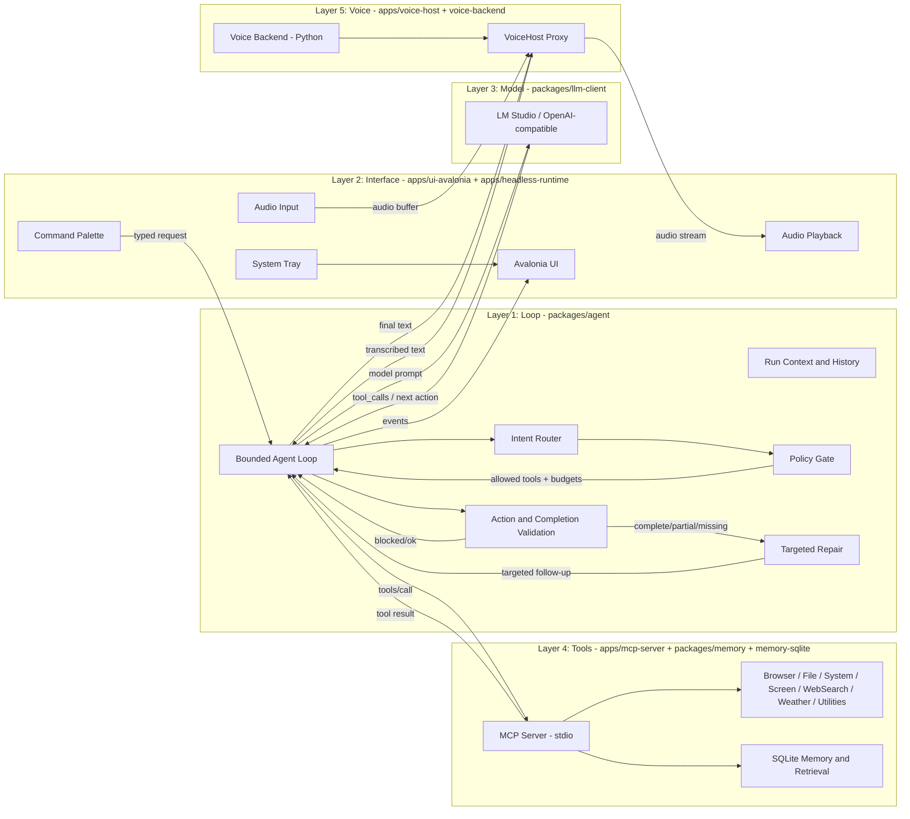

<div align="center">
  

  <h1>Sir Thaddeus</h1>

  <p><strong>AI that runs on your computer. Not theirs.</strong></p>

  <p>
    <a href="https://github.com/raydeStar/sir-thaddeus/releases">
      
    </a>
    <a href="https://github.com/raydeStar/sir-thaddeus/blob/main/LICENSE">
      
    </a>
    
  </p>
</div>

---

Sir Thaddeus is a local-first AI copilot designed for **Windows, macOS, and Linux**. It handles chat, voice, desktop tasks, and browsing while keeping permissions explicit and actions visible. It connects to local language models — such as [LM Studio](https://lmstudio.ai/) — and runs entirely under your control.

No telemetry by default. No silent background autonomy. No hidden actions.

If it acts, you see it. If you press **STOP**, it stops.

**[Privacy policy →](PRIVACY.md)** · **[Security policy →](SECURITY.md)**

---

## What It Feels Like to Use

Hold the push-to-talk hotkey and say:

> "When is the local grocery store open?"

Before doing anything, Sir Thaddeus proposes the next step. You can see:

- **What access is requested**
- **Why it is needed**
- **How long the permission lasts**

You approve. It runs. You get the result. Permission expires.

That same interaction model applies throughout the runtime:

- Nothing runs silently
- Nothing lingers in the background without approval
- Every important action is recorded locally

<div align="center">
  
</div>

---

## Privacy, in plain English

No telemetry. No analytics. No sign-up. No cloud sync.

Sir Thaddeus does not phone home. Your prompts go to your local model server. Your data stays on your machine. If you ask it to browse a website, it connects only to the sites you asked it to reach — nothing else runs in the background.

**[Full privacy details \u2192](PRIVACY.md)**

---

<details>
<summary><strong>Features</strong></summary>

### Voice and Interface

- **Push-to-talk voice input** with release-to-send behavior
- **Command palette** for keyboard-first workflows
- **Global STOP kill switch** to halt active execution
- **Tray-first Windows experience** with local desktop controls

### Local AI Runtime

- **Local LLM integration** through LM Studio and OpenAI-compatible endpoints
- **Reasoning pipeline** for breaking down logic questions step by step
- **Small-model support** with routing assistance for better tool use
- **Supported document formats**: PDF, DOCX, XLSX, CSV, RTF, Markdown, and plain text
- **In-memory result caching** with configurable TTLs for web search, weather, and location data
- **Conversation-scoped memory retrieval** for better continuity across multi-turn chats
- **Automatic history persistence** for chat and briefing context in memory-backed flows

### Permissioned Tooling via MCP

- **Web search and browser actions**
- **Screen reading** and active-window context
- **Read-only file listing and reading** with limits
- **Clipboard read/write** for seamless copy/paste integration
- **Allowlisted system actions**
- **Built-in utilities** for math, conversions, and structured lookups

### Trust and Safety

- **Explicit permission prompts** before tool execution
- **Time-boxed permission tokens**
- **Local audit logging**
- **Fail-closed behavior** when something goes sideways
- **Tool budgets** to prevent runaway loops and token burn

### Optional Connected Services

- **Background watchers** for website changes
- **Local notifications** for monitored events

</details>

---

## Quick Start

No cloud account required.

1. Download the latest release from the [Releases page](https://github.com/raydeStar/sir-thaddeus/releases) and unzip the archive
2. Run `SirThaddeus.exe`  
   *Windows SmartScreen may appear — choose **More Info → Run Anyway***
3. Start [LM Studio](https://lmstudio.ai/) or another OpenAI-compatible local model server
4. Complete the first-run setup inside the app
5. Hold the push-to-talk hotkey and ask something

That is it.

---

<details>
<summary><strong>Headless Runtime</strong></summary>

A terminal entry point exists for chat-first runs:

```bash
dotnet run --project apps/headless-runtime/SirThaddeus.HeadlessRuntime
```

Convenience launch scripts are available:

```powershell
# Windows PowerShell
./dev/terminal.ps1
```

```bash
# Linux/macOS shell
./dev/terminal.sh
# (or: bash ./dev/terminal.sh)
```

Commands:
- `/help`
- `/reset`
- `/tools`
- `/whoami`
- `/quickstart`
- `/exit`

Tooling in headless mode is optional:

```bash
dotnet run --project apps/headless-runtime/SirThaddeus.HeadlessRuntime -- --tools
```

MCP now has a split tool model:
- Core tools run cross-platform (`net10.0`)
- Windows-only tools (screen capture / OCR) load only on Windows

Runtime API composition has also been modularized into focused endpoint groups
(`core`, `memory`, `runs`, `profiles`, `personalities`) to reduce regression risk
and improve production maintainability.

</details>

---

## Changelog

See [CHANGELOG.md](CHANGELOG.md) for release notes and recent updates.

---

## Core Principles

### 1. You are in control

Sir Thaddeus proposes actions. You approve them.

### 2. Nothing runs silently

If it acts, you can see it.

### 3. STOP always works

The kill switch revokes permissions and halts execution immediately.

Sir Thaddeus is not designed to replace your judgment. It is designed to extend your capability without taking away your agency.

---

<details>
<summary><strong>Architecture</strong></summary>

Sir Thaddeus uses a five-layer architecture that separates loop control, interface, model access, tools, and voice runtime.

**Execution loop:** `propose -> validate -> execute -> observe -> verify -> repair -> repeat`


```mermaid
flowchart LR
  subgraph loop [Layer 1: Loop - packages/agent]
    Loop[Bounded Agent Loop]
    Context[Run Context and History]
    Router[Intent Router]
    Gate[Policy Gate]
    Validate[Action and Completion Validation]
    Repair[Targeted Repair]
  end

  subgraph frontend [Layer 2: Interface - apps/ui-avalonia + apps/headless-runtime]
    Tray[System Tray]
    Overlay[Avalonia UI]
    PTT[Audio Input]
    Playback[Audio Playback]
    Palette[Command Palette]
  end

  subgraph model [Layer 3: Model - packages/llm-client]
    LmStudio[LM Studio / OpenAI-compatible]
  end

  subgraph tools [Layer 4: Tools - apps/mcp-server + packages/memory + memory-sqlite]
    Server[MCP Server - stdio]
    Toolset[Browser / File / System / Screen / WebSearch / Weather / Utilities]
    Memory[SQLite Memory and Retrieval]
  end

  subgraph voice [Layer 5: Voice - apps/voice-host + voice-backend]
    VoiceHost[VoiceHost Proxy]
    VoiceBackend[Voice Backend - Python]
    VoiceBackend --> VoiceHost
  end

  PTT -->|audio buffer| VoiceHost
  VoiceHost -->|transcribed text| Loop
  Palette -->|typed request| Loop

  Loop --> Router --> Gate
  Gate -->|allowed tools + budgets| Loop

  Loop -->|model prompt| LmStudio
  LmStudio -->|tool_calls / next action| Loop

  Loop --> Validate
  Validate -->|blocked/ok| Loop
  Validate -->|complete/partial/missing| Repair
  Repair -->|targeted follow-up| Loop

  Loop -->|tools/call| Server
  Server --> Toolset
  Server --> Memory
  Server -->|tool result| Loop

  Loop -->|final text| VoiceHost
  VoiceHost -->|audio stream| Playback

  Loop -->|events| Overlay
  Tray --> Overlay
```

### Layer Responsibilities

| Layer | Project(s) | Responsibility | Talks to |
| --- | --- | --- | --- |
| Layer 1: Loop | `packages/agent` | Route, gate, validate, repair, complete | Interface, Model, Tools, Voice |
| Layer 2: Interface | `apps/ui-avalonia`, `apps/headless-runtime` | Avalonia UI + terminal runtime entry points | Loop, Voice |
| Layer 3: Model | `packages/llm-client` | OpenAI-style model calls and embeddings | LM Studio, Loop |
| Layer 4: Tools | `apps/mcp-server`, `packages/memory`, `packages/memory-sqlite` | MCP tools plus local memory retrieval/storage | Loop |
| Layer 5: Voice | `apps/voice-host`, `apps/voice-backend` | Local ASR and TTS transport/runtime | Interface, Loop |

</details>

---

<details>
<summary><strong>Project Structure</strong></summary>

```text
sir-thaddeus/
|-- apps/
|   |-- ui-avalonia/
|   |-- headless-runtime/
|   |-- voice-host/
|   |-- voice-backend/
|   `-- mcp-server/
|-- assets/
|-- packages/
|-- tests/
|-- tools/
|-- Microsoft/
`-- project-notes/
```

</details>

---

<details>
<summary><strong>Development</strong></summary>

### Prerequisites

- .NET 10.0 SDK
- (Optional) LM Studio or any OpenAI-compatible local model server
- (Optional) SearXNG for local web search (bundled setup available)

### Build

```bash
dotnet build SirThaddeus.sln
```

### Test

```bash
dotnet test SirThaddeus.sln
```

### Run (headless)

```bash
dotnet run --project apps/headless-runtime/SirThaddeus.HeadlessRuntime
```

### Run (Avalonia UI)

```bash
dotnet run --project apps/ui-avalonia/SirThaddeus.UI.Avalonia
```

</details>

---

<details>
<summary><strong>Technical Notes</strong></summary>

- Tested primarily with **LM Studio** and smaller local models
- Other local runtimes may work, but support may vary
- Smaller reasoning models can take longer to respond, especially in deeper thinking modes
- The runtime is designed around **permissioned execution**, **local visibility**, and **practical reliability**

</details>

---

## Who This Is For

Sir Thaddeus is for:

- Developers exploring **local AI tooling**
- Privacy-conscious users who want **AI without telemetry**
- Builders interested in **MCP architecture**, **tool routing**, and **permissioned agents**
- Anyone who wants an AI copilot they can actually control

It is not intended to be an unbounded autonomous agent that runs freely on your machine.

---

## Documentation

- [Architecture Overview](docs/ARCHITECTURE.md)
- [Settings Reference](docs/SETTINGS.md)
- [Contributing](CONTRIBUTING.md)
- [Privacy Policy](PRIVACY.md)
- [Security Policy](SECURITY.md)

---

## License

Licensed under **Apache 2.0**. See [LICENSE](LICENSE) for details.
