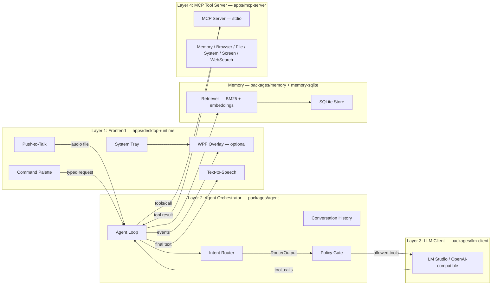

<p align="center">

</p>

<h1 align="center">Sir Thaddeus</h1>
<p align="center">
<strong>A permissioned AI runtime that runs on your machine.</strong>
</p>

## A Local‑First AI Runtime

Most AI assistants run primarily in the cloud. That means your requests are processed on remote servers, and ongoing access typically requires a subscription.

**Sir Thaddeus** takes a different approach.

He is a local‑first, permissioned AI runtime for Windows. He runs on your machine, connects to your local models (such as LM Studio), and executes actions only with explicit approval.

No telemetry by default.
No background activity without consent.
No hidden autonomy.

If he acts, you see it. If you press STOP, everything stops.

## What It Feels Like To Use

Hold your push‑to‑talk hotkey.

Say:

> “Summarize this page.”

Thaddeus responds with a plan:

- Read active window
- Duration: 30 seconds
- Capability requested: SCREEN_READ (active window only)

You approve.

He reads.
He summarizes.
The action is written to a local audit log.
The permission expires automatically.

That interaction pattern applies to everything.


## Why Sir Thaddeus?

- 🛡️ **Local by Default** Your data stays on your machine. The runtime works offline. There is no telemetry unless you explicitly enable a service connection.

- 🔐 **Explicit, Time‑Boxed Permissions** Every privileged action requires a scoped permission token. Permissions are specific, short‑lived, and revocable.

- 📜 **Transparent Execution** All actions are written to a local, human‑readable audit log. The overlay always shows what the assistant is doing.

- 🎙️ **Voice + Command Palette** Speak naturally with push‑to‑talk or use a keyboard command palette. Release to send. Press STOP to cancel.

- ⚙️ **Action, Not Just Chat** Thaddeus can read the screen, automate the browser, and interact with your system — but only after proposing a plan and receiving approval.

---

## The Contract

1. **You are the principal.** He proposes plans; you approve them.
2. **Nothing runs silently.** If it acts, you see it.
3. **STOP always works.** The kill switch revokes permissions and halts execution immediately.

Sir Thaddeus is not designed to replace your agency.
He is designed to extend it — with boundaries.


## Architecture (4 layers)


```mermaid
flowchart LR
  subgraph frontend [Layer 1: Frontend — apps/desktop-runtime]
    Tray[System Tray]
    Overlay[WPF Overlay — optional]
    PTT[Push-to-Talk]
    TTS[Text-to-Speech]
    Palette[Command Palette]
  end

  subgraph agent [Layer 2: Agent Orchestrator — packages/agent]
    Loop[Agent Loop]
    Context[Conversation History]
    Router[Intent Router]
    Gate[Policy Gate]
  end

  subgraph llm [Layer 3: LLM Client — packages/llm-client]
    LmStudio[LM Studio / OpenAI-compatible]
  end

  subgraph memory [Memory — packages/memory + memory-sqlite]
    Store[SQLite Store]
    Retriever[Retriever — BM25 + embeddings]
  end

  subgraph mcp [Layer 4: MCP Tool Server — apps/mcp-server]
    Server[MCP Server — stdio]
    Tools[Memory / Browser / File / System / Screen / WebSearch]
  end

  PTT -->|audio file| Loop
  Palette -->|typed request| Loop
  Loop --> Router -->|RouterOutput| Gate
  Gate -->|allowed tools| LmStudio
  LmStudio -->|tool_calls| Loop
  Loop -->|tools/call| Server
  Server -->|tool result| Loop
  Loop --> Retriever --> Store
  Loop -->|final text| TTS
  Loop -->|events| Overlay
  Tray --> Overlay
```

### Layer responsibilities

| Layer | Project(s) | Responsibility | Talks to |
|---|---|---|---|
| **Frontend** | `apps/desktop-runtime` | Hotkeys, tray, overlay, PTT capture trigger, TTS output, Chat/Memory/Profile UI | Agent orchestrator (in-process) |
| **Agent** | `packages/agent` | Conversation loop, intent routing, policy gate, tool execution orchestration | LLM client + MCP client |
| **LLM client** | `packages/llm-client` | OpenAI-style `/v1/chat/completions` + `/v1/embeddings` calls | LM Studio HTTP server |
| **Memory** | `packages/memory`, `packages/memory-sqlite` | Retrieval engine (BM25 + embeddings), scoring, gating, SQLite store | — |
| **MCP server** | `apps/mcp-server` | Exposes tools over MCP stdio: memory, browser, file, system, screen, web search | Desktop runtime (child process) |

## Project structure

```
sir-thaddeus/
├── apps/
│   ├── desktop-runtime/              # WPF overlay + tray + hotkeys + PTT + TTS
│   │   ├── Converters/               # XAML value converters (Markdown, Base64, etc.)
│   │   ├── Services/                 # Hotkey, MCP process, PTT, TTS, tray icon
│   │   └── ViewModels/               # MVVM view models (Chat, Memory, Profile browsers)
│   ├── voice-host/                   # Local VoiceHost process (ASR/TTS HTTP surface)
│   ├── voice-backend/                # Python ASR/TTS backend + model/voice assets
│   └── mcp-server/                   # MCP tool server (stdio)
│       └── Tools/                    # Memory, Browser, File, System, Screen, WebSearch
├── assets/
│   └── manifest.json                 # SHA-256 checksums + download URLs for voice assets
├── packages/
│   ├── agent/                        # Agent orchestration loop + policy gate + router
│   ├── llm-client/                   # LM Studio / OpenAI-compatible client + embeddings
│   ├── memory/                       # Memory retrieval engine, scoring, intent classification
│   ├── memory-sqlite/                # SQLite-backed IMemoryStore (WAL mode, FTS5)
│   ├── web-search/                   # Web search providers (DuckDuckGo, Google News, SearXNG)
│   ├── config/                       # %LOCALAPPDATA% settings.json management
│   ├── core/                         # State machine, runtime controller, asset manager
│   ├── audit-log/                    # JSONL audit logging
│   ├── permission-broker/            # Time-boxed permission token management
│   ├── tool-runner/                  # Tool execution with permission enforcement
│   ├── invocation/                   # Command planning/execution
│   ├── observation-spec/             # Observation spec schema + validation
│   └── local-tools/
│       └── Playwright/               # Playwright browser tool (not MCP-wired yet)
├── tests/                            # Unit + integration tests
├── tools/                            # Dev utilities (PopulateTestMemory, etc.)
└── project-notes/                    # Design docs and notes
```

## Prerequisites

- **Windows 10/11**
- **.NET SDK pinned in `global.json`** (currently `9.0.305`)
- **LM Studio** (or any OpenAI-compatible local server)
  - Default expected base URL: `http://localhost:1234`
  - Endpoints used: `/v1/chat/completions`, `/v1/embeddings` (optional)
- **Internet connection on first run** — voice backend assets (~320 MB total) are downloaded automatically from GitHub Releases during the onboarding wizard. After the first run, the app works fully offline.

## Configuration

On first run, the desktop runtime creates:

- **Settings**: `%LOCALAPPDATA%\SirThaddeus\settings.json`
- **Memory DB**: `%LOCALAPPDATA%\SirThaddeus\memory.db`
- **Audit log**: `%LOCALAPPDATA%\SirThaddeus\audit.jsonl`
- **PTT audio folder**: `%LOCALAPPDATA%\SirThaddeus\audio\`

Example settings file:

```json
{
  "llm": {
    "baseUrl": "http://localhost:1234",
    "model": "local-model",
    "maxTokens": 2048,
    "temperature": 0.7,
    "systemPrompt": "You are a helpful assistant with access to local tools."
  },
  "audio": {
    "pttKey": "F13",
    "ttsEnabled": true
  },
  "ui": {
    "startMinimized": false,
    "showOverlay": true
  },
  "mcp": {
    "serverPath": "auto"
  },
  "memory": {
    "enabled": true,
    "dbPath": "auto",
    "useEmbeddings": true,
    "embeddingsModel": ""
  }
}
```

Notes:
- `audio.pttKey` supports `F1`..`F24` or hex virtual keys like `0x7C`.
- `mcp.serverPath = "auto"` resolves to the built `SirThaddeus.McpServer.exe` in the repo output folders.
- `memory.dbPath = "auto"` resolves to `%LOCALAPPDATA%\SirThaddeus\memory.db`.
- `memory.embeddingsModel` defaults to the chat model if left empty.
- `runtimeSafety.strictHandshake` enforces protocol/contract/manifest compatibility at startup (fail closed).
- `runtimeSafety.panicMode` blocks side-effect tool groups at runtime.
- `toolBudgets` applies hard per-turn/per-session/per-minute caps to reduce runaway tool loops.

## Privacy model

Sir Thaddeus is local-first by design.

- Processing happens on your machine, with explicit outbound calls only through configured tools.
- No default telemetry pipeline is enabled in this repo.
- Audit logging is append-only and local (`%LOCALAPPDATA%\SirThaddeus\audit.jsonl`).

### What is logged

- Event metadata (actor, action, timestamp, result)
- Tool call lifecycle events (start/end, duration, permission outcome)
- Redacted tool input/output summaries for diagnostics

### What is not logged by default

- Raw secrets (tokens, API keys, passwords, cookies, bearer strings, connection strings)
- Full OCR dumps and full file contents
- Full `system_execute` command text in audit summaries (only executable name, argument count, and command hash)

### Local data paths

- Settings: `%LOCALAPPDATA%\SirThaddeus\settings.json`
- Memory DB: `%LOCALAPPDATA%\SirThaddeus\memory.db`
- Audit log: `%LOCALAPPDATA%\SirThaddeus\audit.jsonl`

## Building & tests

```powershell
# First-time setup / restore
.\dev\bootstrap.ps1

# Fetch voice backend assets from GitHub Releases (dev/CI)
.\dev\fetch-assets.ps1

# Fast local loop (Debug build + tests)
.\dev\test.ps1

# Full suite (Release + restore) for pre-commit checks
.\dev\test_all.ps1

# Production preflight gate before release/distribution
.\dev\preflight.ps1

# Start the voice backend manually (for development)
.\dev\start-voice-backend.ps1 -TtsEngine kokoro -TtsVoiceId af_sky
```

Testing details and filters are documented in `README_TESTING.md`.

### Release packaging (MVP ZIP)

Use the release packaging script from repo root:

```powershell
.\dev\release-package.ps1 -Version v0.1.0
```

This produces a self-contained `win-x64` ZIP and checksum files under `.\artifacts\release\`.
The package includes `README_FIRST_RUN.md` and (when present) `SirThaddeus.Settings.template.json`.

### Optional git pre-push gate

To run the local test gate automatically before each push:

```powershell
git config core.hooksPath .githooks
```

This enables `.githooks/pre-push.cmd`, which runs `.\dev\test.ps1` and blocks pushes on failure.

### GitHub automation baseline

- PR gate: `.github/workflows/ci-pr.yml` (runs `.\dev\test.ps1`, uploads TRX artifacts)
- Release gate: `.github/workflows/ci-release.yml` (runs preflight, packages self-contained ZIP, and publishes release assets on `v*` tags)
- SBOM gate: `.github/workflows/ci-sbom.yml` (manual/tag-triggered SPDX SBOM artifact)
- Dependency updates: `.github/dependabot.yml`

## Running

### Desktop runtime (overlay + tray)

```powershell
dotnet run --project apps/desktop-runtime/SirThaddeus.DesktopRuntime
```

### Headless (tray + hotkeys, no overlay window on startup)

```powershell
dotnet run --project apps/desktop-runtime/SirThaddeus.DesktopRuntime -- --headless
```

You can still show the overlay later from the tray menu.

### MCP server standalone (for inspection)

```powershell
dotnet run --project apps/mcp-server/SirThaddeus.McpServer
```

## Keyboard shortcuts

| Shortcut | Action |
|---|---|
| `Ctrl+Space` | Open Command Palette |
| `F13` (default; configurable via settings) | Push-to-Talk trigger (keyboard hook) |

## Command Palette tabs

| Tab | Purpose |
|---|---|
| **Chat** | Conversational interface to the agent. Tool calls, web search, and screen capture trigger from here. |
| **Memory** | Browse, filter, and CRUD facts, events, and chunks stored in SQLite. |
| **Profile** | Manage Profile Cards (user + people) and Memory Nuggets (atomic personal facts). Sub-panes: Profiles, Nuggets. |

## MCP tools exposed today

| Tool | Description |
|---|---|
| `MemoryRetrieve` | Retrieves relevant memory (profile card, nuggets, facts, events, chunks). Supports `mode=greet` for cold start. |
| `MemoryStoreFacts` | Stores subject-predicate-object facts with conflict/duplicate detection. |
| `MemoryUpdateFact` | Updates an existing fact's object value (for conflict resolution). |
| `WebSearch` | Searches the web via DuckDuckGo, Google News RSS, or SearXNG. |
| `BrowserNavigate` | HTTP fetch + content extraction (Playwright available but not MCP-wired yet). |
| `FileRead` | Reads up to 1 MB from a local file. |
| `FileList` | Lists up to 100 entries in a directory. |
| `SystemExecute` | Runs allowlisted commands only. No raw shell execution. |
| `ScreenCapture` | Captures full screen or active window (explicit permission required). |
| `health.check` | Read-only control-plane health snapshot with dependency readiness. |
| `capabilities.describe` | Read-only manifest and capability summary for MCP tools. |
| `policy.get_state` | Read-only policy/runtime safety snapshot from current settings. |
| `policy.set_panic_mode` | Explicitly toggles panic mode (`confirm=true` required). |
| `audit.export_bundle` | Creates a redacted diagnostics bundle (`confirm=true` required). |

## Architecture Review Index

Use this list when you want reviewers to focus on architecture first, not implementation details:

- [project-notes/architecture-review-index.md](project-notes/architecture-review-index.md) - quick index of design docs + review order
- [project-notes/architecture-nuts-bolts.md](project-notes/architecture-nuts-bolts.md) - current runtime architecture, trust boundaries, wiring paths
- [project-notes/mcp-tools-reference.md](project-notes/mcp-tools-reference.md) - current MCP tool contracts, permission model, and audit guarantees
- [project-notes/tool-conflict-matrix.md](project-notes/tool-conflict-matrix.md) - deterministic tool conflict resolution rules
- [project-notes/tool-routing-v2.md](project-notes/tool-routing-v2.md) - current routing pipeline notes + MCP hook points
- [project-notes/architectural-design.md](project-notes/architectural-design.md) - product-level architecture strategy

## Voice backend assets

Large binary assets (Python runtime, STT/TTS models, wheel packages) are hosted on GitHub Releases under the `assets-v1` tag instead of being checked into the repo.

| Asset | Size | Description |
|---|---|---|
| `voice-runtime-win-x64.zip` | 43 MB | Python 3.11 runtime + uv package manager |
| `voice-deps-win-x64.zip` | 72 MB | Python wheel packages for voice backend |
| `piper-win-x64.zip` | 21 MB | Piper TTS native binary + espeak DLLs |
| `piper-voice-en_US-john-medium.zip` | 56 MB | Piper voice model |
| `stt-model-whisper-base.zip` | 127 MB | Faster-Whisper base STT model |

**End users**: Assets are downloaded automatically during the first-run onboarding wizard. No manual steps required.

**Developers**: Run `dev\fetch-assets.ps1` after cloning, or let `VoiceBackendSupervisor` auto-fetch on first voice use. The manifest is at `assets/manifest.json`.

## Known gaps (intentionally called out)

- **Playwright via MCP**: Playwright tool exists, but MCP uses a simpler HTTP navigation tool for now.
- **Voice cold-start latency**: first-turn ASR/TTS may be slower while local models warm up.
- **Nugget auto-suggest**: V1 nuggets are manual-only. Two-sighting auto-suggest (V1.1+) is designed but deferred.

## More docs

- [README_TESTING.md](README_TESTING.md) - test harness usage and troubleshooting
- [README_DEPLOY.md](README_DEPLOY.md) - production preflight and deployment checklist
- [README_FIRST_RUN.md](README_FIRST_RUN.md) - end-user first-run flow for release ZIP builds
- [project-notes/architecture-review-index.md](project-notes/architecture-review-index.md) - architecture docs index for review
- [project-notes/github-branch-protection.md](project-notes/github-branch-protection.md) - required status checks and merge guard setup
- [project-notes/code-signing.md](project-notes/code-signing.md) - optional Authenticode signing guidance

## License

See LICENSE file.
