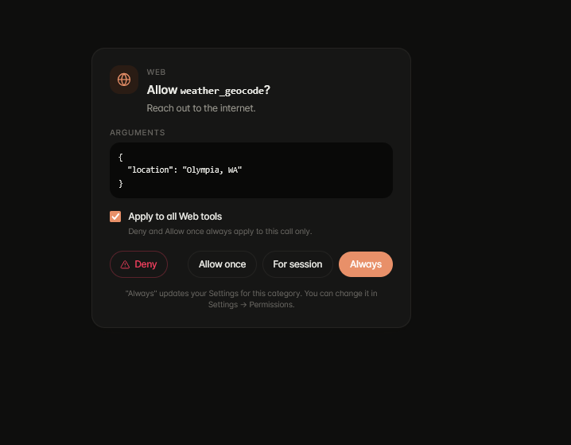
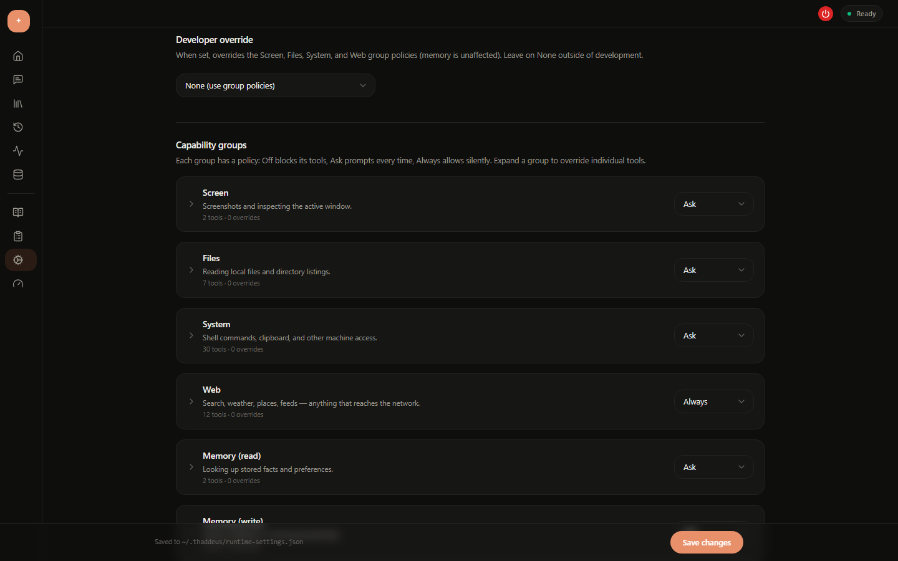
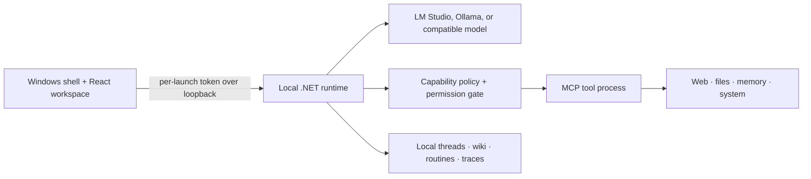

<div align="center">
  

  <h1>Private, local-first AI for Windows</h1>

  <p><strong>Your thoughts deserve a butler, not an audience.</strong></p>

  <p>
    Run your own models. Keep your own memory. Approve sensitive tools before they act.<br />
    No account. No telemetry. No mystery background agent.
  </p>

  <p>
    <a href="https://github.com/raydeStar/sir-thaddeus/releases/latest"><strong>Download for Windows</strong></a>
    &nbsp;·&nbsp;
    <a href="#quick-start">Quick Start</a>
    &nbsp;·&nbsp;
    <a href="#see-it-in-action">See It in Action</a>
    &nbsp;·&nbsp;
    <a href="#trust-model">Trust Model</a>
    &nbsp;·&nbsp;
    <a href="https://github.com/raydeStar/sir-thaddeus">Star on GitHub</a>
  </p>

  <p>
    <a href="https://github.com/raydeStar/sir-thaddeus/actions/workflows/ci-pr.yml">
      
    </a>
    <a href="https://github.com/raydeStar/sir-thaddeus/releases/latest">
      
    </a>
    <a href="LICENSE">
      
    </a>
    
    
    
  </p>
</div>


**Sir Thaddeus is an open-source, local-first AI assistant and private knowledge workspace for Windows.** Connect [LM Studio](https://lmstudio.ai/), [Ollama](https://ollama.com/), or another OpenAI-compatible model endpoint; chat with your model; search the web; work with files; build a Markdown wiki; and inspect the trail afterward. Sensitive capabilities run through explicit policies and visible permission prompts instead of silent access.

Use a local model with network tools disabled and the core workspace stays offline. Enable web tools or a hosted model only when you choose to.

## Why Sir Thaddeus?

| Your model | Your data | Your permission | Your receipts |
| --- | --- | --- | --- |
| Bring LM Studio, Ollama, or an OpenAI-compatible endpoint. | Threads, memory, settings, routines, and wiki pages live on your disk. | Set each capability group to **Off**, **Ask**, or **Always**, with per-tool overrides. | Inspect activity, tool outcomes, permission decisions, diagnostics, and per-turn traces. |

This is for developers protecting source code, consultants protecting client work, and anyone who wants useful AI without surrendering the workspace around it.

<a id="see-it-in-action"></a>
## See It in Action

### Permission before power

When a protected capability is set to **Ask**, Sir Thaddeus pauses the turn and shows the exact tool, arguments, and available scope. Deny it, allow it once, allow it for the session, or remember the decision.

<p align="center">
  
</p>

### Policies you can actually see

Network, file, system, screen, and memory capabilities have direct controls in Settings. Safe defaults stay legible; individual tools can override their group when you need precision.



### Answers with evidence, not link confetti

Search results become readable source cards with titles, domains, snippets, publication context, and one-click source access.


## What You Can Do

- **Chat with local models** — stream threaded conversations through LM Studio, Ollama, or another compatible endpoint.
- **Use live information** — search the web, fetch pages, find places, check weather and time zones, read feeds, and look up holidays.
- **Work with documents** — read scoped files and extract useful content from PDF, DOCX, XLSX, CSV, RTF, Markdown, and text files.
- **Build a private knowledge base** — organize Markdown roots, folders, pages, revisions, search, imports, exports, and AI-assisted edits.
- **Keep durable memory** — review, search, edit, and audit the facts your assistant can recall.
- **Run repeatable routines** — turn recurring work into visible, reusable workflows.
- **Debug the whole turn** — inspect activity, model/tool events, permission decisions, diagnostics, and trace data.
- **Stop it immediately** — abort active turns and sidecar processes with explicit stop and kill controls.

Voice, push-to-talk, tray integration, the compact panel, clipboard tools, and screen tools are available as beta features.

<a id="quick-start"></a>
## Quick Start

### 1. Download

1. Open the [latest Windows release](https://github.com/raydeStar/sir-thaddeus/releases/latest).
2. Download the release ZIP and its checksum, then extract it.
3. Run `Launch Sir Thaddeus.cmd` or `Thaddeus.Runtime.exe`.

Windows may show SmartScreen while the app is unsigned. Verify the published checksum before running it. The [first-run guide](docs/FIRST_RUN.md) covers the setup wizard and local data paths.

### 2. Connect a model

Open **Settings → Models**, select a provider, enter its base URL, and test the connection.

| Provider | Default base URL | Setup note |
| --- | --- | --- |
| LM Studio | `http://127.0.0.1:1234/v1` | Load an instruction-tuned model and start the local server. |
| Ollama | `http://127.0.0.1:11434/v1` | Pull and run a model; Sir Thaddeus uses Ollama's OpenAI-compatible API. |
| Custom | Your `/v1` endpoint | Use any compatible local or hosted service. |

### 3. Choose the boundary

Open **Settings → Permissions**. Leave sensitive groups on **Ask**, switch unwanted capabilities **Off**, and enable silent access only where you trust it.

## How It Works


```mermaid
flowchart LR
    UI["Windows shell + React workspace"] -->|"per-launch token over loopback"| RT["Local .NET runtime"]
    RT --> MODEL["LM Studio, Ollama, or compatible model"]
    RT --> POLICY["Capability policy + permission gate"]
    POLICY --> MCP["MCP tool process"]
    MCP --> TOOLS["Web · files · memory · system"]
    RT --> DATA["Local threads · wiki · routines · traces"]
```

The runtime binds to `127.0.0.1` on an ephemeral port. A bearer token rotates each launch. Tool execution crosses a separate MCP process boundary, and protected capabilities are resolved through their configured policy before execution. Read the [public architecture overview](docs/ARCHITECTURE_PUBLIC.md) for the complete boundary and its explicit non-promises.

<a id="measured-not-guessed"></a>
## Measured, Not Guessed

Sir Thaddeus includes a benchmark harness because “agentic” is easy to claim and harder to prove. The harness value-grades answers across repeated runs, records failures, tests tool infrastructure before scoring it, and keeps negative results instead of polishing them away.

- A 1.2B local model scored **0/6** on a math probe unaided and **5/6** with the calculator tool.
- A sandboxed `python_eval` tool moved a 20-item compute suite from roughly **0% to 43%**; the remaining misses exposed model reasoning limits rather than being hidden.
- About **1,900 lines** of benchmark-specific shortcut solvers were removed so the harness exercises the real model and tool loop.
- Strict items grade the actual value, not answer shape; a confidently wrong number fails.
- A Docker sandbox canary aborts a broken run instead of misreporting infrastructure failures as model failures.
- Majority-vote self-consistency was measured and rejected for the tested model family: it was flat on the Python suite at twice the cost and reduced MMLU-Pro from **37.9% to 27.9%**.

Run [`dev/model-intake.ps1`](dev/model-intake.ps1) to turn a new model into a scorecard and recommended configuration. The suites live under [`tools/SirThaddeus.Harness/Suites/`](tools/SirThaddeus.Harness/Suites/); the methodology is documented in [docs/TESTING.md](docs/TESTING.md).

<a id="trust-model"></a>
## Trust Model

| Promise | Concrete mechanism |
| --- | --- |
| Local-first | The runtime listens on loopback, not the LAN. |
| Per-launch access | A bearer token rotates on every launch; old tokens die with the process. |
| Controlled tools | Protected capabilities resolve **Off**, **Ask**, or **Always** policies, with per-tool overrides. |
| Scoped files | File access is constrained to user-configured roots and limits. |
| Auditability | Tool calls, permission decisions, outcomes, and turn events are recorded locally. |
| Stop control | `/api/stop-all` aborts active turns and sidecar processes. |
| No telemetry | No product analytics, crash reporting, or “anonymous” usage collection. |

Sir Thaddeus is a local-first workspace, not a hardened multi-tenant security product. A local process running as you can still access data you can access. Review [PRIVACY.md](PRIVACY.md), [SECURITY.md](SECURITY.md), and [DISCLAIMER.md](DISCLAIMER.md) before using it with sensitive work.

## Build From Source

Requirements: Windows 10/11, the .NET SDK version pinned in [`global.json`](global.json), Node.js with npm, and PowerShell 5.1 or newer.

```powershell
git clone https://github.com/raydeStar/sir-thaddeus.git
cd sir-thaddeus
dotnet restore SirThaddeus.sln

Push-Location web
npm ci
npm run build
Pop-Location

dotnet run --project src/Thaddeus.Shell/Thaddeus.Shell.csproj
```

Common developer commands:

```powershell
./dev/bootstrap.ps1                     # one-time environment setup + restore
./dev/test.ps1                          # local CI-equivalent test loop
./dev/harness.ps1 --all --judge none    # conversation-level validation
./dev/release-package.ps1 -Runtime win-x64
```

See [docs/TESTING.md](docs/TESTING.md) for the full test guide and [docs/DEPLOYMENT.md](docs/DEPLOYMENT.md) for release packaging.

## Project Status

- **Stable v1 core** — Windows shell, loopback runtime, React workspace, chat, history, settings, diagnostics, memory, routines, wiki, model configuration, MCP boundary, permission policies, activity, and audit surfaces.
- **Beta** — voice, ASR/TTS, push-to-talk, tray integration, compact panel, clipboard tools, and screen tools.
- **Planned** — a polished installer, auto-update, scheduled unattended automation, and cross-platform desktop parity.

The honest release boundary lives in [docs/KNOWN_LIMITATIONS.md](docs/KNOWN_LIMITATIONS.md) and [docs/ROADMAP.md](docs/ROADMAP.md).

## Frequently Asked Questions

<details>
<summary><strong>Can Sir Thaddeus run fully offline?</strong></summary>

Yes. Use a model hosted on your machine and leave network-capable tools disabled. The app does not require a Sir Thaddeus cloud account and does not send telemetry. Web tools and hosted model endpoints naturally require network access when you enable them.
</details>

<details>
<summary><strong>Which local AI servers are supported?</strong></summary>

LM Studio and Ollama have first-class presets. Any service exposing a compatible OpenAI-style `/v1` API can also be configured.
</details>

<details>
<summary><strong>Does every tool pop up a permission dialog?</strong></summary>

No. Protected capability groups follow the policy you choose: **Off** blocks, **Ask** prompts, and **Always** allows. Safe metadata operations may run without a prompt. Individual tools can override their group policy.
</details>

<details>
<summary><strong>Where is my data stored?</strong></summary>

Threads, workspace state, memory, wiki content, settings, routines, logs, and traces are stored locally. See [docs/FIRST_RUN.md](docs/FIRST_RUN.md) for the current paths and backup guidance.
</details>

<details>
<summary><strong>How is this different from a cloud chatbot?</strong></summary>

Sir Thaddeus is the workspace around your model: local state, explicit tool boundaries, inspectable execution, durable memory, a wiki, routines, diagnostics, and stop controls. You choose whether the model itself is local or hosted.
</details>

## Documentation

Start with the [documentation index](docs/README.md), or jump directly to:

- [First run](docs/FIRST_RUN.md)
- [Public architecture](docs/ARCHITECTURE_PUBLIC.md)
- [Testing and benchmark harness](docs/TESTING.md)
- [Known limitations](docs/KNOWN_LIMITATIONS.md)
- [Roadmap](docs/ROADMAP.md)
- [Release notes](CHANGELOG.md)

## Try It

1. **[Download the latest Windows release](https://github.com/raydeStar/sir-thaddeus/releases/latest).**
2. Point it at LM Studio, Ollama, or your own compatible endpoint.
3. Ask it to use a protected tool and watch the permission boundary become visible.

If something feels off, [open an issue](https://github.com/raydeStar/sir-thaddeus/issues). If this is the kind of AI ownership you want to see more of, [star the repository](https://github.com/raydeStar/sir-thaddeus).

## Contributing and License

Contributions are welcome. Read [CONTRIBUTING.md](CONTRIBUTING.md) for the workflow and [SECURITY.md](SECURITY.md) for vulnerability reporting. Sir Thaddeus is licensed under the [Apache License 2.0](LICENSE).
