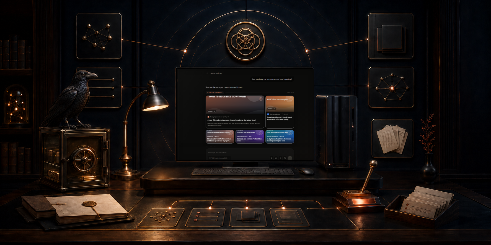
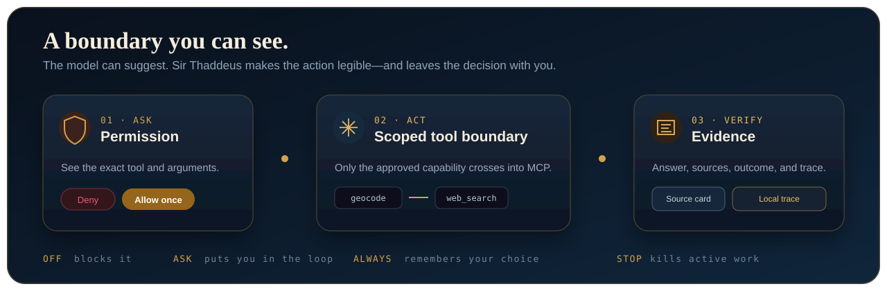
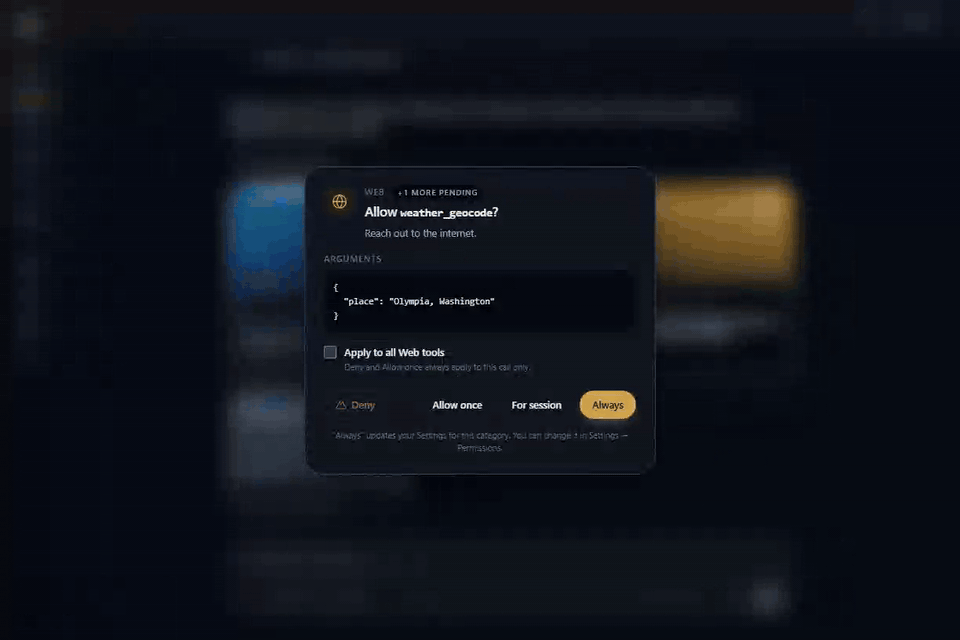
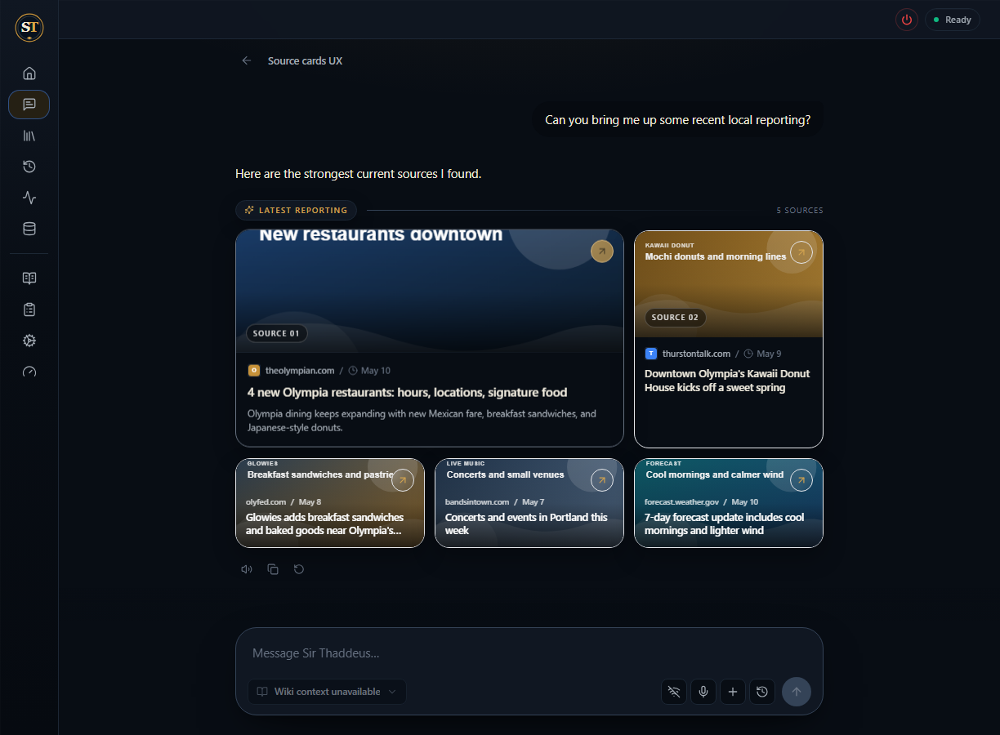
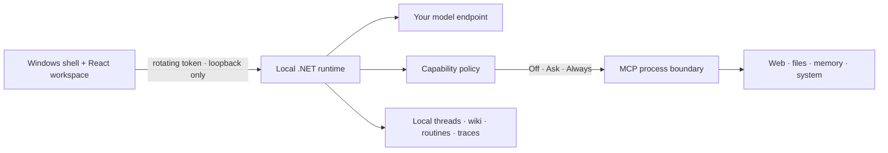

<div align="center">
  

  <h1>Private AI that answers to you.</h1>

  <p>
    <strong>Run your model. Keep your memory. See every sensitive action before it happens.</strong><br />
    A local-first AI assistant and knowledge workspace for Windows—without the account, telemetry, or invisible agent.
  </p>

  <p>
    <a href="https://github.com/raydeStar/sir-thaddeus/releases/latest"><strong>Download for Windows</strong></a>
    &nbsp;·&nbsp;
    <a href="#three-minutes-to-private-ai">Quick Start</a>
    &nbsp;·&nbsp;
    <a href="#control-is-the-feature">How Control Works</a>
    &nbsp;·&nbsp;
    <a href="#measured-not-guessed">Benchmarks</a>
    &nbsp;·&nbsp;
    <a href="https://github.com/raydeStar/sir-thaddeus">Star the Project</a>
  </p>

  <p>
    <a href="https://github.com/raydeStar/sir-thaddeus/actions/workflows/ci-pr.yml"></a>
    <a href="https://github.com/raydeStar/sir-thaddeus/releases/latest"></a>
    <a href="LICENSE"></a>
    
    
    
  </p>
</div>



<p align="center"><em>Your model. Your memory. Your permission.</em></p>

**Sir Thaddeus is an open-source, local-first AI assistant for Windows.** Connect [LM Studio](https://lmstudio.ai/), [Ollama](https://ollama.com/), or another OpenAI-compatible endpoint, then give your model a private workspace: threaded chat, permissioned tools, durable memory, a Markdown wiki, routines, sources, traces, and an emergency stop.

Use a model on your machine and leave network tools off to keep the core experience offline. Turn on web access or a hosted endpoint only when *you* decide the job needs it.

| **Your model** | **Your workspace** | **Your boundary** | **Your receipts** |
| --- | --- | --- | --- |
| LM Studio, Ollama, or any compatible `/v1` endpoint. | Threads, memory, wiki, routines, and settings on your disk. | Capability groups set to **Off**, **Ask**, or **Always**, plus per-tool overrides. | Sources, outcomes, permission decisions, diagnostics, and per-turn traces. |

## What We Are Proving

Sir Thaddeus tests a specific claim: **a fixed small model can complete more useful everyday work when it is given well-designed deterministic capabilities, evidence, state, permissions, and verification.** Replacing it with a larger or newer model may be a sound deployment choice, but it is not evidence that the harness improved the original model.

Optimization work therefore changes one generalized mechanism at a time, compares it with the same raw model and unchanged product, and keeps only repeatable gains. The active priorities, gates, and stop rules live in the [calibrated improvement plan](docs/CALIBRATED_IMPROVEMENT_PLAN.md); the [inference-method gap map](docs/research/INFERENCE_METHOD_GAP_MAP.md) ranks research ideas against measured Thaddeus failures; and the durable record of what worked, failed, or remains uncertain lives in the [research findings](docs/research/README.md).

<a id="control-is-the-feature"></a>
## Control Is the Feature

Most assistants ask for trust. Sir Thaddeus gives you a boundary you can inspect.



<p align="center">
  
</p>

<p align="center"><sub>Actual Sir Thaddeus UI · deterministic Playwright capture · no simulated product screens</sub></p>

### Nothing vague. Nothing buried.

When a protected capability is set to **Ask**, the turn pauses. You see the tool, its arguments, and the scope of the decision.

| **Deny** | **Allow once** | **For session** | **Always** |
| --- | --- | --- | --- |
| Stop this call. | Approve only this action. | Remember it until you leave. | Update the visible policy. |

File, web, system, screen, and memory capabilities stay independently configurable. Individual tools can override their group.
Wiki mutations are deliberately stricter: each state-changing Wiki call asks
for a fresh **Allow once** decision, even when its broader group or tool policy
is **Always**. Read-only Wiki access continues to follow the configured policy.

## Answers Should Show Their Work

Search results are not dumped into a footnote graveyard. Sir Thaddeus turns them into readable source cards with titles, domains, snippets, publication context, and one-click access—then keeps the tool outcome in the local trace.



## More Than a Chat Window

| Research | Private knowledge | Real work |
| --- | --- | --- |
| Web search, page fetch, places, weather, time zones, feeds, and holidays. | Durable memory plus a Markdown wiki with roots, folders, pages, revisions, search, import, export, and AI editing. | Scoped file reading for PDF, DOCX, XLSX, CSV, RTF, Markdown, and text; repeatable routines; system tools behind policy. |
| **Inspectable** | **Model-flexible** | **Interruptible** |
| Activity, diagnostics, audit events, permission decisions, and per-turn traces. | Local or hosted OpenAI-compatible models, with direct provider and context controls. | Stop active turns and kill sidecar work instead of hoping an agent eventually listens. |

Voice, ASR/TTS, push-to-talk, tray integration, the compact panel, clipboard tools, and screen tools are available as beta features.

<a id="three-minutes-to-private-ai"></a>
## Three Minutes to Private AI

### 1. Launch

Download the [latest Windows release](https://github.com/raydeStar/sir-thaddeus/releases/latest), verify the published checksum, extract it, and run `Launch Sir Thaddeus.cmd` or `Thaddeus.Runtime.exe`.

### 2. Connect your model

Open **Settings → Models** and test one of these endpoints:

| Provider | Default base URL |
| --- | --- |
| LM Studio | `http://127.0.0.1:1234/v1` |
| Ollama | `http://127.0.0.1:11434/v1` |
| Custom | Your compatible `/v1` endpoint |

### 3. Draw the line

Open **Settings → Permissions**. Leave sensitive groups on **Ask**, turn unwanted capabilities **Off**, and allow silent access only where you trust it.

Windows may show SmartScreen while release binaries remain unsigned. The [first-run guide](docs/FIRST_RUN.md) covers setup, local data paths, and backups.

## Built Local-First, Not Painted Local Later


```mermaid
flowchart LR
    UI["Windows shell + React workspace"] -->|"rotating token · loopback only"| RT["Local .NET runtime"]
    RT --> MODEL["Your model endpoint"]
    RT --> POLICY["Capability policy"]
    POLICY -->|"Off · Ask · Always"| MCP["MCP process boundary"]
    MCP --> TOOLS["Web · files · memory · system"]
    RT --> DATA["Local threads · wiki · routines · traces"]
```

The runtime binds to `127.0.0.1` on an ephemeral port. A bearer token rotates each launch. Protected tool execution crosses a separate MCP process boundary and resolves the policy you configured before it runs. Read the [public architecture overview](docs/ARCHITECTURE_PUBLIC.md) for the full boundary and its explicit non-promises.

<a id="measured-not-guessed"></a>
## Measured, Not Guessed

"Agentic" is cheap copy. Sir Thaddeus ships the harness that can prove—or disprove—the claim.

| Probe | Baseline | Candidate or augmented result | Honest interpretation |
| --- | ---: | ---: | --- |
| 1.2B model, six math tasks | **0 / 6** without tools | **5 / 6** with `calculator` | The harness improved the user outcome; it did not change closed-book model capacity. |
| 20-item compute suite | roughly **0%** without tools | **43%** with `python_eval` | Tools help; model reasoning still sets the ceiling. |
| 1.2B model, stabilized 20-item MMLU-Pro development slice | **10 / 20** raw | **10 / 20** same-prompt direct, current harness, and historical product SHA | The saved **13 / 20** harness repeats did not reproduce under the frozen runtime. They remain consumed historical observations, not a current harness uplift. |
| Native 1.2B model, held-in QLoRA training-path smoke | **0 / 4** exact before training | **0 / 4** exact after training; loss **6.81 -> 2.28** | Rejected on its frozen gate. The adapter saved and reloaded in 89 seconds, proving plumbing only—not generalization or a benchmark gain. |
| 8B model, 50-item general-capability battery | **37 / 50** raw | **36 / 50** unchanged harness | No general uplift on this battery; broad claims remain unproven. |
| MMLU-Pro sampled voting | **37.9%** unchanged | **27.9%** with voting | More inference made this model worse, so the experiment was removed. |
| 1.2B Q4, disjoint local-Wiki evidence validation | **2 / 8** unchanged full-scope prompt; **1 / 6** attached | **5 / 8** query-focused packet; **4 / 6** attached | Explicit local evidence became more usable while provider calls stayed flat; this is harness capability, not closed-book knowledge. |
| 8B Q4, unseen Wiki root-creation validation | **9 / 16** semantic-tool parent | **14 / 16** with deterministic first-tool selection, repeated exactly | A narrow, externally verified Wiki reliability gain—not a general reasoning or MMLU gain. |
| 1.2B Q4, fresh Wiki root temporal-deferral validation | **4 / 18** unchanged harness | **13 / 18** with temporal-deferral pruning | Nine paired wins, zero losses, **10 / 10** deferred requests preserved state, **8 / 8** immediate controls retained root-tool access, full validity, and seven fewer model calls. This is mutation precision, not new model knowledge. |
| 1.2B Q4, disjoint Wiki root default-location validation | **10 / 18** unchanged harness | **14 / 18** with application-owned location projection | Four paired wins, zero losses, **8 / 8** default-location writes, **6 / 6** deferred/non-action states preserved, full validity, correct activation, and seven fewer model calls. This removes argument bookkeeping; it does not add model knowledge. |
| 1.2B Q4, disjoint answer-only local evidence validation | **8 / 16** unchanged, repeated | **12 / 16** with verbatim evidence projection | Four paired wins, zero losses, full validity, and zero negative activations; successful projections also skip one validator call. This is response-contract reliability, not new model knowledge. |
| 1.2B Q4, repeated completion-repair attribution | **124** provider calls across paired controls | **119** with exact-identity repair termination | Public outcomes and changed-repair behavior were identical across development, repeat, and disjoint validation. Three call savings were directly case-matched; other call drift is not claimed as causal. This is product efficiency, not model-capacity uplift. |
| 1.2B Q4, current local date/time utility | **5 / 30** eligible unseen activations with one false activation | **8 / 30** with zero false activations | Product comparison repeated two local-time correctness gains, one harmful location-route repair, six date correctness ties, and no observed loss. Eligible turns used zero model calls; repeat positive first-visible p50 improved **211.5 ms -> 5.5 ms**. This is narrow harness and product-quality evidence, not MMLU. |
| 1.2B Q4, frozen 16-case tool-semantic refresh | **3 / 16** raw; **1 / 16** same-prompt direct | **9 / 16** unchanged harness | Current Thaddeus materially outperformed both direct arms on this local outcome slice. An offline literal-contract oracle reached **12 / 16** twice, but three product candidates remained **9 / 16** with zero activations, so none was promoted. |
| 1.2B Q4, frozen 32-task verified-outcome redirect | **9 / 32** raw; **6 / 32** same-prompt direct | **9 / 32** unchanged harness | Current Thaddeus tied raw overall while winning different capability-backed tasks. An evaluator-only route ceiling reached **13 / 32** twice, but its compact product-safe form reached **11 / 32** and missed the frozen gate, so no router shipped. |
| 1.2B Q4, fresh 12-case local-read recovery validation | **3 / 12** unchanged harness | **7 / 12** audited recovery candidate | Four verified gains and no paired losses, with p95 improving from **4.61 s** to **4.29 s**. Rejected because recovery also activated on an exact-missing-file control, reducing validity to **11 / 12**; no product code shipped. |
| 1.2B Q4, fresh 16-case unique local-file validation | **5 / 16** unchanged harness, repeated | **12 / 16** with fail-closed suffix resolution, repeated | Seven paired wins, zero losses, full validity, zero negative activations, nine fewer model calls, about 5% fewer tokens, and lower p50/p95. This improves local-file outcomes without changing model knowledge. |
| 1.2B Q4, fresh 20-task capability-closure scorecard | **4 / 20** raw | **15 / 20** unchanged harness; **19 / 20** compact-gold ceiling | Current Thaddeus captured 13 of 15 gold-supported positive-task wins. Wiki extraction and explicit calculator use reached **4 / 4** each, but validity was **19 / 20** and exact no-tool controls were **2 / 4**, so the scorecard confirmed shipped value without selecting another product candidate. |
| 1.2B Q4, broader matched 20-task capability ablation | **4 / 20** with task capabilities withheld | **10 / 20** with existing capabilities available | Seven paired wins and one loss confirm net capability value, concentrated in calculator work at **4 / 4**. The frozen gate rejected the broader claim because it required eight wins and one deferred no-action request incorrectly created state. |
| 1.2B Q4, fresh 32-task failure discovery | Diagnostic only; no candidate arm | **19 / 32** unchanged harness; **31 / 32** valid | Computation reached **4 / 4** and local files, Wiki creation, and no-action safety each reached **3 / 4**. Instruction contracts and multi-source synthesis each failed three cases, but both belong to closed mechanism families, so no oracle or product code ran. |
| 1.2B Q4, fresh 12-task local document discovery | Diagnostic only; no candidate arm | **8 / 12** unchanged harness; **11 / 12** valid | CSV/RTF field extraction and row selection each reached **3 / 4**; table aggregation reached **2 / 4**. Ten document reads returned usable evidence, but the four misses split across semantic binding, tool commitment, path binding, and incomplete arithmetic, so no oracle or product code ran. |

The scorer grades actual values, not answer shape. A Docker canary aborts broken sandbox runs instead of blaming the model. Roughly **1,900 lines** of benchmark-specific shortcut solvers were removed so the suite exercises the real model and tool pipeline.

Three scorecards stay separate:

- **Model capacity:** closed-book knowledge, math, science, document reasoning,
  instruction following, validity, and calibration.
- **Harness capability:** verified outcomes produced with tools, retrieval,
  permissions, state, and external postconditions.
- **Product quality:** latency, safety, personality, continuity, validity,
  permissions, resource use, and user-visible regressions.

The default general-capability portfolio is MMLU-Pro, GSM1k, ARC-Challenge,
DROP, and IFBench or IFEval, with harder and fresher confirmation lanes used
where the model is above the floor. See [Benchmarking](docs/BENCHMARKING.md) for
the run tiers, attribution controls, metrics, and safe customization rules. See
the [calibrated improvement plan](docs/CALIBRATED_IMPROVEMENT_PLAN.md) for the
current sequence of work and the [research findings](docs/research/README.md)
for the evidence behind it.

### What survived evaluation

The July 2026 pass tightened the real answer and measurement paths rather than teaching Sir Thaddeus the suite. No probe IDs, expected answers, suite thresholds, or answer keys were added to production code.

| Before | After | Why it matters |
| --- | --- | --- |
| Strict numeric replies depended on one narrow wording pattern. | A shared answer contract recognizes natural requests such as “return just the number,” including unseen paraphrases. | Product behavior follows user intent instead of benchmark phrasing. |
| Valid compute results were easiest to preserve when they arrived as plain integer strings and the request named the tool. | Actual compute-tool records are authoritative; numeric JSON values and scientific notation are accepted too. | Fewer correct tool results are discarded because of harmless formatting differences. |
| A completed model-intake run could be lost to a later reporting failure, forcing the expensive measurement to run again. | Completed summaries can regenerate scorecards and reports with `-ReuseSummaryPath`. | Measurement is cheaper to recover and easier to audit. |
| Windows-native output quirks could masquerade as model-load or reporting failures. | Model loading uses the real process exit code, reporting filters incidental stream records, and malformed summary data fails closed. | Infrastructure errors are less likely to be reported as model weakness—or as a misleading scorecard. |
| Wiki page mutations required the model to carry opaque ids and versions across several calls. | By-name Wiki contracts resolve unique roots, folders, pages, and current versions inside the audited tool boundary; ambiguous targets fail closed. | Small models perform less mechanical bookkeeping while permissions, revisions, and concurrency checks remain intact. |
| Explicit Wiki-root creation could be lost among many available tools. | A deterministic policy selects `wiki_root_create` only for explicit, unambiguous root requests and only on the first model round. | The model still supplies arguments and the normal permissioned tool loop executes the write. |
| The small model could invent or mishandle an optional Wiki root path even when the user wanted the configured library. | Eligible immediate default-location requests expose only the required root name on the first model round; explicit locations retain the full contract. | The application owns its configured storage location while the model, permission boundary, and audited MCP tool retain their existing responsibilities. |
| A mistaken Wiki write could ride a prior Session or Always grant. | Typed `WikiWrite` calls require a fresh call-scoped confirmation; Session, Always, per-tool Always, and developer Always cannot persist a bypass. | Two repeated development comparisons and disjoint validation prevented three observed unauthorized root creations without losing a paired authorized or read-only outcome or adding a model call. |
| Attaching a multi-page Wiki scope concatenated pages until a large prompt budget was exhausted, so late or contradictory facts could be missed. | Root, folder, and all-Wiki attachments now rank pages against the question and compile up to four bounded extractive passages; source metadata stays outside the model packet. | Small models receive less irrelevant text without adding a classifier, embedding request, or extra model call. |
| A small model could request the correct filename or trailing folder path but miss an authorized parent directory. | `file_read` resolves a safe suffix only when exactly one file matches inside allowed roots; explicit `./name`, unsafe syntax, ambiguity, and missing files fail closed. | The harness removes mechanical path bookkeeping without expanding permissions, guessing among files, or adding a model call. |
| Native PDF, DOCX, and XLSX behavior could not be measured with the isolated harness because file setup accepted text only. | Harness-only state setup now accepts bounded Base64 fixtures, validates them before execution, and writes bytes inside the existing traversal-safe sandbox. | Native document outcomes can be tested reproducibly without adding a production upload path or exposing expected answers. |
| Small models could answer ordinary current-date/time requests incorrectly or spend multiple model calls on facts already available from the machine clock. | A bounded deterministic utility recognizes current local date/time requests while rejecting event, scheduling, elapsed-time, location, timezone, and compound requests. | Eligible turns return an application-clock answer with zero model calls; uncertain requests retain the full pipeline. |

### Model ceiling check, not an optimization

One baseline run per model on the same closed-book, 20-item `python-probe` suite, with no judge:

| Model | Result | Read |
| --- | ---: | --- |
| `liquid/lfm2.5-1.2b` | **8 / 20 · 40%** | Remarkable for its size, but wrong program construction still dominates the misses. |
| `lfm2.5-8b-a1b` | **17 / 20 · 85%** | The larger model converts the same tool boundary into substantially more correct work. |

That **+45 percentage-point** gap is a model comparison, not a claimed code-score uplift. A single run is a spot check, not a leaderboard. Its value is diagnostic: model semantics remain a ceiling even when the same capability boundary is available. Model intake may inform deployment, transfer checks, or escalation research, but swapping models cannot satisfy a fixed-model harness-improvement gate.

Run [`dev/model-intake.ps1`](dev/model-intake.ps1) to produce a repeated production-baseline scorecard for a new model. See [docs/TESTING.md](docs/TESTING.md) for methodology and [`tools/SirThaddeus.Harness/Suites/`](tools/SirThaddeus.Harness/Suites/) for the probes.

<a id="trust-model"></a>
## The Trust Model, Without Hand-Waving

| Promise | Mechanism |
| --- | --- |
| Local-first | Runtime listens on loopback, not the LAN. |
| Per-launch access | The bearer token rotates every launch. |
| Controlled tools | Protected capabilities resolve **Off**, **Ask**, or **Always**, with per-tool overrides. |
| Scoped files | File reads stay inside user-configured roots and limits. |
| Auditability | Tool calls, permission decisions, outcomes, and turn events are recorded locally. |
| Stop control | `/api/stop-all` aborts active turns and sidecar processes. |
| No telemetry | No product analytics, crash reporting, or “anonymous” usage collection. |

Sir Thaddeus is a local-first personal workspace, not a hardened multi-tenant security product. A local process running as you can access what you can access. Review [PRIVACY.md](PRIVACY.md), [SECURITY.md](SECURITY.md), and [DISCLAIMER.md](DISCLAIMER.md) before using it with sensitive work.

<details>
<summary><strong>Build from source</strong></summary>

Requirements: Windows 10/11, the .NET SDK pinned in [`global.json`](global.json), Node.js with npm, and PowerShell 5.1 or newer.

```powershell
git clone https://github.com/raydeStar/sir-thaddeus.git
cd sir-thaddeus
dotnet restore SirThaddeus.sln

Push-Location web
npm ci
npm run build
Pop-Location

dotnet run --project src/Thaddeus.Shell/Thaddeus.Shell.csproj
```

```powershell
./dev/bootstrap.ps1                     # one-time setup + restore
./dev/test.ps1                          # local CI-equivalent test loop
./dev/harness.ps1 --all --judge none    # conversation-level validation
./dev/release-package.ps1 -Runtime win-x64
```

See [docs/DEPLOYMENT.md](docs/DEPLOYMENT.md) for release packaging.
</details>

<details>
<summary><strong>Project status</strong></summary>

- **Stable v1 core** — Windows shell, loopback runtime, React workspace, chat, history, settings, memory, routines, wiki, model configuration, MCP boundary, permissions, activity, diagnostics, and audit surfaces.
- **Beta** — voice, ASR/TTS, push-to-talk, tray integration, compact panel, clipboard tools, and screen tools.
- **Planned** — polished installer, auto-update, scheduled unattended automation, and cross-platform desktop parity.

See [known limitations](docs/KNOWN_LIMITATIONS.md) and the [roadmap](docs/ROADMAP.md).
</details>

## Frequently Asked Questions

<details>
<summary><strong>Can Sir Thaddeus run fully offline?</strong></summary>

Yes. Use a model hosted on your machine and leave network-capable tools disabled. The app requires no Sir Thaddeus cloud account and sends no telemetry. Web tools and hosted models naturally use the network when you enable them.
</details>

<details>
<summary><strong>Which local model servers are supported?</strong></summary>

LM Studio and Ollama have first-class presets. Any service exposing a compatible OpenAI-style `/v1` API can also be configured.
</details>

<details>
<summary><strong>Does every tool produce a permission popup?</strong></summary>

No. Protected capability groups follow your policy: **Off** blocks, **Ask** prompts, and **Always** allows. Safe metadata operations may run without a prompt. Individual tools can override their group.
</details>

<details>
<summary><strong>Where is my data stored?</strong></summary>

Threads, workspace state, memory, wiki content, settings, routines, logs, and traces stay local. The [first-run guide](docs/FIRST_RUN.md) lists current paths and backup guidance.
</details>

## Make Your Model Yours

The model is only half the product. The boundary, memory, tools, evidence, and stop button are what turn it into a workspace you can own.

1. **[Download the latest Windows release](https://github.com/raydeStar/sir-thaddeus/releases/latest).**
2. Connect LM Studio, Ollama, or your own compatible endpoint.
3. Ask for live information and watch the permission boundary do its job.

If something feels wrong, [open an issue](https://github.com/raydeStar/sir-thaddeus/issues). If this is the future you want local AI to have, [star Sir Thaddeus](https://github.com/raydeStar/sir-thaddeus).

## Documentation, Contributing, and License

[Documentation](docs/README.md) · [First run](docs/FIRST_RUN.md) · [Architecture](docs/ARCHITECTURE_PUBLIC.md) · [Testing](docs/TESTING.md) · [Brand system](assets/BRAND.md) · [Roadmap](docs/ROADMAP.md) · [Changelog](CHANGELOG.md)

Contributions are welcome. Read [CONTRIBUTING.md](CONTRIBUTING.md) for the workflow and [SECURITY.md](SECURITY.md) for vulnerability reporting. Sir Thaddeus is licensed under the [Apache License 2.0](LICENSE).
