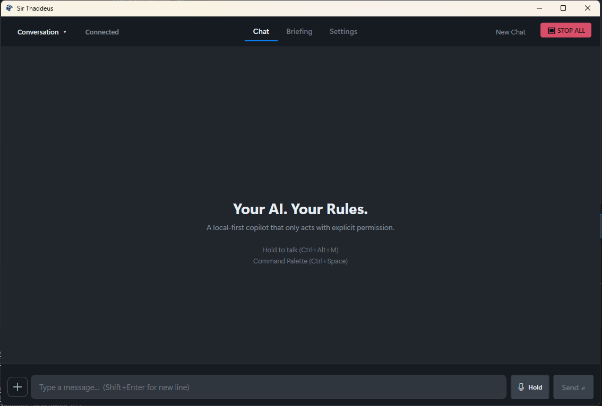
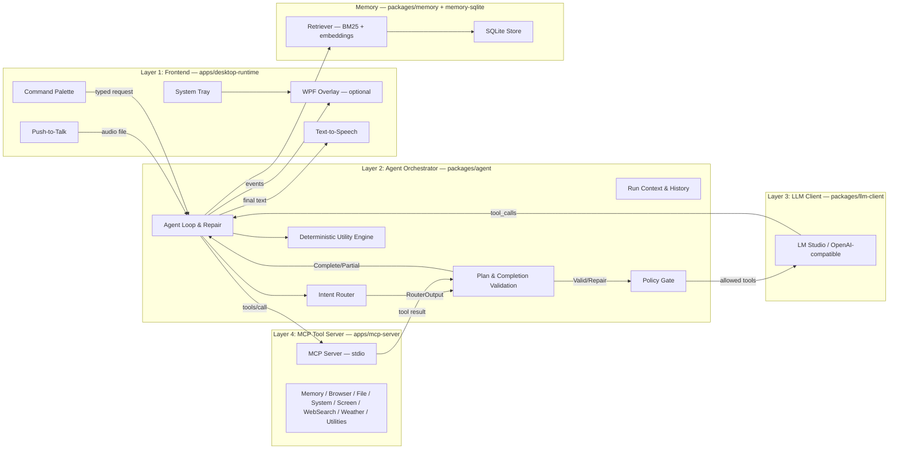

<div align="center">
  

  <div style="font-size: 2em; font-weight: bold; margin-top: 0.5em;">Sir Thaddeus</div>
  
  <p>
    <strong>A permissioned AI runtime that runs on your machine.</strong>
  </p>

  <hr width="100%" />
</div>

## A Local‑First AI Copilot

Most AI assistants live in the cloud.

Sir Thaddeus runs on your machine.

A local-first, permissioned AI runtime for Windows. Connects to your local models (such as LM Studio) and executes actions only with explicit approval.

No telemetry by default. No background activity without consent. No hidden autonomy.

If he acts, you see it. If you press STOP, everything stops.

---

## What It Feels Like To Use

Hold your push‑to‑talk hotkey.

Say:

> “When is the grocery store open?”

Before doing anything, Thaddeus proposes a plan.

You see:

- What access is requested
- Why it’s needed
- How long it will last

You approve.

He performs the action. The result appears. The permission expires automatically. The action is written to a local audit log.

Nothing runs silently. Nothing lingers.

That same interaction pattern applies to everything.

<div align="center">
  
</div>

---

## Current Capabilities (V1)

### Interaction

- 🎙️ **Push-to-talk voice** (release to send)
- ⌨️ **Command palette** for typed workflows
- 🛑 **Global STOP kill switch**

### Local Intelligence

- 🧠 **Local LLM integration** (LM Studio supported)
- 🔍 **First-principles reasoning** for breaking down problems and reframing logic puzzles
- 📚 **Lightweight document reading** (text-based files)

### System Awareness (Permissioned)

- 🖥️ **Screen reading** (active window or full screen)
- 🌐 **Browser search and page reading**
- 📂 **File listing and file reading** (size-limited, read-only)
- 🧾 **Allowlisted system commands**

### Trust & Safety

- 🔐 **Explicit, time-boxed permission tokens**
- 📜 **Local, append-only audit log**
- 🚨 **Panic mode + safe mode fail-closed gates**
- 🧮 **Tool budgets** to prevent runaway automation

### Optional (if service connected)

- 👀 **Background “watchers”** for website changes
- 🔔 **Local notifications** for monitored events

---

## Quick Start

No cloud account required. No telemetry by default.

Getting up and running takes a few minutes.

1. Go to the **Releases** page.
2. Download the latest release ZIP.
3. Unzip the archive.
4. Run `SirThaddeus.exe`\
   (Windows may show a security warning — choose *More Info → Run Anyway*.)
5. Start your local LLM runner.\
   *(Tested with LM Studio.)*
6. Follow the initial setup prompt inside the app.

That’s it.

---

## The Contract

1. **You are the principal.** He proposes plans; you approve them.
2. **Nothing runs silently.** If it acts, you see it.
3. **STOP always works.** The kill switch revokes permissions and halts execution immediately.

Sir Thaddeus is not designed to replace your agency. He is designed to extend it — with boundaries.

---

## Architecture (4 layers)


```mermaid
flowchart LR
  subgraph frontend [Layer 1: Frontend — apps/desktop-runtime]
    Tray[System Tray]
    Overlay[WPF Overlay — optional]
    PTT[Push-to-Talk]
    TTS[Text-to-Speech]
    Palette[Command Palette]
  end

  subgraph agent [Layer 2: Agent Orchestrator — packages/agent]
    Loop[Agent Loop & Repair]
    Context[Run Context & History]
    Router[Intent Router]
    Gate[Policy Gate]
    Validation[Plan & Completion Validation]
    Utilities[Deterministic Utility Engine]
  end

  subgraph llm [Layer 3: LLM Client — packages/llm-client]
    LmStudio[LM Studio / OpenAI-compatible]
  end

  subgraph memory [Memory — packages/memory + memory-sqlite]
    Store[SQLite Store]
    Retriever[Retriever — BM25 + embeddings]
  end

  subgraph mcp [Layer 4: MCP Tool Server — apps/mcp-server]
    Server[MCP Server — stdio]
    Tools[Memory / Browser / File / System / Screen / WebSearch / Weather / Utilities]
  end

  PTT -->|audio file| Loop
  Palette -->|typed request| Loop
  Loop --> Router -->|RouterOutput| Validation
  Validation -->|Valid/Repair| Gate
  Gate -->|allowed tools| LmStudio
  LmStudio -->|tool_calls| Loop
  Loop -->|tools/call| Server
  Server -->|tool result| Validation
  Validation -->|Complete/Partial| Loop
  Loop --> Retriever --> Store
  Loop --> Utilities
  Loop -->|final text| TTS
  Loop -->|events| Overlay
  Tray --> Overlay
```

### Layer responsibilities

| Layer          | Project(s)                                  | Responsibility                                                                  | Talks to                        |
| -------------- | ------------------------------------------- | ------------------------------------------------------------------------------- | ------------------------------- |
| **Frontend**   | `apps/desktop-runtime`                      | Hotkeys, tray, overlay, PTT capture trigger, TTS output, Chat/Memory/Profile UI | Agent orchestrator (in-process) |
| **Agent**      | `packages/agent`                            | Routing, policy gates, validation, bounded repair loops, deterministic utilities| LLM client + MCP client         |
| **LLM client** | `packages/llm-client`                       | OpenAI-style `/v1/chat/completions` + `/v1/embeddings` calls                    | LM Studio HTTP server           |
| **Memory**     | `packages/memory`, `packages/memory-sqlite` | Retrieval engine (BM25 + embeddings), scoring, gating, SQLite store             | —                               |
| **MCP server** | `apps/mcp-server`                           | Exposes tools over MCP stdio: memory, browser, file, system, screen, web search | Desktop runtime (child process) |

---

## Project structure

```
sir-thaddeus/
├── apps/
│   ├── desktop-runtime/
│   ├── voice-host/
│   ├── voice-backend/
│   └── mcp-server/
├── assets/
├── packages/
├── tests/
├── tools/
└── project-notes/
```

---

## License

See LICENSE file.

