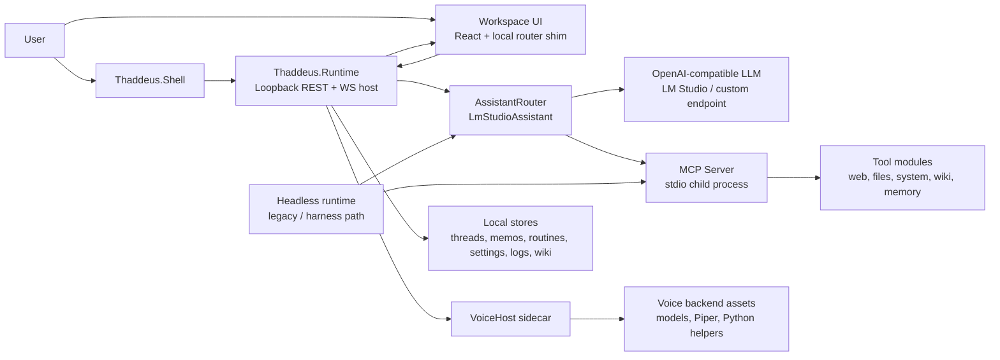

# Architecture And Feature Overview

Sir Thaddeus is a local-first assistant system built from a launcher shell, a loopback runtime, a React workspace, a permission-gated assistant pipeline, a stdio MCP tool server, and a voice sidecar. This document is meant to be a review document: what exists now, how it fits together, what the major features are, and which pieces are still transitional.

This overview reflects the current code in [src/Thaddeus.Runtime/](../src/Thaddeus.Runtime/), [src/Thaddeus.Shell/](../src/Thaddeus.Shell/), [web/](../web/), [apps/mcp-server/](../apps/mcp-server/), [apps/voice-host/](../apps/voice-host/), and the supporting [packages/](../packages/). Where older migration notes or legacy comments disagree, this file favors the current codebase.

## Executive Summary

- The primary product surface is the hybrid shell: [src/Thaddeus.Runtime/](../src/Thaddeus.Runtime/) hosts the API and web bundle, [web/](../web/) provides the workspace UI, and [src/Thaddeus.Shell/](../src/Thaddeus.Shell/) launches and supervises the runtime.
- The legacy terminal runtime in [apps/headless-runtime/](../apps/headless-runtime/) still exists for the harness and transition work, but it is no longer the main user surface.
- Tooling is isolated behind [apps/mcp-server/](../apps/mcp-server/) and a manifest-driven MCP contract in [packages/mcp-shared/](../packages/mcp-shared/).
- Voice is split out into [apps/voice-host/](../apps/voice-host/) plus local backend assets and models in [apps/voice-backend/](../apps/voice-backend/).
- Persistence is local: threads, memos, routines, settings, logs, audit files, and wiki content are written to the local machine.
- The trust model is explicit: loopback-only hosting, per-launch bearer tokens, visible permission prompts, audit logging, bounded tool execution, and kill/stop controls.

## System Topology

## Current Runtime Surfaces

| Surface | Project(s) | Role | Current Status |
| --- | --- | --- | --- |
| Hybrid runtime | [src/Thaddeus.Runtime/](../src/Thaddeus.Runtime/) | Loopback API host, static workspace host, runtime state/event hub, storage composition root | Active and primary |
| Workspace UI | [web/](../web/) | Browser-based workspace for chat, memory, routines, settings, diagnostics, wiki, activity, onboarding, compact mode | Active and primary |
| Launcher shell | [src/Thaddeus.Shell/](../src/Thaddeus.Shell/) | Starts or attaches to runtime, opens workspace window, manages tray/shortcuts/compact window on supported platforms | Active, Windows-first |
| MCP server | [apps/mcp-server/](../apps/mcp-server/) | stdio tool server used by the assistant tool loop | Active |
| Voice host | [apps/voice-host/](../apps/voice-host/) | HTTP sidecar for ASR/TTS and voice-health supervision | Active |
| Voice backend assets | [apps/voice-backend/](../apps/voice-backend/) | Local models, Python helpers, Piper voices, YouTube transcription pipeline, bootstrap scripts | Active support bundle |
| Headless runtime | [apps/headless-runtime/](../apps/headless-runtime/) | Legacy terminal runtime and v1 harness surface | Transitional / legacy |
| Optional search stack | [apps/searxng/](../apps/searxng/) | Optional local search infrastructure used by the wider search/tooling stack | Optional support surface |

The old Avalonia desktop client has been removed. The current desktop path is the shell plus the browser-hosted workspace.

## Core Design Principles

- Local-first by default: the system is designed to run on the user's machine, with local storage and loopback-only runtime hosting.
- Permissioned execution: dangerous capabilities are grouped and explicitly gated before use.
- Visible actions: the workspace surfaces activity, permission prompts, runtime state, and kill controls.
- Bounded loops: tool execution, previews, and retries are deliberately limited to reduce runaway behavior.
- Graceful degradation: when the LLM, MCP server, or voice host is unavailable, the runtime falls back rather than crashing the whole app.
- Replaceable boundaries: LLMs, voice providers, and tool modules are hidden behind interfaces or sidecars instead of being hard-wired into the UI.

## End-To-End Flows

### Typed chat flow

1. [src/Thaddeus.Shell/](../src/Thaddeus.Shell/) ensures the runtime is running, performs an IPC handshake, and opens the workspace URL.
2. [src/Thaddeus.Runtime/Api/WorkspaceHostingExtensions.cs](../src/Thaddeus.Runtime/Api/WorkspaceHostingExtensions.cs) serves `index.html` and injects the runtime token, port, version, and route hint.
3. The SPA uses REST for CRUD operations and `/ws` for turn streaming and runtime events.
4. User input is posted to `/api/threads/{id}/messages`.
5. [src/Thaddeus.Runtime/Chat/AssistantRouter.cs](../src/Thaddeus.Runtime/Chat/AssistantRouter.cs) chooses between `StubAssistant` and `LmStudioAssistant` based on current settings and endpoint health.
6. [src/Thaddeus.Runtime/Chat/LmStudioAssistant.cs](../src/Thaddeus.Runtime/Chat/LmStudioAssistant.cs) builds the system prompt, history window, and tool definitions; [LmStudioAssistant.Pipeline.cs](../src/Thaddeus.Runtime/Chat/LmStudioAssistant.Pipeline.cs) owns the per-turn composition documented in [ASSISTANT_PIPELINE.md](ASSISTANT_PIPELINE.md).
7. The turn pipeline can inject memory context, personality shaping, dialogue-state continuity, guardrails, search fallback, footman tool-family narrowing, completion validation, and repair.
8. [src/Thaddeus.Runtime/Chat/ChatTurnPublisher.cs](../src/Thaddeus.Runtime/Chat/ChatTurnPublisher.cs) streams deltas over WebSocket while the thread store persists the final message.
9. The runtime state machine and activity log update in parallel so the UI can show progress and audit data immediately.

### Tool-assisted turn flow

1. The assistant asks [src/Thaddeus.Runtime/Tools/McpClientHost.cs](../src/Thaddeus.Runtime/Tools/McpClientHost.cs) for available MCP tools.
2. `BuildToolDefinitionsAsync` converts the tool manifest into model function definitions.
3. An optional footman router narrows tool families before the main model sees them.
4. Each tool call is routed through [src/Thaddeus.Runtime/Tools/RuntimePermissionGateAdapter.cs](../src/Thaddeus.Runtime/Tools/RuntimePermissionGateAdapter.cs) into [src/Thaddeus.Runtime/Tools/ToolPermissionGate.cs](../src/Thaddeus.Runtime/Tools/ToolPermissionGate.cs).
5. If policy is `ask`, the runtime emits a `permission.request` event, the UI surfaces [web/src/components/PermissionModal.tsx](../web/src/components/PermissionModal.tsx), and the decision is posted to `/api/permissions/respond`.
6. Approved calls cross the stdio boundary into [apps/mcp-server/SirThaddeus.McpServer/Program.cs](../apps/mcp-server/SirThaddeus.McpServer/Program.cs) and dispatch into the registered tool assemblies.
7. Tool results are appended to the turn history and fed back into the LLM until a final answer is produced or the round-trip cap is reached.
8. If MCP is not ready, the runtime keeps operating in text-only mode and returns a bounded unavailable message for the tool call.

### Voice flow

1. The shell can emit push-to-talk phases to `/api/voice/ptt/down`, `/api/voice/ptt/up`, and `/api/voice/ptt/shutup`.
2. The workspace listens on `/api/voice/ptt/events` and can also capture microphone input directly in the browser.
3. The runtime ensures [src/Thaddeus.Runtime/Voice/VoiceHostProcessSupervisor.cs](../src/Thaddeus.Runtime/Voice/VoiceHostProcessSupervisor.cs) has a responsive voice host, starting it if necessary.
4. `/api/voice/asr` proxies captured audio to the voice sidecar and returns the transcript.
5. The transcript is sent through the same assistant pipeline as typed chat.
6. `/api/voice/tts` proxies assistant text to the voice sidecar and streams synthesized audio back to the browser.

### Wiki flow

1. Local wiki roots, folders, pages, revisions, import/export, and search live behind `/api/wiki/*`.
2. The workspace exposes a dedicated `/wiki` route and can also attach wiki context to normal chat turns.
3. Page-specific assistant endpoints support page chat, draft generation, and selected-text rewriting.

### Routine flow

1. Users create routines with checklist items and an optional prompt template.
2. Runs are started explicitly by the user. There is no background scheduler in the current v2 runtime.
3. The UI patches checklist completion and notes, then completes or discards the run.
4. Routine mutations and lifecycle events are appended to the audit log.

## Layered Architecture

The original repo documentation described a five-layer split. That model still applies, but the current product is easier to understand as seven operational layers.

| Layer | Main Projects | Responsibility |
| --- | --- | --- |
| Shell and desktop host | [src/Thaddeus.Shell/](../src/Thaddeus.Shell/) | Process supervision, workspace window, tray integration, global shortcuts, compact panel lifecycle |
| Runtime host | [src/Thaddeus.Runtime/](../src/Thaddeus.Runtime/) | Loopback API, static asset hosting, WebSocket broadcasting, local stores, sidecar composition |
| Workspace UI | [web/](../web/) | Chat, wiki, memory, routines, settings, diagnostics, onboarding, activity, compact experience |
| Assistant and orchestration | [src/Thaddeus.Runtime/Chat/](../src/Thaddeus.Runtime/Chat/), [packages/agent/](../packages/agent/) | Routing, history shaping, memory/personality injection, tool loop, validation and repair |
| Model integration | [packages/llm-client/](../packages/llm-client/) | OpenAI-compatible chat client, token budgets, endpoint abstraction |
| Tools and knowledge | [apps/mcp-server/](../apps/mcp-server/), [packages/mcp-tools-core/](../packages/mcp-tools-core/), [packages/mcp-tools-windows/](../packages/mcp-tools-windows/), [packages/wiki/](../packages/wiki/) | Web, file, system, screen, semantic memory, and wiki capabilities |
| Voice | [apps/voice-host/](../apps/voice-host/), [apps/voice-backend/](../apps/voice-backend/), [src/Thaddeus.Tts.Abstractions/](../src/Thaddeus.Tts.Abstractions/), [src/Thaddeus.Tts.Kokoro/](../src/Thaddeus.Tts.Kokoro/), [src/Thaddeus.Tts.Piper.Legacy/](../src/Thaddeus.Tts.Piper.Legacy/) | Speech-to-text, text-to-speech, voice sidecar startup, local model assets |

## Package And Project Map

| Area | Projects | Responsibility |
| --- | --- | --- |
| Runtime and shell | [src/Thaddeus.Runtime/](../src/Thaddeus.Runtime/), [src/Thaddeus.Shell/](../src/Thaddeus.Shell/), [web/](../web/) | Active product surface |
| Shared contracts | [packages/shared-types/](../packages/shared-types/), [packages/shared-schemas/](../packages/shared-schemas/), [packages/contracts/](../packages/contracts/) | DTOs and shared models used across runtime, UI, and services |
| Assistant core | [packages/agent/](../packages/agent/), [packages/llm-client/](../packages/llm-client/), [packages/personality-engine/](../packages/personality-engine/), [packages/permission-broker/](../packages/permission-broker/), [packages/tool-runner/](../packages/tool-runner/), [packages/observation-spec/](../packages/observation-spec/) | Tool-capable agent loop, routing, validation, repair, personality, permissions |
| Tooling and search | [apps/mcp-server/](../apps/mcp-server/), [packages/mcp-shared/](../packages/mcp-shared/), [packages/mcp-tools-core/](../packages/mcp-tools-core/), [packages/mcp-tools-windows/](../packages/mcp-tools-windows/), [packages/web-search/](../packages/web-search/), [packages/local-tools/](../packages/local-tools/), [packages/document-reader/](../packages/document-reader/) | Tool manifest, MCP transport, tool implementations, search providers, local file/document extraction |
| Knowledge and memory | [packages/memory/](../packages/memory/), [packages/memory-sqlite/](../packages/memory-sqlite/), [packages/wiki/](../packages/wiki/) | Retrieved semantic memory, SQLite storage, core pinned memory, and the local wiki canvas |
| Platform and infrastructure | [packages/config/](../packages/config/), [packages/core/](../packages/core/), [packages/runtime-host/](../packages/runtime-host/), [packages/logging/](../packages/logging/), [packages/startup-diagnostics/](../packages/startup-diagnostics/), [packages/voice/](../packages/voice/) | Configuration, logging, runtime helpers, diagnostics, shared voice contracts |
| Legacy and harness | [apps/headless-runtime/](../apps/headless-runtime/), [tools/](../tools/) | Older runtime surface, harnesses, migration and transition support |

## User-Facing Feature Inventory

| Area | Current Feature Set | Notes |
| --- | --- | --- |
| Chat and threads | Create threads, auto-title first turn, rename, pin, delete, retry latest reply, stream assistant deltas, render Markdown, surface sources, show tool activity, show footman decisions | Main conversation surface |
| Voice | Browser mic capture, shell-driven push-to-talk phases, ASR proxy, TTS proxy, Piper voice catalog, voice-host health and warmup, stop-all control | Windows-first shell ergonomics, browser voice path available in workspace |
| Search and live data | Web search, direct page fetch, place discovery, place lookup, weather geocoding, weather forecast, timezone resolution, holiday lookup, feed fetch, URL status checks | Exposed through MCP tools |
| Memory | Semantic memory audit UI, recall chips, pinned core memory, and agent memory retrieve/store/update/delete/list tools | Wiki is the user-curated knowledge surface; memory is the retrieval/audit substrate |
| Files and knowledge | File list/read with preview/apply pattern, document extraction, allowlisted roots, and wiki tools | File access is permission-gated and root-scoped |
| Wiki | Root/folder/page CRUD, move/rename/delete/restore/purge, revisions, graph view endpoint, search, import/export, page chat, page drafting, selected-text rewrite | More capable than the older summary docs suggest |
| Routines | Routine CRUD, checklist runs, run history, run patching, completion, discard | Manual accountability surface; no scheduler yet |
| Settings and diagnostics | Model provider configuration, gatekeeper status, audio devices, voice catalogs, file-root policy, location and units, privacy flags, runtime info, diagnostics cards | Settings tabs are `general`, `models`, `audio`, `files`, `location`, and `advanced` |
| Shell and desktop | Managed runtime start/attach, workspace window, compact panel route and launcher, tray support, stop-all action, global shortcuts, runtime kill flow | Windows has the richest implementation |
| Local model integration | LM Studio preset, Ollama OpenAI shim preset, custom OpenAI-compatible endpoint, hosted OpenAI preset | The router falls back to a stub when the configured provider is unavailable |

## Workspace UI Surface

### Routes

| Route | Purpose |
| --- | --- |
| `/` | Home / quick-start surface with chat entry and voice affordances |
| `/chat` | Thread list |
| `/chat/:threadId` | Active conversation view |
| `/wiki` | Local wiki canvas |
| `/history` | Searchable thread history and management |
| `/activity` | Activity feed |
| `/activity/:entryId` | Activity entry detail |
| `/memory` | Memo management |
| `/routines` | Routine list |
| `/routines/:id/edit` | Routine editor |
| `/routines/:id/run` | Active routine run |
| `/routines/:id/history` | Routine run history |
| `/settings` | Settings landing page |
| `/settings/:category` | Settings deep-link |
| `/diagnostics` | Runtime/system diagnostics |
| `/onboarding` | First-run setup |
| `/compact` | Compact quick-interaction surface |

### Root-level UI systems

- [web/src/routes/__root.tsx](../web/src/routes/__root.tsx) hosts the main workspace chrome.
- [web/src/components/PermissionModal.tsx](../web/src/components/PermissionModal.tsx) handles tool approval decisions.
- [web/src/components/KillAppButton.tsx](../web/src/components/KillAppButton.tsx) triggers runtime kill behavior.
- Runtime metadata is injected by the server and read by [web/src/lib/runtime.ts](../web/src/lib/runtime.ts).
- Runtime state, permissions, chat, wiki, and activity are synchronized through the SPA stores in [web/src/stores/](../web/src/stores/).

## Runtime API Surface

### State and workspace hosting

| Endpoint(s) | Purpose |
| --- | --- |
| `/` and `/index.html` | Serve the workspace bootstrap with injected runtime metadata |
| `/compact` | Serve the compact workspace bootstrap |
| `/ws` | Runtime WebSocket for chat deltas, permissions, state, and other events |
| `/api/state` | Runtime state snapshot |
| `/api/health` | Basic liveness |
| `/api/runtime-info` | Version, port, pid, uptime, parent shell status, lockfile path |
| `/api/runtime/stop` | Graceful shutdown |
| `/api/runtime/kill` | Hard kill of runtime or parent-managed process tree |
| `/api/stop-all` | Stop in-flight voice work and managed sidecars |
| `/api/_debug/state` | Test-mode-only state forcing endpoint |

### Chat

| Endpoint(s) | Purpose |
| --- | --- |
| `GET /api/threads` | List threads |
| `POST /api/threads` | Create thread |
| `GET /api/threads/{id}` | Get thread |
| `PATCH /api/threads/{id}` | Rename or pin thread |
| `DELETE /api/threads/{id}` | Delete thread |
| `POST /api/threads/{id}/messages` | Append user message and start assistant turn |
| `POST /api/threads/{id}/messages/retry` | Remove latest assistant reply and rerun from prior user message |

### Memory, routines, activity, and settings

| Group | Endpoint(s) |
| --- | --- |
| Memory audit | `GET /api/memory/overview`, `GET /api/memory/{nuggets,facts,events,profiles}`, `DELETE /api/memory/{nuggets,facts,events}/{id}`, `POST /api/memory/nuggets/{id}/pin`, `POST /api/memory/reflect` |
| Routines | `GET/POST /api/routines`, `GET/PATCH/DELETE /api/routines/{id}` |
| Routine runs | `GET/POST /api/routines/{id}/runs`, `GET/PATCH/DELETE /api/routine-runs/{runId}`, `POST /api/routine-runs/{runId}/complete` |
| Activity | `GET /api/activity`, `GET /api/activity/{id}` |
| Diagnostics | `GET /api/diagnostics` |
| Settings | `GET/PUT /api/settings`, `POST /api/settings/test-llm`, `GET /api/settings/gatekeeper-status` |
| Permissions | `GET /api/permissions/pending`, `POST /api/permissions/respond` |
| Audio | `GET /api/audio/devices` |

### Voice

| Endpoint(s) | Purpose |
| --- | --- |
| `GET /api/voice/piper-voices` | Enumerate Piper voices |
| `GET /api/voice/host-health` | Probe or ensure the voice host |
| `POST /api/voice/warmup` | Warm the voice host |
| `POST /api/voice/tts` | Proxy TTS |
| `POST /api/voice/asr` | Proxy ASR |
| `POST /api/voice/ptt/{phase}` | Push-to-talk phase relay (`down`, `up`, `shutup`) |
| `GET /api/voice/ptt/events` | SSE stream for PTT events |

### Wiki

The wiki API is broad enough to treat as a subsystem rather than a single CRUD surface.

| Endpoint family | Purpose |
| --- | --- |
| `/api/wiki/roots` | List, create, rename, remove, and export wiki roots |
| `/api/wiki/roots/{rootId}/tree` | Get a root tree snapshot |
| `/api/wiki/roots/{rootId}/folders/*` | Folder create, rename, move, delete, restore, purge |
| `/api/wiki/roots/{rootId}/pages` | Create pages |
| `/api/wiki/pages/{pageId}` | Read, update, move, rename, delete, restore, purge page documents |
| `/api/wiki/pages/{pageId}/graph` | Page graph data |
| `/api/wiki/pages/{pageId}/revisions*` | List and restore revisions |
| `/api/wiki/pages/{pageId}/chat` | Ask the assistant about a page |
| `/api/wiki/pages/{pageId}/draft` | Generate a page draft |
| `/api/wiki/pages/{pageId}/selection/rewrite` | Rewrite a selected passage |
| `/api/wiki/search` | Wiki search |
| `/api/wiki/roots/{rootId}/trash` | View soft-deleted content |
| `/api/wiki/roots/{rootId}/index/rebuild` | Rebuild the wiki index |
| `/api/wiki/roots/{rootId}/import/preview` and `/import` | Import preview and import execution |

## MCP Architecture And Hooks

The assistant never links tool implementations directly into the chat surface. Instead it talks to a child stdio MCP process, which keeps tool discovery, tool execution, and permission handling at a clean boundary.

### Runtime hook points

| Hook | What it does |
| --- | --- |
| [src/Thaddeus.Runtime/Tools/McpClientHost.cs](../src/Thaddeus.Runtime/Tools/McpClientHost.cs) | Spawns `SirThaddeus.McpServer`, performs the stdio handshake, exposes `IMcpToolClient`, and restarts the child when relevant settings change |
| [src/Thaddeus.Runtime/Chat/LmStudioAssistant.cs](../src/Thaddeus.Runtime/Chat/LmStudioAssistant.cs) | Calls `ListToolsAsync`, builds tool definitions, and runs the per-turn tool loop |
| [src/Thaddeus.Runtime/Tools/RuntimePermissionGateAdapter.cs](../src/Thaddeus.Runtime/Tools/RuntimePermissionGateAdapter.cs) | Bridges the agent pipeline's permission abstraction into the runtime permission gate |
| [src/Thaddeus.Runtime/Tools/ToolPermissionGate.cs](../src/Thaddeus.Runtime/Tools/ToolPermissionGate.cs) | Applies `ask`/`once`/`session`/`always`/`deny` behavior per tool group |
| [packages/mcp-shared/SirThaddeus.McpShared/ToolManifest.cs](../packages/mcp-shared/SirThaddeus.McpShared/ToolManifest.cs) | Canonical manifest of every tool, alias, category, permission requirement, and limit |
| [apps/mcp-server/SirThaddeus.McpServer/Program.cs](../apps/mcp-server/SirThaddeus.McpServer/Program.cs) | Registers tool assemblies with the MCP server host |

### Permission and environment hooks

- Tool groups are classified into safe, screen, files, system, web, memory-read, and memory-write lanes.
- Meta/time tools are effectively safe or low-risk; dangerous groups can be `off`, `ask`, or `always`.
- `Session` approvals are cached in-process. `Always` updates persisted settings.
- Typed `WikiWrite` capabilities are call-scoped exceptions: an explicit
  `Off` still denies immediately, while any otherwise permitted mutation asks
  for a fresh confirmation. Session and Always responses can approve only that
  call and are neither cached nor persisted. Wiki reads retain normal policy.
- File-access settings are turned into `ST_DOCUMENT_READER_*` environment variables for the MCP child process.
- When the MCP child is missing or still warming up, tool calls degrade to a bounded unavailable message instead of taking the runtime down.

### Tool inventory

The manifest currently defines these tool groups.

| Category | Tool names | Notes |
| --- | --- | --- |
| Memory | `memory_retrieve`, `memory_store_facts`, `memory_update_fact`, `memory_list_facts`, `memory_delete_fact` | Mix of read and write; write tools are permission-gated |
| Web and live data | `web_search`, `browser_navigate`, `places_discover`, `places_lookup`, `weather_geocode`, `weather_forecast`, `resolve_timezone`, `holidays_get`, `holidays_next`, `holidays_is_today`, `feed_fetch`, `status_check_url` | Current/live information and URL fetches |
| Files and knowledge store | `file_read`, `file_read_preview`, `file_read_apply`, `document_read`, `file_list`, `file_list_preview`, `file_list_apply`, `knowledge_store_list_roots`, `knowledge_store_read_file`, `knowledge_store_list_files`, `knowledge_store_create_file`, `knowledge_store_append_to_file`, `knowledge_store_journal_log_entry` | Preview/apply pairs make file and command operations more explicit |
| Wiki canvas | `wiki_roots_list`, `wiki_root_create`, `wiki_root_rename`, `wiki_root_remove`, `wiki_tree_get`, `wiki_folder_create`, `wiki_folder_rename`, `wiki_folder_move`, `wiki_folder_delete`, `wiki_page_create`, `wiki_page_create_by_name`, `wiki_page_read`, `wiki_page_update`, `wiki_page_update_by_name`, `wiki_page_rename`, `wiki_page_rename_by_name`, `wiki_page_move`, `wiki_page_delete`, `wiki_page_delete_by_name`, `wiki_page_patch_selection`, `wiki_page_patch_selection_by_name`, `wiki_page_revisions_list`, `wiki_page_revision_restore`, `wiki_search` | Local Markdown-based wiki surface; by-name writes resolve unique targets inside the tool and fail closed on ambiguity |
| System and desktop | `system_execute`, `system_execute_preview`, `system_execute_apply`, `clipboard_read`, `clipboard_write`, `screen_capture`, `get_active_window` | `clipboard_*`, `screen_capture`, and `get_active_window` are Windows-specific desktop hooks |
| Meta and control plane | `tool_ping`, `tool_list_capabilities`, `health.check`, `capabilities.describe`, `policy.get_state`, `audit.export_bundle`, `policy.set_panic_mode`, `time_now` | Manifest, health, policy, diagnostics bundle, panic-mode control, and clock data |

### Registration model

- Core tools come from [packages/mcp-tools-core/](../packages/mcp-tools-core/).
- Windows-specific desktop tools come from [packages/mcp-tools-windows/](../packages/mcp-tools-windows/).
- The MCP host always registers the meta/core assembly and conditionally registers the Windows tool assembly.
- The runtime treats tool visibility as something to reduce, not expand. The footman and permission layers narrow exposure instead of widening it.

## Data, Storage, And State

| Item | Storage model | Notes |
| --- | --- | --- |
| Runtime lock file | Local lock-file path resolved at startup | Contains port, token, pid, start time, and sidecar metadata |
| Threads | JSON files under the runtime threads directory | Managed by `JsonFileThreadStore` |
| Settings | Local JSON settings file | Managed by `JsonFileSettingsStore` |
| Legacy memos | JSON files under the runtime memos directory | Read only by `MemosToWikiMigrator`; no active UI or REST surface |
| Routines and runs | JSON files under the runtime routines directory | Managed by `JsonFileRoutineStore` |
| Audit trail | `logs/audit.jsonl` under the runtime root | Append-only local audit log |
| Runtime logs | `logs/thaddeus-runtime-*.log` | Serilog rolling file sink |
| Wiki library | Local wiki root directory, defaulting to the user's Documents folder when not overridden | Managed by `LocalWikiStore`; test mode uses isolated storage |
| Semantic memory | SQLite database under the runtime root unless `ST_MEMORY_DB_PATH` is set | Powers recall, audit UI, reflection, and core pinned memory |
| Runtime state sync | `RuntimeStateMachine`, `StateSnapshot`, `EventBus`, `WebSocketBroadcaster`, `ChatTurnPublisher` | Used to synchronize UI state and turn streaming |

## Security, Trust, And Failure Model

- The runtime binds to `127.0.0.1` on an ephemeral port. It is not intended to be LAN-facing.
- Every `/api/*` request requires the per-launch bearer token. `/ws` uses `?access_token=` because browser WebSocket handshakes cannot set custom headers.
- The workspace bootstrap is the only anonymous surface. The runtime injects the bearer token and other metadata into the page.
- Tool permissions are explicit and group-based. Dangerous calls can be denied, allowed once, allowed for the session, or persisted as always allowed.
- The runtime can stop sidecars with `/api/stop-all` or kill the entire managed process tree with `/api/runtime/kill`.
- If the configured LLM endpoint is missing or unreachable, `AssistantRouter` falls back to the stub assistant so the UI still responds.
- If the MCP server is unavailable, the runtime keeps the assistant alive in text-only mode.
- Voice calls are bounded by startup and request timeouts and return explicit 5xx errors instead of hanging indefinitely.

## Current Completion Picture

### Core v1 and substantially implemented

- Hybrid runtime and self-contained packaging path
- Browser workspace with chat, history, activity, memory, routines, settings, diagnostics, onboarding, wiki, and beta compact route
- Shell launcher with runtime supervision, workspace launch, stop-all, and kill controls
- Permission modal plumbing and runtime permission APIs
- Manifest-driven MCP tool surface spanning web, files, wiki, system, memory, and desktop hooks
- Local wiki canvas with revisions, import/export, and assistant actions

### Present but beta for v1

- Voice sidecar supervision plus proxied ASR/TTS endpoints
- Push-to-talk, tray integration, global shortcuts, compact panel, clipboard/screen tools, and Windows desktop observation hooks

### Transitional or incomplete

- The legacy terminal runtime in [apps/headless-runtime/](../apps/headless-runtime/) still exists because the harness and some transitional workflows have not fully moved to the hybrid runtime.
- Profiles and personality administration are deferred from the active v1 workspace surface.
- Routines are explicitly manual. There is no scheduler, background automation worker, or unattended routine execution in the current hybrid runtime.
- Packaging gaps remain for polished installers and updates: MSIX, macOS app bundles, Linux desktop integration, and auto-update channels are documented in [docs/packaging.md](packaging.md).
- Cloud STT/TTS providers are still deferred in [docs/hybrid-shell.md](hybrid-shell.md).

### Areas to review carefully

- Some migration docs and comments still describe tray, push-to-talk ergonomics, or permission UX as future work, while the current repo already contains shell, shortcut, compact-panel, and permission-modal code. Treat tray, push-to-talk, global shortcuts, and compact mode as beta for v1 unless live Windows validation says otherwise.
- The v1 headless runtime and the v2 hybrid runtime both coexist. Review work should always distinguish the active product surface from the legacy harness surface.

## Review Checklist

Use this when evaluating whether the app is complete enough for your target release.

1. Can the shell reliably start or attach to the runtime, open the workspace, and shut everything down cleanly?
2. Can chat operate with both the stub assistant and a configured OpenAI-compatible local model?
3. Do permission prompts appear and resolve correctly for MCP web, file, system, screen, and memory-write actions?
4. If beta surfaces are being shown, do ASR, TTS, push-to-talk, tray, global shortcuts, compact mode, and Windows desktop hooks work correctly on the target Windows machine?
5. Do wiki create/edit/revision/import/export and page-assistant flows behave correctly on real content?
6. Are routine CRUD, run lifecycle, and audit events sufficient for the intended accountability workflow?
7. Does the legacy headless runtime still satisfy harness needs while the hybrid runtime remains the main user-facing surface?
8. Are the remaining packaging and installer gaps acceptable for the release you are reviewing?

## Related Docs

- [V1_SCOPE.md](archive/V1_SCOPE.md)
- [ARCHITECTURE_PUBLIC.md](ARCHITECTURE_PUBLIC.md)
- [ARCHITECTURE_EXECUTIVE_SUMMARY.md](ARCHITECTURE_EXECUTIVE_SUMMARY.md)
- [FEATURE_GAP_MATRIX.md](FEATURE_GAP_MATRIX.md)
- [DEMO_SCRIPT.md](DEMO_SCRIPT.md)
- [KNOWN_LIMITATIONS.md](KNOWN_LIMITATIONS.md)
- [RELEASE_CHECKLIST.md](RELEASE_CHECKLIST.md)
- [ROADMAP.md](ROADMAP.md)
- [docs/hybrid-shell.md](hybrid-shell.md)
- [docs/packaging.md](packaging.md)
- [docs/SETTINGS.md](SETTINGS.md)
- [docs/observability.md](observability.md)
