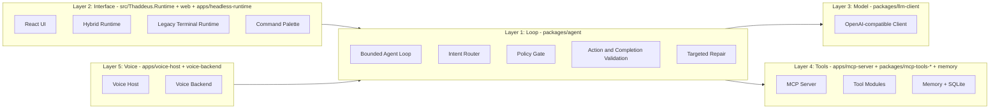

# Architecture Overview

## Five-Layer Architecture

Sir Thaddeus separates responsibilities into five layers so orchestration, model IO, tool execution, and voice/runtime boundaries stay explicit.

## Package Map

| Package | Responsibility | Key Interfaces |
|---------|----------------|----------------|
| `agent` | Route, gate, validate, complete, and repair responses | `IAgentOrchestrator`, `IRouter` |
| `audit-log` | Local append-only audit trail | `IAuditLogger` |
| `config` | Settings loading, defaults, validation | Settings models |
| `contracts` | Shared DTOs and contract types | Contract records/interfaces |
| `core` | Cross-cutting primitives (including cache) | `IResultCache` |
| `invocation` | Tool invocation models/abstractions | Invocation models |
| `llm-client` | OpenAI-compatible chat + embedding clients | `ILlmClient`, `IEmbeddingClient` |
| `local-tools` | Local helper tools (Playwright, etc.) | Tool classes |
| `mcp-shared` | Shared MCP tool metadata/types | Tool manifest and models |
| `mcp-tools-core` | Cross-platform MCP tool implementations | Tool classes |
| `mcp-tools-windows` | Windows-only MCP tools (screen, clipboard) | Tool classes |
| `memory` | Memory abstractions | Memory provider interfaces |
| `memory-sqlite` | SQLite-backed memory implementation | SQLite memory provider |
| `observation-spec` | Observation validation contracts | `ObservationSpecValidator` |
| `permission-broker` | Time-boxed permission token lifecycle | `IPermissionBroker` |
| `personality-engine` | Personality profile resolution | `IPersonalityEngine` |
| `runtime-host` | Shared runtime bootstrapping and env composition | Runtime host services |
| `tool-runner` | Bounded tool execution and loop budgeting | `IToolRunner` |
| `voice` | Voice contracts and transport types | Voice service interfaces |
| `web-search` | SearXNG/SearchAPI provider orchestration | `IWebSearchProvider` |
| `document-reader` | Local PDF/DOCX/XLSX/CSV/RTF/MD/TXT extraction | `IDocumentReader` |

## Agent Orchestrator Decomposition

`AgentOrchestrator` is split into focused partial classes (routing, LLM interaction, memory, web search, history/session state, and utility execution) to keep control-loop behavior modular while preserving one orchestrator contract.

## Routing Pipeline

1. `IntentFeatureExtractor` classifies intent and signals.
2. `RouterV2` and footman/arbitration policy select the strategy.
3. `PolicyGate` enforces permission and budget constraints.
4. `ToolLoop` executes bounded tool actions.
5. Completion validation determines done/retry/repair behavior.

## Search Pipeline

1. Search mode routing selects news/fact/deep-dive flow.
2. Entity resolution + query building shape tool calls.
3. MCP web tools fetch search/article data.
4. Clustering/formatting/synthesis build user-facing responses.
5. Source metadata and audit events are persisted for traceability.
