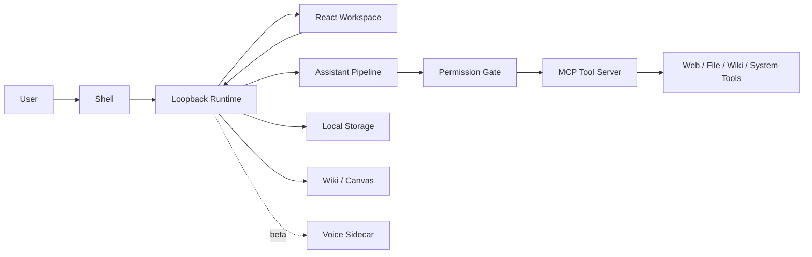

# Public Architecture Overview

Sir Thaddeus v1 is a local-first AI workspace for controlled agentic workflows. The architecture separates the desktop shell, loopback runtime, React workspace, assistant pipeline, MCP tool boundary, permission gate, local storage, wiki/canvas, and beta voice sidecar so each part has a narrow responsibility.

This document is the short public version. For deeper subsystem detail, read [ARCHITECTURE.md](ARCHITECTURE.md). For release scope, read [../V1_SCOPE.md](../V1_SCOPE.md). For completion status by subsystem, read [FEATURE_GAP_MATRIX.md](FEATURE_GAP_MATRIX.md).

## System Shape

## Shell

[src/Thaddeus.Shell/](../src/Thaddeus.Shell/) is the desktop entry point. It starts or attaches to the runtime, performs the IPC handshake, opens the workspace window, and coordinates shell-level controls such as stop-all, kill, tray, global shortcut, and compact-panel plumbing.

For v1, the shell is Windows-first. Tray, global shortcuts, push-to-talk, compact panel, clipboard/screen tools, and desktop observation hooks are beta surfaces that need live machine validation. Removing the Shell leaves a working product — you just lose tray and global hotkeys.

## Loopback Runtime

[src/Thaddeus.Runtime/](../src/Thaddeus.Runtime/) hosts the local API, WebSocket stream, static web workspace, local stores, sidecar supervision, MCP client host, permission gate, and assistant router. It binds to `127.0.0.1` on an ephemeral port and uses a per-launch bearer token for API calls.

Key entry points:

- REST endpoints in [Api/](../src/Thaddeus.Runtime/Api/) — `ChatApi`, `MemoryAuditApi`, `RoutinesApi`, `SettingsApi`, `ActivityApi`, `StateApi`, `PermissionsApi`, `AudioApi`, `WikiApi`, `VoiceApi`.
- WebSocket broadcaster (`/ws`) for state and event-bus messages.
- State machine in [State/RuntimeStateMachine.cs](../src/Thaddeus.Runtime/State/RuntimeStateMachine.cs).

The runtime is the composition root for v1. It is the surface that turns local settings, storage, tools, chat, wiki, activity, diagnostics, and voice sidecars into one local workspace.

## React Workspace

[web/](../web/) is the browser workspace served by the runtime. The active routes include chat, wiki, routines, memory, history, activity, diagnostics, settings, onboarding, and compact mode.

The workspace is not a marketing shell. It is the operational UI for threads, streamed replies, tool activity, permission prompts, wiki/canvas work, manual routines, diagnostics, and settings.

API wrappers under [web/src/lib/](../web/src/lib/) all funnel through `runtimeFetch()` which:

- Reads the bearer token from `<meta>` tags injected by the runtime before serving `index.html`.
- Sends the token via `Authorization: Bearer …` and `X-Thaddeus-Token`.
- Falls back to `?access_token=` query for endpoints that strip headers (and for WebSockets, per RFC 6750 §2.3).

## Assistant Pipeline

Chat enters the runtime through the chat API and is routed by `AssistantRouter`. The router can use a stub assistant for smoke testing or the LM-Studio/OpenAI-compatible assistant path for real model work.

The real assistant path builds a system prompt, prepares conversation history, exposes MCP tool definitions, streams deltas back to the UI, and records final messages in local thread storage. Model quality and tool reliability depend on the configured endpoint and model.

Optional **gatekeeper** model: a small fast model that pre-classifies each turn so the primary model only sees the tools that make sense. Configurable via Settings → Models → Verification model. Reuses the primary client when endpoints match (`reusePrimaryForGatekeeperOnSharedEndpoint`) to avoid LM Studio load/offload churn on single-GPU rigs.

## MCP Tool Boundary

Tool calls are not hidden inside the UI. The runtime starts [apps/mcp-server/](../apps/mcp-server/) as a stdio child process through `McpClientHost`. Tool names, groups, aliases, risk tiers, and categories are described by the shared manifest in [packages/mcp-shared/](../packages/mcp-shared/).

The v1 tool surface includes web/live-data tools, file/document tools, wiki and knowledge hooks, memory tools, utilities, and Windows-specific desktop hooks. File/document and live-data tools are core when they operate under permission gating. Clipboard, screen, and desktop observation hooks are beta.

The boundary is a process boundary. A tool cannot reach into the runtime; the runtime can only see the tool's declared input/output. This is the seam where the **permission gate** lives — the runtime intercepts every `tools/call` before it crosses to the MCP server.

## Permission Gate

`ToolPermissionGate` is the single chokepoint for tool execution. The contract:

- Each tool belongs to a **group** (`Web`, `Files`, `System`, `Screen`, `MemoryRead`, `MemoryWrite`).
- For each group, the user has a **policy** in `runtime-settings.json`: `off | ask | always`.
- The developer-override field can clamp the entire permission system to a stricter mode.
- A tool call resolves against policy:
  - `off` → instant refusal.
  - `always` → run, log, no prompt.
  - `ask` → emit a permission-request event over WebSocket; suspend the turn; resume when the user answers; record the decision.
- The user's answer is one of: **Deny / Once / Session / Always**.
- Every decision and every tool call is appended to `~/.thaddeus/logs/audit.jsonl`.

This is central to the product: Sir Thaddeus is intended to make tool access visible and reviewable, not silent.

## Local Storage

The runtime uses local stores for threads, semantic memory, legacy memo migration, routines, settings, audit logs, runtime logs, activity, and wiki data. Storage is part of the trust model: the app is designed around local persistence and local review surfaces rather than cloud sync.

| Path | Contents |
|---|---|
| `runtime.lock` | per-launch lock + bearer token + port. |
| `runtime-settings.json` | settings document (LLM, voice, audio, privacy, files, limits, permission policy). |
| `threads/*.json` | one file per chat thread. |
| `memos/*.json` | legacy memo files consumed by the one-shot wiki migrator. |
| `routines/*.json` | routines + run-history files. |
| `wiki/<root>/...` | wiki pages as Markdown + revisions + a metadata index. |
| `logs/thaddeus-runtime-*.log` | Serilog daily rolling. |
| `logs/audit.jsonl` | append-only tool / permission audit. |

Stores are interface-fronted (`IThreadStore`, `IMemoryStore`, `IMemoStore` for migration, `IRoutineStore`, `ISettingsStore`) so a future remote-store backend could slot in without changing call sites — but v1 is local-files-only.

Important review surfaces include chat history, tool activity, the activity feed, diagnostics, audit logs, and wiki revisions.

## Wiki / Canvas

[packages/wiki/](../packages/wiki/) and the runtime wiki API provide the durable knowledge surface. v1 includes wiki roots, folders, pages, search, revisions, import/export, and page assistant actions such as page chat, draft generation, and selected-text rewrite.

Pages are **Markdown** at rest. The editor (`web/src/components/wiki/WikiMarkdownEditor.tsx`) is a Tiptap-based editor; serialization round-trips through Markdown.

The wiki shares the agent loop: page chat, draft, and selected-text rewrite all run the same model + permission gate as the chat surface.

## Voice Sidecar (Beta)

Voice is architecturally present but beta for v1. The runtime can supervise a local VoiceHost process and proxy ASR/TTS requests, but real behavior depends on local assets, sidecars, models, drivers, and machine setup.

- **VoiceHost** (.NET) — sidecar exposing ASR (`/asr`) and TTS (`/tts`) over loopback. Hosts swappable engines via `ITtsEngine`.
- **voice-backend** (Python) — implements ASR via `faster-whisper` / `whisper.cpp`.
- **Thaddeus.Tts.Kokoro** — default TTS engine (KokoroSharp, CPU).
- **Thaddeus.Tts.Piper.Legacy** — legacy fallback for machines with existing Piper voices.

Voice, push-to-talk, and spoken workflows should not be the headline v1 demo. The runtime does not embed voice; if VoiceHost is down, every other feature still works.

## Trust And Failure Model

Sir Thaddeus v1 makes a specific, bounded trust claim:

- It is local-first.
- The runtime listens on loopback.
- Runtime APIs require a per-launch token.
- Tool calls cross an MCP boundary.
- Tool access is permission-gated.
- A meta-test in the runtime suite asserts no `IHostedService` performs background user-affecting work.
- Activity, diagnostics, audit logs, and wiki revisions provide review surfaces.
- Stop-all and kill controls are part of the public surface.
- If model or MCP services are unavailable, the app degrades rather than silently inventing tool results.

This is not a production-grade security claim. It is serious local systems engineering: visible actions, bounded local execution, explicit permissions, and honest failure modes.

What the system explicitly **does not** promise:

- Hardened multi-tenant security. The runtime trusts its own machine.
- Defence against a local user who has shell access. They can read `~/.thaddeus/`. So can the model server they configured.
- Cross-process isolation beyond the OS process boundary.
- Auto-recovery from a corrupted settings file beyond loading defaults with a "safe mode" flag (which clears on next successful load).

Failures are biased toward **visible refusal** rather than silent fallback.
