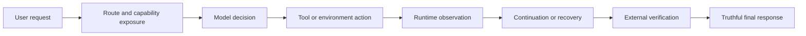
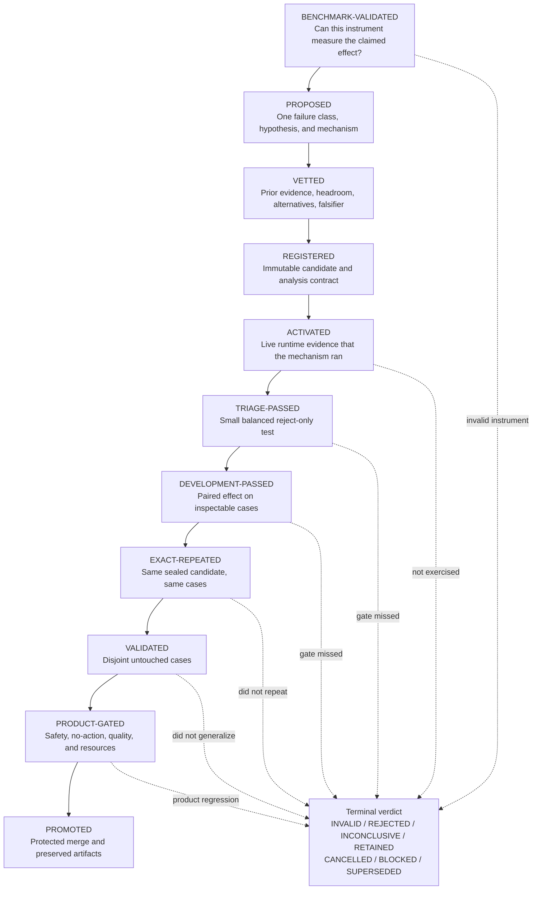

# Registered Sequential Agent-Harness Experiments

## Executive summary

Sir Thaddeus is built around a research question:

> Can one generalized change to an agent harness make the same frozen model
> complete more useful work, without hiding regressions in safety, truthfulness,
> conversation quality, latency, or resource use?

The project now answers that question with a method we provisionally call
**Registered Sequential Agent-Harness Experiments**, or **RSAHE**.

RSAHE is an engineering-science protocol for improving an agent harness without
benchmark-maxxing. It combines ideas that already have strong foundations:

- preregistration and results-blind review;
- controlled ablation and frozen confounders;
- sequential testing and early rejection;
- adaptive-data and holdout protections;
- repeated trials for stochastic agents;
- outcome-based agent evaluation; and
- software artifact review and independent reproduction.

The individual ingredients were not invented here. The contribution is their
combination into an executable product-development contract with several
agent-specific rules that are still uncommon in ordinary benchmark work:

1. validate the benchmark before interpreting a candidate;
2. distinguish failure to activate from failure to improve;
3. hold the model fixed when claiming harness lift;
4. require runtime-owned state and externally verified outcomes;
5. treat ordinary conversation and no-action behavior as independent gates;
6. separate exact repetition from fresh validation; and
7. record the entire candidate funnel, including invalid and negative results.

This is not a claim that a new scientific field or theorem has been invented.
It is a defensible claim that a domain-specific experimental method has been
developed by synthesizing established practices and operationalizing them for
agent-harness engineering. A targeted literature review found close relatives
for every major component, but no universally adopted protocol for this exact
combination. Establishing a priority claim would require a systematic review.

## Why an agent harness needs its own method

An ordinary model benchmark asks whether a model returned the expected answer.
An agent-harness experiment has a longer causal chain:



A final failure does not identify which link failed. A final success does not
prove that the proposed mechanism caused it. The model may have varied, the
candidate may never have activated, the scorer may be broken, an unintended
side effect may have satisfied a weak grader, or a stronger model call may have
been silently responsible.

Agent trajectories are also stochastic. Nominal temperature zero does not make
multi-step execution deterministic: small changes early in a trajectory can
compound through later observations and actions. A recent large empirical
study of agentic evaluations recommends multiple independent runs and power
analysis when small pass-rate changes matter.

RSAHE therefore treats **measurement validity**, **mechanism activation**,
**causal efficacy**, **generalization**, and **product acceptability** as
different questions. They are answered in that order.

## The central separation: exploration and confirmation

### Exploration

Exploration is allowed to be curious and adaptive. It may inspect development
failures, compare trajectories, read papers, test oracles, build synthetic
cases, and discard hypotheses quickly. Its purpose is to discover a plausible
mechanism and the smallest test capable of falsifying it.

Exploratory scores are not promotion evidence.

### Confirmation

Confirmation begins only after the candidate and experiment contract are
frozen in an immutable registration. The registration fixes the hypothesis,
mechanism, model, environment, task roles, planned looks, stop rules, analysis,
guardrails, and resource budget before scored execution.

If a result changes the mechanism, prompt, threshold, task selection, or
analysis, the next run is a new candidate. Any evidence that influenced that
change is consumed development evidence, not fresh validation.

This separation is the method's main defense against a common failure mode in
AI engineering: performing a long sequence of reasonable-looking tweaks, then
presenting the surviving winner as if it had been the original hypothesis.

## The full experiment lifecycle



Each gate earns only the next expense. Early tests can reject a candidate but
cannot promote it.

### Gate A: validate the measuring instrument

Before using a benchmark to judge a candidate, establish:

- pinned task, scorer, environment, and provider versions;
- a zero-model or known-wrong negative control;
- a known-state or known-answer positive control;
- scorer sensitivity to meaningful state changes;
- live transport and tool reachability;
- usable dynamic range for the frozen model and selected task tier;
- answer-blind task selection; and
- an explicit statement of what the score does and does not measure.

A metric pinned at zero cannot rank candidates. A weak grader that accepts an
empty answer cannot establish completion. In both cases, the experiment is
invalid before the candidate is considered.

### Gate B: propose and vet one causal mechanism

The proposal names one observed failure class, one recoverable bottleneck, one
generalized mechanism, and one falsification condition. It must explain why the
mechanism should help outside the motivating benchmark.

Before implementation, the vet asks:

1. Does an oracle show that this layer has meaningful headroom?
2. Does a reference scaffold expose the same model capability?
3. Is the proposed behavior supported by primary research or a working system?
4. Is there a simpler explanation?
5. Is this a renamed version of an already rejected mechanism?
6. What result would make us stop?

The purpose of the vet is not to approve ideas politely. It is to eliminate
weak ideas before they consume code and model time.

### Gate C: register the experiment

The immutable registration records, at minimum:

- experiment and parent-candidate identifiers;
- hypothesis, mechanism, non-goals, and rollback;
- baseline and candidate commits;
- exact model artifact, quantization, provider, context, sampling, prompts,
  tools, budgets, and environment versions;
- development, repeat, validation, and confirmation fingerprints;
- task contamination history;
- primary metric, paired estimand, and uncertainty method;
- activation condition and telemetry;
- positive, negative, no-op, blocker, permission, and safety controls;
- planned scored looks and maximum spend; and
- promotion, rejection, invalidity, and stopping rules.

A pushed commit on a protected remote is the internal minimum. A public claim
should use an externally time-stamped, immutable registration or signed release.

### Gate D: prove activation before efficacy

The experiment must prove that the mechanism reached the live runtime and
changed the state it claims to change. Useful evidence includes:

- the activation decision;
- runtime-owned typed state;
- state transitions;
- tool or transport receipts;
- the terminal reason; and
- zero inappropriate activation on controls.

Model-authored syntax that resembles a tool call is not proof that a tool ran.
A candidate that never activates is **INVALID**, not **REJECTED**. This
distinction prevents transport failures from being misreported as evidence
against an architectural idea.

### Gate E: reject sequentially

Run the cheapest test that can invalidate the current hypothesis:

1. static and deterministic checks;
2. one live transport and activation sentinel;
3. a balanced reject-only triage;
4. paired development evaluation;
5. exact repeat;
6. disjoint validation;
7. product and resource regression suites; and
8. an external benchmark or public submission.

The fast development loop should usually remain below ten minutes. Ten minutes
is a ceiling, not a target. Longer campaigns must earn their cost by surviving
the earlier gates.

Sequential inspection creates analytic freedom, so all scored looks and stop
rules are declared in advance. Early stopping is used primarily for rejection.
A positive scientific claim rests on the sealed final analysis, not on whichever
interim view looked best.

### Gate F: compare pairs, not only totals

The minimum result table is:

```text
baseline wins
candidate wins
paired gains
paired losses
unchanged successes
unchanged failures
invalid episodes
false successes
negative activations
model calls, tool calls, tokens, latency, and resource cost
```

An aggregate move from `10/16` to `12/16` can conceal three repaired cases and
one regression. The pair table exposes that trade. For binary paired outcomes,
the discordant pairs are the direct causal evidence; uncertainty should respect
pairing and task-family clustering.

### Gate G: repeat, then validate

An exact rerun of the same sealed candidate on the same cases measures
**repeatability**. It does not measure generalization.

Disjoint untouched tasks measure **validation**. Once their outcomes influence
the implementation, they become consumed development data. A later candidate
needs another fresh set for a new generalization claim.

For durable public claims, RSAHE ultimately seeks:

- **repeatability:** the same team reruns the sealed artifact and setup;
- **reproducibility:** an independent team obtains the result using supplied
  artifacts; and
- **replicability:** an independent team obtains a consistent result using an
  independently developed implementation or task family.

### Gate H: verify the world, not the model's confidence

The preferred success evidence is an externally observable postcondition:

- exact application or database state;
- file contents;
- successful deterministic computation;
- compiler or test result;
- tool trace and receipt;
- explicit permission outcome; or
- another independently checked state transition.

“The task is complete” is not evidence that the task is complete. Valid JSON,
plausible prose, a clean plan, or an LLM judge's stylistic approval can be
useful enabling signals, but they cannot override a failed postcondition.

## The three independent scorecards

Every experiment declares one primary scorecard. The other two remain hard
guardrails.

| Scorecard | Question | Appropriate evidence |
| --- | --- | --- |
| Model capacity | Did the model itself improve at closed-book knowledge, reasoning, or instruction following? | Strict answer correctness, calibration, robustness, and fresh capacity items without answer-producing tools. |
| Harness capability | Can the same frozen model complete more useful work because of the product? | Paired, independently verified answers, artifacts, state transitions, tool outcomes, and permission behavior. |
| Product quality | Did the system become faster, safer, clearer, or more reliable? | Latency, tokens, calls, memory/VRAM, false success, safety, permissions, conversation quality, personality, and continuity. |

A calculator-assisted answer is a harness win, not a raw math win. A stronger
model is a deployment comparison, not evidence that the fixed-model harness
improved. A latency reduction cannot erase a safety regression.

## The control structure

When attribution requires it, RSAHE uses up to four matched arms:

1. **Raw minimal:** the smallest valid evaluator prompt without product
   capabilities.
2. **Same-prompt direct:** the production identity and safety prompt with a
   single direct generation.
3. **Unchanged harness:** the production-equivalent Sir pipeline.
4. **Candidate:** the unchanged harness with one declared mechanism changed.

The model artifact, sampling, provider, context, tools, tasks, and budgets stay
fixed unless one of them is the declared treatment. Oracle-route, oracle-tool,
gold-evidence, and reference-scaffold arms are diagnostic ceiling tests. Their
success is not counted as Sir's success.

This structure supports two different questions:

```text
raw vs unchanged harness      -> current product contribution
unchanged harness vs candidate -> causal effect of the new mechanism
```

Conflating those comparisons is how a model upgrade, a prompt change, and a
harness change can accidentally become one impressive but uninterpretable
number.

## Why negative, no-action, and conversational controls are first-class

An assistant can improve an action benchmark by becoming overeager. That is not
necessarily product improvement.

Every relevant candidate is therefore tested on requests that should remain
inert or conversational, including:

- informational and hypothetical requests;
- explicit “do not act” or deferred intent;
- already-satisfied state;
- unavailable or ambiguous resources;
- impossible tasks and concrete blockers;
- permission-sensitive actions;
- paraphrases and renamed arguments;
- irrelevant tools or documents; and
- contradictory evidence.

This matters especially for Sir because the product thesis includes ordinary
conversation. Execution strength is not allowed to consume the assistant's
ability to explain, discuss, abstain, or ask a truthful clarification.

## What is genuinely distinctive here

The strongest claim is not that RSAHE invented preregistration, ablation, or
holdouts. It is that the method joins them at the precise fault lines exposed
by executable AI agents.

### 1. Benchmark validity comes before candidate validity

The benchmark itself must demonstrate dynamic range, state sensitivity, and
live transport. This is stronger than assuming a published benchmark is an
infallible ruler.

### 2. Activation is a separate causal gate

Agent systems can fail before the proposed mechanism is ever exercised. RSAHE
requires runtime telemetry and assigns `INVALID` rather than converting a
plumbing failure into a negative efficacy claim.

### 3. The harness is the treatment

The fixed-model comparison isolates what orchestration, tools, evidence,
permissions, and verification contribute. This directly addresses the question
Sir was built to answer.

### 4. Product behavior constrains the experiment

Conversation, no-action behavior, safety, permissions, latency, and resources
are independent gates, not prose in a limitations section after the score has
already won.

### 5. Engineering delivery is part of the evidence chain

A promising local run is not the endpoint. The sealed implementation, tests,
artifacts, protected review, remote CI, and post-merge state are part of the
claim. Rejected behavior is removed while its evidence remains discoverable.

### 6. The failed-candidate funnel is preserved

Publishing only the winner exaggerates the apparent reliability of the search
process. RSAHE records invalid, rejected, inconclusive, retained, cancelled,
blocked, superseded, and promoted candidates. That makes selection pressure
visible.

## A concrete example: why precise verdicts matter

The requirement-grounded verification candidate illustrates the method better
than a clean win.

The hypothesis was plausible: turn public user requirements into typed
obligations, refuse completion until fresh observations satisfy them, and send
unresolved obligations back to execution. Isolated typed-state construction
worked. But the nominal action and verification calls did not reach the live
MCP runtime.

Under a loose process, the result could be described as “verification did not
help.” Under RSAHE, it is **INVALID**: the candidate's core mechanism was not
exercised, so efficacy remains unknown. The next admissible experiment is not a
larger benchmark run or a prompt tweak. It is a small transport sentinel proving
one real action, one real verification, and one inert control through the
unchanged scaffold.

That verdict saves compute while preserving the idea from an unsupported
rejection. It is the scientific method doing useful engineering work.

## What the project evidence says so far

The research supports a narrower and more credible claim than “orchestration
makes a small model smarter”:

- The stabilized LFM 1.2B MMLU-Pro slice tied at `10/20` for raw, same-prompt
  direct, and the current harness. No repeatable closed-book uplift was found.
- Existing capabilities moved a fresh 20-task verified-outcome scorecard from
  `4/20` raw to `15/20` under unchanged Sir, while a compact-gold ceiling
  reached `19/20`.
- Fail-closed unique-file resolution improved a disjoint slice from `5/16` to
  `12/16` twice, with seven paired wins, zero losses, and fewer model calls.
- Wiki temporal-deferral policy improved validation from `4/18` to `13/18`
  while preserving every deferred state and immediate-action control.
- A narrow date/time utility added correctness and reduced positive
  first-visible p50 from `211.5 ms` to `5.5 ms` with zero model calls.
- Several attractive mechanisms—sampled voting, broad retries, recursive
  planning, and same-model critique—failed to produce reliable benefit or
  violated resource and safety gates. They were not retained as dormant
  product code.

These are bounded experiments, not a universal leaderboard. Their importance
is causal clarity: the same model completed more verified work because a narrow
mechanism changed, and the result had to survive paired losses and product
guardrails.

## What the method can and cannot establish

RSAHE can support this claim:

> Mechanism M changed; the model and relevant environment were held fixed; M
> activated where expected; its paired effect repeated; it survived fresh
> evaluation and product guardrails; and the outcome has a credible causal
> explanation.

It cannot, by itself, establish that:

- Sir is state of the art;
- a small synthetic result transfers to every real workflow;
- one exact repeat is independent reproduction;
- a consumed validation set is still unseen;
- a stronger model proves harness uplift;
- one benchmark represents the entire product thesis; or
- the method itself is superior to alternatives without a comparative study.

## Threats to validity

The method is strong, but not finished.

### Small samples and trajectory variance

The early funnel intentionally uses small samples to reject quickly. Those
samples are efficient engineering instruments, not precise estimates of a
population effect. A `+2/-0` result may justify the next gate without supporting
a broad claim.

### Researcher and implementer are often the same person

Registration reduces flexibility but does not eliminate subconscious choices
in task construction, mechanism design, adjudication, or reporting. Protected
Git history is weaker than results-blind external review.

### One mechanism at a time can miss interactions

Narrow ablation improves attribution, but agent mechanisms can interact. After
individual effects are established, a registered factorial or interaction
study may be more informative than permanently using one-factor-at-a-time
testing.

### Synthetic tasks can become proxy objectives

Even structurally realistic synthetic tasks may fail to predict long-horizon
native-runtime behavior. They should act as fast mechanism tests and regression
guards, with fresh external tasks reserved for confirmation.

### Benchmarks and products drift

Models, providers, tool servers, dependencies, and benchmarks change. Version
pins preserve interpretation of one result but do not guarantee current
performance. A temporal confirmation stream is necessary.

### The candidate search creates a winner's curse

Even when every individual test is clean, choosing the best result from many
candidates inflates expectations for the winner. Preserving the full candidate
funnel makes that pressure visible; an independent confirmation set is still
needed.

## How to strengthen RSAHE

### Immediate: make the current method harder to misuse

1. **Publish an append-only experiment ledger.** Give every candidate family
   and revision a stable identifier, parent, lifecycle transition, task-role
   fingerprint, and immutable artifact hash.
2. **Add a contamination ledger.** Record when every task or semantic family
   became development, repeat, validation, confirmation, consumed, or retired.
3. **Make benchmark validation executable.** Ship one command that runs the
   zero-model, known-state, scorer-sensitivity, transport, and dynamic-range
   sentinels before any candidate call.
4. **Require a causal trace.** Connect activation to typed intermediate state,
   tool receipt, postcondition, and terminal response so the proposed mechanism
   can be distinguished from model variance.
5. **Declare the unit of analysis.** Tasks, task families, and repeated
   trajectories are not interchangeable independent samples.
6. **Separate deterministic gates from inferential claims.** Use early gates to
   reject obvious failures; reserve confidence intervals and hypothesis tests
   for the sealed comparison on which the public claim rests.

### Next: improve statistical and external credibility

7. **Power material claims before running them.** Estimate baseline rate,
   plausible effect, clustering, and trajectory variance; predeclare enough
   independent runs to distinguish the intended change.
8. **Use paired uncertainty correctly.** Report discordant pairs, exact paired
   intervals or tests where appropriate, and task-family bootstrap intervals
   when cases are clustered.
9. **Predeclare sequential boundaries.** If interim looks can support a positive
   decision, use a group-sequential or alpha-spending design. Otherwise keep
   interim stages reject-only and base the claim on one sealed final look.
10. **Add robustness envelopes.** Predeclare a small set of defensible prompt,
    scorer, provider-order, and environment variants. A mechanism should not
    depend on one arbitrary specification.
11. **Run temporal confirmation.** Periodically draw fresh executable tasks
    created after the candidate froze, rather than repeatedly reusing a static
    holdout.
12. **Measure the Pareto frontier.** Report verified gain alongside calls,
    tokens, wall time, p95 latency, peak memory/VRAM, and escalation. There may
    be no single best candidate across all deployment constraints.
13. **Estimate population relevance.** Weight or stratify task families using a
    documented target-use distribution before making claims about ordinary
    user work.

### Public-research maturity

14. **Use an external immutable registration.** Deposit the protocol, hashes,
    planned analyses, and sealed artifacts in a time-stamped repository such as
    OSF, optionally under embargo.
15. **Adopt Stage 1 review.** Ask reviewers to critique the question, benchmark,
    controls, analysis, and stopping rules before results exist—the core idea
    behind Registered Reports.
16. **Package one-command reproduction.** Pin the environment, provide a smoke
    path, publish raw trajectories where licensing and privacy permit, and
    generate a machine-checkable report.
17. **Seek independent reproduction.** Have someone outside the implementation
    loop run the sealed artifact without task-answer knowledge.
18. **Seek replication and transfer.** Test the same mechanism with other model
    sizes, task families, and an independently implemented scaffold only after
    the fixed-model causal claim is established.
19. **Compare methods, not just candidates.** Run a meta-experiment comparing
    RSAHE with a conventional benchmark-iteration workflow on false promotions,
    compute spent, time to rejection, reproducibility, and validated gains.
20. **Publish the negative-results appendix.** The complete candidate funnel is
    part of the contribution, because it reveals how much search preceded each
    success.

## Make the method itself falsifiable

RSAHE should not become a ritual that is assumed to work because it sounds
scientific. Treat the protocol as another intervention and measure whether it
actually improves research decisions.

A comparative study should predeclare outcomes such as:

| Method outcome | Measurement |
| --- | --- |
| False promotion rate | Candidates that win development but lose untouched confirmation or independent reproduction. |
| False rejection rate | Candidates rejected by a fast gate that later pass a sufficiently powered diagnostic under the same hypothesis. |
| Invalid-run detection | Transport, scorer, activation, or attribution defects caught before an efficacy verdict. |
| Selection transparency | Proportion of attempted candidates represented in the public funnel. |
| Research efficiency | Wall time, model calls, tokens, and human review spent per valid verdict and per validated gain. |
| Reproducibility | Fraction of sealed result packages independently rerun without author intervention. |
| Decision stability | Whether the same evidence produces the same lifecycle verdict under blinded review. |

The strongest comparison would give two teams the same baseline, budget, and
failure corpus. One uses conventional iterative benchmark tuning; the other
uses RSAHE. Fresh confirmation would then compare not merely their best scores,
but their false promotions, compute cost, generalization, and explanatory
quality. RSAHE should be revised or rejected if it cannot demonstrate a useful
tradeoff.

## My assessment

RSAHE is a genuinely good method. Its strongest feature is not rigor for its
own sake; it is that each rule was purchased by a real failure:

- a broken calibration taught benchmark validation;
- nominal tool calls taught activation proof;
- stochastic reversals taught exact repetition;
- holdout iteration taught task-role accounting;
- false actions taught no-action controls;
- flat scores with major speed gains taught independent scorecards; and
- piles of abandoned branches taught the candidate ledger.

Methods formed this way are often more useful than an abstract checklist
because every gate has an operational reason to exist.

The most original and valuable idea is **activation before efficacy**, embedded
inside a registered promotion funnel. In an agent system, “the candidate did
not run” and “the candidate ran and did not help” are fundamentally different
scientific outcomes. Much evaluation practice still collapses them into one
score.

The second major contribution is treating product constraints as part of the
causal claim. A harness improvement is not just a benchmark point; it must
preserve the assistant's right to converse, abstain, verify a no-op, respect a
permission boundary, report a blocker, and remain affordable.

The method is ready to be named, versioned, used, and exposed for criticism. It
is not yet ready for a strong priority claim or for words such as “proven” or
“world-class.” The next credibility jump will not come from another internal
rule. It will come from external preregistration, powered stochastic evaluation,
and independent reproduction.

## A careful public claim

The defensible wording is:

> We developed Registered Sequential Agent-Harness Experiments, a protocol for
> evaluating fixed-model harness changes. It combines preregistration,
> benchmark validation, controlled ablation, live activation checks, paired
> sequential evaluation, adaptive-data protection, externally verified
> outcomes, and product-quality gates. Its distinctive contribution is the
> operational combination of these practices for production agent harnesses,
> not the invention of the underlying statistical or open-science techniques.

That is already a meaningful contribution. Many inventions are new components.
Others are new arrangements that make existing components solve a problem they
were not previously solving together. RSAHE is presently best understood as
the second kind.

## Reproduce or challenge it

The sibling evaluator's `docs/SCIENTIFIC_METHOD.md` is the authoritative
normative specification. This document is the public rationale and research
argument.

Continue with:

- [Experimentation](EXPERIMENTATION.md) for the product decision policy;
- [Benchmarking](BENCHMARKING.md) for suites and scorecards;
- [Testing](TESTING.md) for the shortest trustworthy commands;
- [Current evidence](research/CURRENT_EVIDENCE.md) for supported conclusions;
- [Experiment catalog](research/EXPERIMENT_CATALOG.md) for the complete local
  promotion, rejection, invalidity, and infrastructure record.

The private evaluator keeps hidden answers, scorer predicates, and untouched
holdouts outside production code. Independent reproductions, failed
replications, and specific criticism are welcome outcomes of publishing the
method.

## Research foundations

- Center for Open Science, [OSF registrations and preregistrations](https://help.osf.io/article/330-welcome-to-registrations).
- Scientific Reports, [Registered Reports](https://www.nature.com/srep/journal-policies/registered-reports).
- Bertinetto et al., [The NeurIPS preregistration experiment](https://proceedings.mlr.press/v148/bertinetto21a/bertinetto21a.pdf).
- Dwork et al., [Generalization in Adaptive Data Analysis and Holdout Reuse](https://papers.nips.cc/paper_files/paper/2015/hash/bad5f33780c42f2588878a9d07405083-Abstract.html).
- Zhu et al., [Establishing Best Practices for Building Rigorous Agentic Benchmarks](https://proceedings.neurips.cc/paper_files/paper/2025/hash/f316275b44ee2de533102913828a8107-Abstract-Datasets_and_Benchmarks_Track.html).
- Bjarnason et al., [On Randomness in Agentic Evals](https://arxiv.org/abs/2602.07150).
- Badertdinov et al., [SWE-rebench](https://arxiv.org/abs/2505.20411).
- Biderman et al., [Lessons from the Trenches on Reproducible Evaluation of Language Models](https://arxiv.org/abs/2405.14782).
- Pineau et al., [Improving Reproducibility in Machine Learning Research](https://jmlr.org/papers/v22/20-303.html).
- ACM, [Artifact Review and Badging](https://www.acm.org/publications/policies/artifact-review-and-badging-current).
