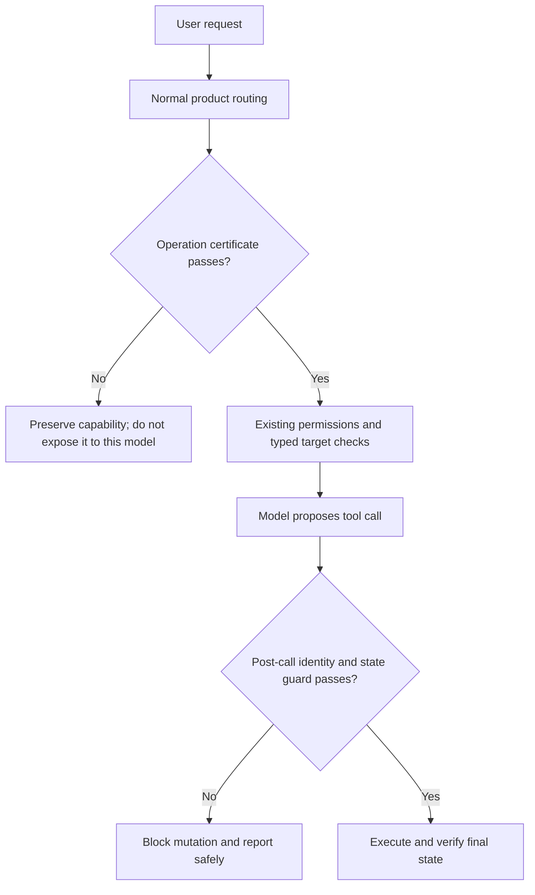
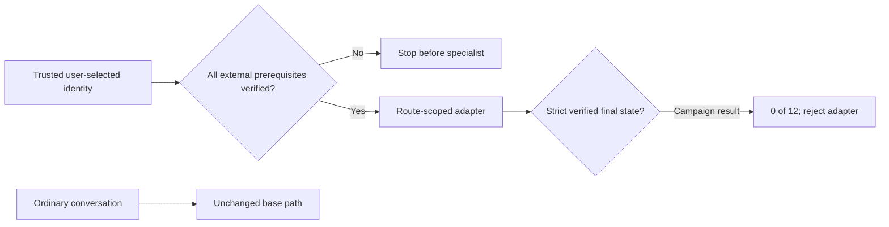

# Capability certification and specialization campaign

Date: 2026-08-01  
Product baseline: `01136576d20959820d4f462885199c366d86b72b`  
Primary fixed model: `LiquidAI/LFM2.5-1.2B-Instruct`  
Transfer diagnostic: `lfm2.5-8b-a1b` Q4_K_M

## 1. High-level result

No new production behavior was promoted. The campaign was still productive:
it turned three promising ideas into hard boundaries and isolated the next
credible orchestration seam.

| Question | Answer | Evidence |
|---|---|---|
| Can a fast certificate decide whether this 1.2B model may perform Wiki rename? | No for this configuration | 5/8; both conflict cases attempted wrong-target mutation |
| Is LM Studio unable to serialize LFM 8B tool calls? | No | Auto-choice update and rename produced exact calls |
| Does forcing a required tool repair LFM 8B? | No | Required rename emitted malformed control text until length |
| Does an extra pre-model conflict guard improve final outcomes? | No | 10/12 vs 9/12, one win, false read-only activation |
| Can route scoping eliminate universal-adapter conversation and stop regressions? | Yes, structurally | External eligibility gate 24/24; stopped/no-route calls 0 |
| Does the scoped 1.2B specialist execute fresh Wiki updates well enough? | No | Native 0/12 strict; adapter 0/12 strict and 0/12 valid |

The retained product position is therefore conservative and model-agnostic:
certify operations independently, preserve tools that fail certification, and
keep deterministic permissions and post-call identity checks authoritative.

## 2. How the pieces fit

Certification is deployment policy, not a benchmark bonus. It answers a
narrow question about one exact model, quantization, provider template, and
operation. It does not modify the model or make a failed operation safer.

The specialist experiment separated safety from competence:

That decomposition worked as an architecture: ordinary conversation and
missing resources never reached the specialist. It failed as a product
candidate because the specialist still could not perform the eligible work.

## 3. Deep dive

### Per-operation certification

The fresh Wiki-rename prerequisite contained four exact renames, two explicit
or hypothetical no-action controls, and two request-versus-selected-target
conflicts. LFM2.5 1.2B Q4_K_M reached 3/4 exact rename and 2/2 no-action, but
0/2 target conflicts. Both conflict cases attempted a mutation against the
wrong target. The safety stop fired immediately: no repeat and no product
exposure.

This is the intended behavior of the certificate system. A result such as
5/8 is not averaged into a permissive global score; the failed safety family
vetoes that operation. Other operations remain independently eligible.

### LFM 8B protocol attribution

The first 128-token diagnostic exhausted output in `reasoning_content` on
valid arms. A provider-supported 512-token follow-up established:

- automatic update: exact provider-serialized call;
- required update: exact provider-serialized call;
- automatic rename: exact provider-serialized call;
- required rename: malformed pseudo-control text, no call, length finish;
- no-action automatic control: correct abstention.

LM Studio serialization is therefore available. The failure is variable model
or template behavior, not a blanket provider inability. `tool_choice: required`
is too unreliable to use as the repair and cannot solve semantic target
binding even when it emits a syntactically valid call.

### Pre-model target-conflict guard

The candidate withheld Wiki-write tools when an explicitly labeled, quoted
root or page in the action clause conflicted with the selected typed target.
It intentionally ignored payload text after content delimiters and retained
Wiki reads and non-Wiki tools.

On Qwen3.5 9B Q4_K_XL, unchanged production scored 9/12 and the candidate
10/12. Both passed all six conflict final states because the supported
post-call typed-target guard already protected them. The candidate supplied
only one paired win, missed the required 11/12 and three-win gates, preserved
only 3/4 legitimate actions, and falsely activated on the read-only control.
No exact repeat or validation ran. The candidate branch was deleted.

### Route-specific QLoRA specialist

The candidate retrained the previously fruitful 3,072-row action-only corpus
against LFM2.5 1.2B with response-only QLoRA: rank 16, alpha 32, 192 steps,
effective batch 16, learning rate `1e-4`, and seed 3419.

An initial renderer-mismatch attempt was excluded before verdict use. The
corrected run restored the historical native LFM renderer and assistant-only
token mask. Its context audit returned to 935-1,458 tokens, all within the
4,096-token window. Training was healthy:

- runtime: 240.076 seconds;
- loss: 1.3557 to 0.0266, finite;
- adapter save/reload: passed;
- peak reserved VRAM: 6,502 MiB.

The fresh development bank held twelve selected-target Wiki updates across
by-name, versioned, and file-to-versioned families. The native base scored
0/12 strict and 6/12 valid. The adapter scored 0/12 strict and 0/12 valid, with
zero paired wins. It often began with a correct source read, then invented or
repeated resource operations, followed already-existing roots, used the wrong
path, or continued after a failed prerequisite. Development failed, so exact
repeat and validation did not run.

### What to retain

- Per-operation, exact-configuration certification as a fast advisory policy.
- Existing post-call typed-target enforcement and permission boundaries.
- Fail-closed external prerequisite checks when trusted identity is available.
- Independent scorecards for model capacity, harness capability, and product
  quality.

### What not to retain

- The pre-model lexical conflict recognizer.
- Forced provider tool choice as a repair.
- Either rejected universal or route-scoped trajectory adapter.
- Any claim that typed labels, falling loss, valid JSON, or safe activation
  proves completion.

## Next conclusive experiment

The next candidate should remove resource rediscovery and call-order planning
from the model rather than train them again. Start only where the product
already has a real user-selected Wiki identity. Resolve the exact root/page and
all required source evidence deterministically, then expose one bounded content
decision or one fully bound mutation proposal to the model. Score verified
final state against unchanged production with fresh semantic mutations.

This would test a genuinely different hypothesis: whether the small model can
perform the remaining semantic content decision after orchestration owns
identity, prerequisites, and execution state. It should not broaden into a
general prompt parser or another universal agent policy.
