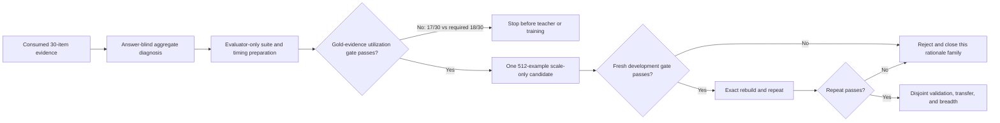

# Learning-Capacity Recalibration

**Status:** completed at pre-training diagnostic; scale-only adapter not authorized

**Date:** July 18, 2026

**Production baseline:** `6b4119cbcfd85c4667fa7976d1f92593a6ca7b62`

**Primary scorecard:** adapted-model closed-book capacity

**Guardrails:** benchmark integrity, breadth, product quality, and sub-ten-minute
hot invocations

## Verdict

Do not train the proposed 512-example rationale adapters. Evaluator preparation
passed, but the frozen pre-training gold-evidence utilization gate did not. The
unchanged 1.2B model improved from `13/30` question-only to `17/30` with human
SciQ support: four wins, zero losses, and mean correct-option margin moving from
`-0.889` to `+0.255`. The immutable prerequisite required `18/30`, `+6/30`, and
eight wins. It was not relaxed after observing the result.

This is a recalibration, not abandonment. The most defensible interpretation is:

- the local training, save, reload, and format-independent scoring path works;
- answer-only exposure did not move the consumed development slice;
- full human support produced a small directional signal;
- aggressive support compression surrendered part of that signal;
- 64 source examples and 30 evaluation items were insufficient to separate a
  small general effect from sampling noise;
- the student can use supplied evidence somewhat, but the effect did not clear
  the predeclared utilization prerequisite; and
- the 512-example scale hypothesis remains untested because no adapter was
  trained.

No production behavior, provider, default model, routing rule, or benchmark
scorer should change during this recalibration.

## What the recent evidence establishes

The fresh 30-item SciQ validation oracle now adds an evidence-utilization
boundary. Gold human support improved strict option-content ranking by four
items with zero losses and improved rank, top-three coverage, and margin. This
is real evidence headroom, but it missed the frozen prerequisite for spending
the larger adaptation campaign. No stronger-teacher call, adapter training,
MMLU-Pro development, mutation, validation, or transfer run followed.

The frozen science comparison used `LiquidAI/LFM2.5-1.2B-Instruct`, 64 public
SciQ examples, 128 records per adapter, one epoch/64 steps, and unlabeled
answer-content likelihood scoring. The 30-item MMLU-Pro science slice is now
consumed development evidence.

| Arm | Strict | Correct option top 2 | Correct option top 3 | Mean correct-option margin |
| --- | ---: | ---: | ---: | ---: |
| Native base | 8/30 | 12/30 | 17/30 | -0.6008 |
| Answer-only v1 | 8/30 | 13/30 | 17/30 | -0.5806 |
| Full-support v1 | 10/30 | 13/30 | 18/30 | -0.4176 |
| Concise-evidence v2 | 9/30 | 13/30 | 18/30 | -0.4249 |

These rank and margin aggregates were computed from the already-consumed,
ignored evaluator summaries. No item, question, expected answer, or option text
was inspected during recalibration.

Full-support v1 had three paired wins and one loss versus native base. With only
four discordant pairs, an exact two-sided sign test gives `p = 0.625`. Concise
v2 had two wins and one loss (`p = 1.0`). These tests are not promotion gates;
they demonstrate how little evidence is contained in the observed differences.

The margins improved, activation checks passed, and v2 changed all eight held-in
score vectors. That is evidence that training altered behavior. It is not
evidence that the change generalizes.

## Evaluation-resolution diagnosis

On 30 items, one answer changes the headline by 3.33 percentage points. At a
50% event rate, the ordinary binomial standard error is about 9.13 percentage
points before paired structure is considered. Exact repetition can expose
runtime instability, but repeating the same 30 questions does not add
distributional coverage.

| Items | One-item resolution | Worst-case binomial standard error |
| ---: | ---: | ---: |
| 30 | 3.33 pp | 9.13 pp |
| 60 | 1.67 pp | 6.45 pp |
| 120 | 0.83 pp | 4.56 pp |
| 150 | 0.67 pp | 4.08 pp |
| 300 | 0.33 pp | 2.89 pp |

The 30-item slice was suitable for rejecting a large promised `+3/30` gain. It
was not suitable for deciding whether a repeatable one- or two-item effect
exists. It must remain historical and may not become the selection loop for a
third candidate.

MMLU-Pro remains a reasonable breadth instrument: its authors designed it to
be harder, more reasoning-focused, and more stable under prompt variation than
original MMLU. Its ten-choice format also creates a low floor for a 1.2B model,
so it should not be the only cross-benchmark confirmation source. See the
[MMLU-Pro paper](https://arxiv.org/abs/2406.01574).

## Data-scale and coverage diagnosis

The two rationale candidates used only 64 SciQ questions. That is enough to
test plumbing and detect gross activation, but it is weak support for a broad
science-capacity hypothesis and no support for a general day-to-day-capability
claim. SciQ is a crowdsourced science-question dataset with human support
passages; its construction makes it a clean source of answer-plus-evidence
supervision, not a complete reasoning curriculum. See the
[SciQ paper](https://aclanthology.org/W17-4413/).

Published results make rationale distillation plausible, not guaranteed.
[Distilling Step-by-Step](https://aclanthology.org/2023.findings-acl.507/)
reports that rationale supervision can reduce the data required by smaller
students. More recent controlled work reports meaningful improvements with
fewer than 920 examples, but on different students and reasoning tasks; it does
not imply that 64 SciQ examples should move this checkpoint. See
[Hu et al. 2026](https://aclanthology.org/2026.findings-acl.1899/).

Rationale length is not a monotonic quality knob. Ablations have found that a
small number of key rationale tokens can match full rationales in some settings,
while this project's answer-blind one-sentence compression lost one of the two
strict gains and did not improve top-three coverage. See
[Wadhwa et al. 2024](https://aclanthology.org/2024.emnlp-main.349/). The honest
conclusion is that the prior compression heuristic failed here—not that concise
rationales never work.

For knowledge-intensive problems, research also warns that small students may
not retain enough factual knowledge for chain-of-thought distillation alone.
Decomposition plus external retrieval can outperform plain rationale
distillation, but that is a harness-capability mechanism and must not be counted
as closed-book uplift. See
[Li et al. 2024](https://aclanthology.org/2024.findings-acl.464/) and
[Probe Then Retrieve and Reason](https://aclanthology.org/2024.lrec-main.1140/).

## Model-ceiling diagnosis

The current artifacts do not prove a hard 1.2B ceiling. They do show that the
bottleneck is not merely answer formatting:

- answer-only training was identical to the base on all 30 strict choices;
- full support moved top-one correctness by two, but top-three coverage by only
  one;
- the average correct answer remained below the best distractor; and
- physics remained 1/10 under every arm.

Before attributing another failure to training data, the evaluator must record
three labeled ceilings on fresh, non-selection data:

1. **Stronger-teacher ceiling:** direct, format-independent scoring by a
   stronger local open model on the same public prompts. This is a diagnostic
   ceiling, never a candidate or a fixed-model gain.
2. **Gold-evidence utilization control:** a small, separate public suite where
   the 1.2B model receives sufficient answer-bearing evidence without an answer
   label. If it still cannot rank the answer, more memorization-oriented
   distillation is unlikely to fix that class.
3. **Rank and margin distribution:** report top-one/top-two/top-three coverage
   and correct-option margin in aggregate. If scale improves rank but not
   top-one selection, the next hypothesis may concern calibration. If rank does
   not move, stop changing selection logic.

The stronger model must be declared before it is loaded. Its outputs and costs
must be recorded as oracle evidence. It must not generate hidden labels for the
candidate evaluation set.

## Fast evaluation redesign

Format-independent scoring changed the test economics. The last invocation
trained one adapter and evaluated four arms plus activation and rotation checks
in 132.33 seconds, with 176 batched forwards and zero generation calls. A
120-item, three-arm direct-scoring development run is therefore plausibly below
ten minutes even with a larger one-epoch training set. This is a linear planning
estimate, not a measured guarantee; a no-holdout timing sentinel must validate
it before the candidate is authorized.

Freeze the following evaluator assets before training:

| Asset | Purpose | Proposed size | Selection status |
| --- | --- | ---: | --- |
| Training | Same-domain scale test | 512 SciQ train examples | Public, contamination-audited |
| Activation | Prove adapter and rationale task activate | 16 held-in examples plus negative controls | Not a capacity score |
| Development | Fast paired selection | 120 fresh MMLU-Pro science items, balanced biology/chemistry/physics | Frozen before training |
| Mutation | Option rotation and paraphrase robustness | 12 development-derived mutations | Guardrail only |
| Validation | Generalization | At least 300 disjoint science items or a power-sized equivalent | Untouched until repeat |
| Cross-benchmark | Dataset transfer | Fresh ARC-Challenge/OpenBookQA slice | Untouched until repeat |
| Breadth | Catastrophic-regression check | Existing mixed capacity portfolio | Run only after repeat |

The 120-item development slice gives 0.83-point item resolution. It is still a
selection instrument, not publication evidence. The disjoint validation size
must be chosen from the smallest effect worth shipping and paired pilot
variance; 300 is a planning floor, not a promise that every five-point effect
will be significant.

Each hot invocation remains capped at ten minutes. If training and scoring do
not fit together, split immutable adapter construction and scoring into
separately hashed invocations; do not shrink the evaluation after seeing a
candidate result. Validation may likewise be split into predeclared immutable
shards so that no individual invocation exceeds ten minutes.

## Scale-only candidate disposition

The predeclared candidate was a **scale-only full-support
rationale-distillation experiment** that would have:

- keep the exact LFM2.5 1.2B base revision, 4-bit load, LoRA targets, sequence
  length, optimizer family, prompt construction, and format-independent scorer;
- expand from 64 to 512 deterministically selected SciQ training examples;
- train a matched answer-only adapter and a full-support adapter for one epoch;
- keep source selection answer-blind beyond the ordinary public training label;
- compare native base, matched answer-only, and full-support on the frozen
  120-item development suite; and
- make no Sir Thaddeus production change.

Changing data diversity, rationale generation, teacher model, optimizer,
adapter rank, and scale at once would prevent attribution. If the scale-only
candidate succeeds, broader coverage becomes a later, separately predeclared
candidate. If it fails, do not repair it with another support formatter.

Provisional advancement requires all of the following before exact repeat:

- full-support beats both native base and matched answer-only by a meaningful
  predeclared paired margin;
- paired wins materially exceed losses rather than relying on one item;
- rank/margin aggregates move in the same direction;
- activation and rotation guardrails pass;
- no benchmark or evaluation content enters training; and
- every invocation remains within the frozen resource budget.

The numeric gates were finalized before the diagnostic. Because the earlier
gold-evidence prerequisite failed, none of these training or development steps
ran. Reopening this candidate requires a materially different, answer-blind
evidence-utilization mechanism and fresh predeclaration, not a lower threshold.

## Interpretation matrix

| Observation | Interpretation | Next action |
| --- | --- | --- |
| Teacher ceiling is also near floor | Suite/model-family mismatch or excessive difficulty | Choose an accessible fresh science instrument; do not tune the student |
| Gold evidence does not help 1.2B | Utilization/capacity ceiling | Stop knowledge stuffing for that class; pursue harness evidence use separately |
| Answer-only and full-support both improve equally | Domain exposure effect, not rationale benefit | Report honestly; test breadth before considering adaptation |
| Full-support beats matched answer-only and repeats | Credible rationale/scale signal | Consume disjoint validation, then cross-benchmark and breadth gates |
| Correct-answer rank improves but strict top-one does not | Possible calibration/selection headroom | Predeclare a separate answer-blind calibration study; do not tune on item answers |
| Neither adapter improves rank or strict score | Scale-only hypothesis rejected | Stop this rationale family on the 1.2B model and reassess architecture/coverage |
| Science improves but breadth regresses | Narrow specialist only | Do not replace the default model; evaluate explicit specialist escalation separately |

## Reversible implementation phases

### Phase A — evaluator-only preparation — complete

1. Preserve the consumed 30-item slice as historical evidence.
2. Add aggregate paired statistics, rank distributions, and margins without
   emitting item content into product-facing summaries.
3. Build and freeze the 120-item development, mutation, oracle, validation, and
   cross-benchmark selections with disjoint fingerprints.
4. Add contamination, canary, and dirty-worktree checks.
5. Run static tests and a no-holdout timing sentinel only.

Exit: suite fingerprints, planned case counts, timing estimate, and final gates
are reviewed; no adapter has been trained.

### Phase B — scale-only development — stopped before training

1. Predeclare the matched 512-example answer-only and full-support arms.
2. Build training data twice and require identical hashes.
3. Train from fresh base loads and verify changed/reloadable weights.
4. Score base and both adapters once on development plus mutations.
5. Reject, classify mixed, or authorize an exact repeat under the frozen rules.

Exit: one verdict and immutable hashes. A development win is not promotion.

Actual exit: the gold-evidence prerequisite failed at `17/30` versus the frozen
`18/30` minimum and `+4/30` versus the required `+6/30`. The teacher, training,
development, repeat, and validation invocations were not run.

### Phase C — exact repeat and validation

1. Rebuild both adapters from the same frozen inputs and seed.
2. Repeat the exact development scoring in reversed arm order.
3. Only after a repeat, run disjoint validation and cross-benchmark transfer.
4. Run the mixed-capacity and generated-response guardrails.

Exit: promote the adapted model as an optional research artifact, retain it as
a narrow specialist candidate, or delete it. Do not silently replace the
production default.

### Phase D — campaign decision

If the candidate fails, record whether scale, utilization, breadth, or student
capacity was the limiting factor. Resume learning work only with a materially
different coverage or model-utilization hypothesis. If it succeeds, test one
additional model from the frozen ladder for transfer; do not claim a universal
harness gain from one adapted checkpoint.

## No-go list

- Do not run another candidate on the consumed 30-item slice.
- Do not inspect item-level mistakes to hand-select training facts.
- Do not train on MMLU, MMLU-Pro, ARC, OpenBookQA, or validation answers.
- Do not use a larger model as the candidate or hide teacher use.
- Do not change support format, data scale, optimizer, and LoRA topology in one
  experiment.
- Do not promote generated-answer improvements without format-independent
  confirmation.
- Do not call a science specialist a general day-to-day improvement.
- Do not spend validation after a failed development or exact-repeat gate.
- Do not alter production code during evaluator recalibration.

## Direct conclusion

The rationale-distillation idea remains scientifically plausible, but it is no
longer the next recommended experiment for this 1.2B checkpoint. The model used
gold support directionally but failed the immutable utilization prerequisite,
so the 512-example adapters were never trained. Move to a different causal
hypothesis centered on reliable evidence packaging, externally verifiable
outcomes, and deterministic postconditions. Reopen closed-book rationale
training only after a fresh answer-blind control demonstrates stronger evidence
utilization; do not lower this gate or try another rationale formatter.
