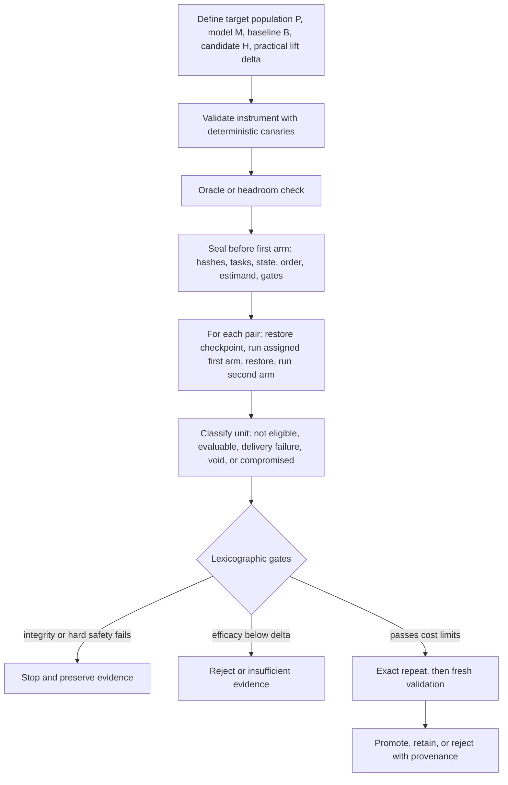

# Method v1 adversarial review

Date: 2026-08-10
Product repository reviewed: `sir-thaddeus@1412b1840fb524d5bef6f9b7836f2fb35e7bd60b`
Evaluator repository reviewed: `local-benchmark-runner@ec8b6e69cf2fd701bff7e577310cacf2269dc997`
Scope: review only. No existing method, evaluator, experiment, or product file was modified.

## 1. Executive verdict

- **The research thesis is worth testing.** Fixed-model harness changes can be isolated and have already produced several bounded, mechanically verified gains.
- **The current method is usable for careful internal engineering, but not yet a stable Method v1.** It contains good controls alongside ambiguous estimands, incomplete run-state semantics, and more ceremony than a solo operator can reliably execute.
- **Do not publish RSAHE as a newly invented scientific method.** The components are mature prior art; the defensible contribution is a failure-derived operational adaptation for agent harnesses.
- **Keep activation proof, but stop treating observed activation as the primary efficacy population.** Candidate nonactivation is part of deployment performance. An activated-only comparison is descriptive unless a separate randomized forced-activation study identifies an activation-specific causal effect.
- **Replace the overloaded `INVALID` state.** Pre-run ineligibility, delivery failure, a void run, and a defect discovered after unsealing are different events with different consequences.
- **Freeze before the first evaluated arm, not merely before candidate execution.** Arm order, initial state, caches, memory, filesystem, browser state, and warmup can otherwise confound a paired comparison.
- **Use lexicographic gates.** Integrity and hard safety failures cannot be averaged away by correctness, latency, or cost gains. Zero observed failures is a release gate, not evidence of zero risk.
- **Use two tiers.** A compact engineering-promotion workflow should remain practical for one operator; public or durable claims require a declared estimand, uncertainty rule, stronger provenance, fresh confirmation, and preferably an independent rerun.
- **The evidence base is real but heterogeneous.** It supports narrow mechanism claims, not one pooled effect size or a claim that Sir generally uplifts all models or all tasks.
- **Before another behavioral campaign, repair the method contract and provenance ledger.** After that, the best next experiment is a small oracle-first semantic-binding study, not another generic continuation, retry, or planning loop.

## 2. Repository method inventory

### Normative and policy documents

| Repository | File | Current role | Review finding |
| --- | --- | --- | --- |
| Evaluator | `docs/SCIENTIFIC_METHOD.md` | Claimed normative method | Best home for Method v1, but mixes lifecycle, analysis advice, terminology, and public-maturity aspirations. Registration begins too late and activation semantics are causally ambiguous. |
| Evaluator | `docs/EXPERIMENT_PROMOTION_FUNNEL.md` | Operational funnel | Useful gate ordering. Its single `INVALID` exit and mandatory activation gate cannot represent ineligible tasks, delivery failures, run-level integrity failures, or post-unseal compromise. |
| Evaluator | `docs/EVALUATION_PAVED_ROAD.md` | Benchmark escalation path | Correctly separates synthetic development from external grounding. It needs explicit state isolation, arm-order, and final-estimand rules. |
| Product | `AGENTS.md` | Repository-wide agent contract | Strong integrity rules. It currently states “No activation is invalid,” which is too broad and can remove real candidate failures from the deployment estimand. |
| Product | `docs/EXPERIMENTATION.md` | Product promotion policy | Strong three-scorecard and paired-comparison discipline. It lacks a precise target population and a complete invalidity/exclusion contract. |
| Product | `docs/RESEARCH_METHOD.md` | Public rationale and method essay | Clear and unusually honest, but too long for a normative protocol, overstates distinctiveness, adopts the provisional RSAHE brand too early, and repeats the activation/`INVALID` error. |
| Product | `docs/BENCHMARKING.md` and `docs/BENCHMARK_METRICS.md` | Portfolio and metric definitions | Useful supporting material, not the method authority. These should link to rather than duplicate Method v1 rules. |
| Product | `docs/research/CURRENT_EVIDENCE.md` | Living evidence ledger | Richest evidence source, but prose density makes claim-to-artifact reconciliation expensive. |
| Product | `docs/research/EXPERIMENT_CATALOG.md` | Candidate inventory | Valuable negative-result record. It is a catalog, not yet an append-only, machine-enforced provenance and task-consumption ledger. |

### Executable process and artifacts

The evaluator contains 249 manifest files, 225 verdict files, and 22 lock files at the reviewed commit. This is substantial preserved evidence, but the counts also reveal the operator problem: lifecycle truth is distributed across prose, YAML/JSON manifests, locks, ignored run artifacts, code, Git history, and two repositories.

`src/benchrun/experiment_process.py` is the executable nucleus. It provides promotion stages, runtime tiers, activation preflight, and verdict classification. Its `CampaignEvidence` is a collection of Booleans rather than an auditable state machine. `classify_experiment_verdict()` reduces validity to `attributable: bool`; it cannot express the distinctions this review requires. Tests enforce the existing simplification faithfully, so the issue is specification design rather than an untested implementation accident.

Representative verdicts show both the value and the inconsistency of current practice:

- `answer-only-tool-evidence-projection-v1` records paired development, exact repeat, disjoint validation, activation, resources, hashes, and delivery.
- `local-read-failure-recovery-v1` correctly preserves a negative result and activation failure, but calls the overall candidate rejected while also treating two intended-positive episodes as invalid.
- `mcpmark-bounded-readonly-dataflow-v1` calls an automatic candidate rejected despite zero activation, whereas the general method says no activation means invalid.
- `mcpmark-webarena-shopping-admin-v1` preserves a post-hoc verifier disclosure and marks the pool consumed without retroactively changing the already-run score. That is closer to the recommended post-unseal-compromise policy than the normative method currently states.

No single authoritative task-consumption register was found. The exact amount of unconsumed runway is therefore **unverified** and should be treated as a blocking unknown before a large confirmation campaign.

## 3. Critical errors

### 3.1 Observed activation is not a principal stratum

Principal strata are defined by the joint potential values of a post-treatment variable under all compared assignments. Observing that the candidate activated tells us only its activation under the candidate arm. Calling that observed subset a principal stratum is incorrect.

The deployment-primary question is:

> For the preregistered target population, what is the paired effect of assigning the candidate harness rather than the unchanged harness?

Candidate nonactivation, nonaction, timeout, and delivery failure remain part of that outcome. Otherwise the candidate is rewarded for failing to deliver its own mechanism.

Permissible secondary questions are:

- performance in an **arm-independent, pre-run eligible subgroup**;
- activation receipt rate among eligible candidate episodes;
- descriptive outcome among episodes that activated, explicitly labeled post-treatment/per-protocol diagnostic;
- efficacy of forced activation in a **separate randomized enabled-versus-disabled ablation**.

Failure mode: excluding candidate nonactivation inflates apparent efficacy and changes the population after treatment assignment.
Operator cost: one eligibility function and one additional receipt column.
Revise or retire this rule if a valid design identifies principal strata from joint potential activation states or an accepted alternative estimand is preregistered.

### 3.2 `INVALID` currently combines incompatible events

The method conflates at least four conditions:

1. a task was not eligible for the mechanism before assignment;
2. an eligible candidate failed to deliver or activate;
3. a fatal integrity condition made an episode or run uninterpretable;
4. a defect was discovered only after outcomes were unsealed.

These do not support the same action. In particular, a late-discovered defect must not be recoded as a candidate loss merely to appear conservative. Preserve the evidence, label the affected unit `COMPROMISED_POST_UNSEAL`, disclose what was known when, and use a fresh reserve if the registered replacement rule permits it. If the remaining evidence cannot answer the question, conclude `INSUFFICIENT_EVIDENCE`.

Failure mode: biased or asymmetric recoding after results are visible.
Operator cost: explicit integrity-event logging and a small affected-unit/replacement table.
Revise or retire this rule if a future platform can prove all fatal conditions before outcome access.

### 3.3 Registration freezes too late

The current language freezes before “scored candidate execution.” A causal comparison begins at the first evaluated arm. If the baseline runs first and warms caches, mutates the filesystem, changes memory, consumes provider state, or reveals an evaluator defect before candidate registration is sealed, the comparison is not fully preregistered or isolated.

Freeze before the first evaluated arm:

- target population and eligibility;
- task-family units and task roles;
- baseline and candidate commits;
- model/runtime/configuration;
- initial environment checkpoint and reset procedure;
- arm order and randomization/counterbalancing seed;
- budgets, scorers, activation receipts, estimand, gates, and replacement rules.

Failure mode: order, learning, contamination, and warm-state effects masquerade as treatment effects.
Operator cost: checkpoint creation plus deterministic arm-order generation.
Revise or retire this rule if each episode is proven stateless and independently reconstructed; still freeze the proof and order rule.

### 3.4 The unit of analysis is underspecified

Prompts, semantic mutations, repeated trajectories, and task families are not automatically independent observations. Exact McNemar inference is appropriate for paired independent binary units; it is not a magic correction for clustered variants or repeated runs.

Method v1 must name the inferential unit. For small clustered campaigns, use task family as the unit: summarize paired family outcomes and report a family-level randomization/permutation test or a cluster bootstrap interval when the number and design support it. With very few families, report the pair table and an uncertainty range descriptively; do not manufacture precision.

Failure mode: pseudoreplication and overly narrow uncertainty.
Operator cost: family IDs plus a predeclared cluster-aware analysis.
Revise or retire this rule when task construction demonstrably yields independent units and the assumption is documented.

### 3.5 Sequential language overreaches the actual funnel

Reject-only triage followed by one fixed final positive decision does not automatically require alpha spending. Formal sequential correction is needed when interim looks can promote, sample size expands in response to favorable results, positive stopping is optional, or repeated looks from the same evidence support a publication claim.

Failure mode: either inflated false-positive risk or unnecessary statistical ceremony that a solo operator cannot execute correctly.
Operator cost: declare whether early looks are reject-only; use one final decision by default.
Revise or retire this rule when always-valid inference or a group-sequential design is deliberately adopted and implemented.

### 3.6 Product guardrails cannot be an omnibus score

Safety, permission, destructive side effects, false success, conversational regressions, efficacy, and cost should not be weighted into one score. Use a lexicographic decision:

1. integrity is adequate;
2. zero observed hard safety, permission, destructive-action, no-action, and defined conversation breaches;
3. efficacy clears the practical threshold;
4. cost and latency remain within frozen limits;
5. diagnostics explain the result but cannot rescue a failed hard gate.

“Zero observed” means the release gate passed on the tested sample. It is not proof of zero risk.

Failure mode: a large correctness gain numerically erases a severe product regression.
Operator cost: a short ordered gate table.
Revise or retire individual hard gates when product policy changes, but never through post-result reweighting.

### 3.7 Terminology and novelty are overstated

The current method imports conflicting reproducibility vocabulary. The National Academies uses reproducibility for the same data and code and replicability for a new study/data; ACM artifact badging uses “Results Reproduced” for an independent team using supplied artifacts. Either convention is legitimate, but mixing them is not.

Method v1 should adopt the National Academies convention and include a one-line ACM crosswalk. More importantly, “activation before efficacy” is a useful agent-specific operational rule, not yet an established novel scientific contribution. A targeted literature map is not a systematic priority review.

Failure mode: reviewers reject a sound engineering protocol because its naming and priority claim outrun its evidence.
Operator cost: remove the acronym and maintain a short terminology box.
Revise or retire this rule only after a systematic review and external comparison justify a stronger claim.

## 4. Keep, change, or remove

| Current element | Decision | Rationale | Operator cost after change |
| --- | --- | --- | --- |
| Fixed model when claiming harness uplift | Keep | Essential treatment isolation. | Low: hash and config capture. |
| Raw, same-prompt, unchanged, candidate arms | Change | Use only arms required by the question. Unchanged vs candidate is primary; raw/same-prompt are attribution diagnostics, not mandatory every campaign. | Lower than today. |
| Oracle/headroom before mechanism | Keep | Prevents building machinery where the model or evidence layer has no recoverable ceiling. | Low to medium. |
| One mechanism per candidate | Keep | Preserves attribution. Explicitly classify infrastructure repair, product defect repair, capability mechanism, or policy change. | Low. |
| Activation before efficacy | Change | Keep mechanical receipts; include nonactivation in deployment-primary outcome. Separate delivery from efficacy. | Low. |
| One `INVALID` verdict | Remove | Replace with precise run/episode integrity and delivery states. | Medium once, then low. |
| Exact repeat | Keep | Measures same-team repeatability. Do not call it reproduction or generalization. | Medium compute. |
| Disjoint holdout | Keep | Tests transfer after repeat. Track family-level consumption. | Medium data cost. |
| Ten-minute development ceiling | Keep as default | Valuable economic discipline, not a scientific constant. Permit a registered exception when the task itself is longer. | Low. |
| Sequential funnel | Change | Default to reject-only early gates plus one fixed final decision. Add formal sequential inference only for positive interim decisions. | Lower. |
| Negative controls terminology | Change | Call these hard behavioral safety/regression cases unless they meet formal negative-control assumptions. | None. |
| A/A before every campaign | Remove | Use deterministic canaries routinely; repeat A/A after material pipeline changes or suspected randomization defects. One nominal A/A difference is not proof of a broken platform. | Lower. |
| Three scorecards | Keep | Correctly separates model capacity, harness capability, and product quality. | Low. |
| One weighted overall score | Prohibit | It can hide noncompensatory harm. | None. |
| Append-only candidate funnel | Keep and automate | Exposes selection pressure and negative results. | Medium once. |
| RSAHE acronym and “new method” framing | Remove for v1 | Creates novelty debt without improving decisions. | Negative cost. |

## 5. Activation and invalidity decision table

These states are mutually exclusive at the smallest affected unit. A campaign verdict is derived only after every planned unit has one state.

| State | Definition | Included in deployment-primary result? | Secondary treatment | Permitted action |
| --- | --- | ---: | --- | --- |
| `NOT_ELIGIBLE` | Arm-independent pre-run rule says the task cannot exercise the mechanism. | No, if the eligibility rule and population were sealed before the first arm. | Report count and reason. | Exclude symmetrically from both arms. |
| `EVALUABLE_DELIVERED` | Eligible; assigned arm ran; candidate receipt shows delivered/activated when applicable. | Yes | Activation and mechanism diagnostics. | Score outcome normally. |
| `DELIVERY_FAILURE` | Eligible candidate assignment completed evaluably but the mechanism was not delivered, did not activate, or timed out. | **Yes, normally as the observed candidate outcome.** | Report separately as delivery failure. | Do not erase from primary efficacy. |
| `RUN_VOID` | A preregistered fatal integrity condition makes the smallest affected unit uninterpretable: wrong model, scorer corruption, shared state leakage, missing required trace, transport outage before assignment, etc. | No | Preserve artifact and reason. | Apply symmetric registered replacement; otherwise reduce analyzable set. |
| `COMPROMISED_POST_UNSEAL` | A material defect is discovered after outcome access and was not handled by the sealed fatal-condition rule. | No clean confirmatory claim from that unit. | Preserve result, timestamp, disclosure, and sensitivity analysis. | Use fresh reserve only under a predeclared replacement rule; otherwise `INSUFFICIENT_EVIDENCE`. |
| `EVALUABLE_BLOCKED` | Candidate reaches a real safety, permission, or external blocker that is itself a valid task outcome. | Yes | Classify blocker truthfulness and appropriateness. | Score according to the public task contract. |

`REJECTED`, `PROMOTED`, `RETAINED`, and `INSUFFICIENT_EVIDENCE` are campaign decisions, not episode states. `CANCELLED`, `BLOCKED`, and `SUPERSEDED` remain administrative campaign states.

## 6. Minimal Method v1



### Rule 1: define the decision, population, and treatment

Before implementation, declare target task population `P`, frozen model/configuration `M`, unchanged baseline `B`, one candidate `H`, practical paired lift `delta`, and hard safety/cost limits.

Failure mode: an attractive score is interpreted as a broader claim than the tested population supports.
Operator cost: five fields in a one-page registration.
Revise/retire evidence: retire a population definition when product usage data or construct-validity work shows it is unrepresentative.

### Rule 2: classify the candidate

Choose exactly one: evaluation-infrastructure repair, product-defect repair, capability mechanism, or policy/guardrail change. Infrastructure repairs validate the ruler and do not count as product uplift.

Failure mode: measurement fixes and capability gains are pooled.
Operator cost: one field.
Revise/retire evidence: reclassify only before unsealing or in a disclosed superseding record.

### Rule 3: validate the instrument cheaply

Run deterministic known-pass, known-fail, scorer-sensitivity, environment/version, pair-completeness, and live transport canaries. Use A/A only after material pipeline/randomization changes or unexplained drift.

Failure mode: a broken scorer or route yields a causal verdict.
Operator cost: seconds to minutes once automated.
Revise/retire evidence: remove a canary when its protected failure can no longer occur and a replacement covers the new architecture.

### Rule 4: establish recoverable headroom

Use the smallest oracle that can answer whether the proposed layer, if correct, changes strict outcomes. Oracle success authorizes a candidate; it is never candidate efficacy.

Failure mode: expensive mechanisms target an irrecoverable model or task ceiling.
Operator cost: one to a few diagnostic cases.
Revise/retire evidence: stop the family when a valid oracle cannot produce the minimum useful region.

### Rule 5: seal before the first arm

Push an immutable registration containing hashes, task-family roles, contamination status, initial-state image, reset procedure, arm order/seed, estimand, analysis, activation receipt, fatal conditions, reserve replacement, gates, and spend.

Failure mode: result-aware changes or state/order confounding.
Operator cost: automated manifest generation and one protected commit.
Revise/retire evidence: strengthen sealing if remote history can be rewritten or if hidden state is discovered.

### Rule 6: isolate state and counterbalance order

For each pair, restore the same checkpoint before each arm. Randomize or deterministically counterbalance whether baseline or candidate runs first within task family. Record checkpoint and reset hashes. Never allow one arm's mutation, memory, browser session, cache, or filesystem output to enter the other.

Failure mode: carryover and warm-state bias.
Operator cost: checkpoint/reset time, usually material but bounded.
Revise/retire evidence: simplify only after a canary proves a component is stateless across arms.

### Rule 7: score deployment assignment first

Primary estimand: paired difference in verified success for all preregistered evaluable units in `P` under assignment to `H` versus `B`. Candidate delivery failures remain candidate outcomes. Report an eligible-subgroup estimate and activation receipt rate secondarily.

Failure mode: post-treatment selection.
Operator cost: one primary pair table plus delivery diagnostics.
Revise/retire evidence: use a different estimand only when its intervention, population, endpoint, and intercurrent-event handling are sealed explicitly.

### Rule 8: use the smallest-unit integrity policy

Apply the decision table in Section 5 symmetrically. Enumerate fatal integrity conditions before running. Preserve all compromised evidence; never silently delete or recode it.

Failure mode: outcome-aware exclusions.
Operator cost: one row per anomaly.
Revise/retire evidence: update the fatal list only between campaigns based on newly observed failure classes.

### Rule 9: apply lexicographic gates

Integrity, then hard safety/permission/no-action/conversation boundaries, then practical efficacy, then cost/resource limits. Diagnostics cannot compensate for a failed higher-order gate.

Failure mode: harmful gains are promoted by averaging.
Operator cost: a short decision table.
Revise/retire evidence: change numeric limits between campaigns using product evidence, never after seeing the candidate result.

### Rule 10: reject cheaply; confirm once

Use deterministic checks and small development slices for rejection. They cannot promote. Default to one fixed confirmatory decision after candidate selection. If positive interim stopping or outcome-driven expansion is desired, register a valid sequential method.

Failure mode: optional stopping or excessive ceremony.
Operator cost: low in Tier A; statistical support in Tier B.
Revise/retire evidence: adopt always-valid or group-sequential inference only when repeated positive looks have real decision value.

### Rule 11: respect clustering and stochasticity

Declare task family as the default inferential unit when prompts are mutations. Report paired gains/losses and family structure. Repeat trajectories when the practical decision depends on small differences; do not pretend one deterministic-looking run measures stochastic reliability.

Failure mode: pseudoreplication and unstable promotion.
Operator cost: additional runs only when the claimed resolution requires them.
Revise/retire evidence: reduce repeats when deterministic canaries and historical variance demonstrate stability at the required resolution.

### Rule 12: preserve the complete evidence chain

Record supported claim, strongest negative result, uncertainty, exact artifacts/hashes, all attempted candidate revisions, task consumption, and delivery status. Unreconciled numbers remain `UNVERIFIED`, not copied into public claims.

Failure mode: winner's curse, hidden experimentation, and stale narrative.
Operator cost: automated ledger append plus short human interpretation.
Revise/retire evidence: fields may be retired only when another immutable artifact supplies the same audit function.

## 7. Two-tier workflow

### Tier A: engineering promotion

Use for reversible, bounded product changes.

1. One-page registration with `P`, `M`, `B`, `H`, `delta`, candidate class, non-goals, and hard gates.
2. Deterministic instrument and environment canaries.
3. Oracle/headroom check when the bottleneck is uncertain.
4. Frozen candidate, arm-independent prompts, seeds, budgets, checkpoint/reset, and counterbalanced order before the first arm.
5. Small paired development slice; early stages reject only.
6. One fixed final Tier A decision using a preregistered point threshold, paired wins/losses, and hard guardrails. A point threshold is an engineering decision rule, not a population-level confidence claim.
7. Exact repeat, fresh disjoint validation, focused product regressions, protected CI, archive, and rollback.

Target operator burden: roughly one page of registration plus automated reports. If routine use requires a statistician or a bespoke essay, Method v1 has failed its Tier A usability goal.

### Tier B: durable or public evidence

Add to Tier A:

1. a precise primary estimand: population, intervention/assignment, comparator, endpoint, summary measure, and handling of nonactivation, timeout, missingness, and other intercurrent events;
2. family-diverse sampling with justified task and trajectory counts;
3. a named cluster-aware uncertainty method and planned positive looks;
4. external immutable registration before the first arm;
5. a versioned task-contamination and reserve ledger;
6. fresh temporal or external confirmation after candidate selection;
7. a one-command artifact package with environment pins and raw trajectories where permitted;
8. ideally, computational reproduction by someone outside the implementation loop and later replication on new tasks or an independent implementation.

Tier B is required before words such as “generalizes,” “scientifically validated,” or “world-class” are used without narrow qualifiers.

## 8. Evidence and provenance reconciliation

The table below reconciles claims visible in the supplied critiques against repository artifacts inspected in this review. It does not pool effects across different tasks, models, baselines, or mechanisms.

| Claim | Status | Supported claim | Strongest negative / uncertainty |
| --- | --- | --- | --- |
| Local tool outcomes `9/16` Sir vs `3/16` raw vs `1/16` same-prompt direct | **Unverified as stated** | A nearby preserved baseline reports full-menu Sir `7/16`, raw `3/16`, and no-tools harness `1/16`. | The supplied `9/16` wording does not match the inspected canonical verdict; do not publish until exact artifact is identified. |
| Answer-only evidence projection `10/12` vs `5/12`, repeated; validation `12/16` vs `8/16` | **Verified in verdict** | Narrow deterministic response projection produced `+5/-0` twice in development and `+4/-0` in disjoint validation with zero negative activation. | Small, local, response-contract-specific sample; not generic evidence grounding. One first validation run was invalidated after an activation expectation mismatch and evaluator policy was changed before the valid rerun. |
| DROP supplied evidence about `0/10` to `5–6/10` | **Unverified in this review** | Historical evidence-utilization work exists. | Exact cohort, arm, and artifact were not reconciled; exclude the number from Method v1 claims. |
| SciQ `13/30` to `17/30` | **Verified in catalog** | Gold support produced four paired wins and zero losses. | It missed the frozen utilization gate; no adapter campaign followed. This is oracle headroom, not promoted harness lift. |
| Local-read recovery `3/12` to `7/12` | **Unverified as stated** | The family exposed real failure-envelope and path-resolution seams. | V1 itself was `0/10` vs `0/10`, with zero candidate activations and two invalid intended positives. Later figures require exact artifact reconciliation. |
| Selected MCPMark easy candidate `13/14` across two runs | **Unverified / easily misread** | MCPMark work demonstrated some bounded headroom and infrastructure corrections. | The reviewed verdicts include multiple zero-score standard/WebArena results and nonactivating candidates. `13/14` must not be presented as a paired candidate-vs-baseline effect without its exact arm table. |
| MCPMark standard holdout `0/3` both | **Unverified here** | Multiple standard slices show severe capability limits. | Need exact manifest and pair table before quoting. |
| Local WebArena `0/3` | **Verified** | Frozen Qwen 35B configuration reached the live site but failed three easy shopping-admin tasks; failures localized to sustained browser interaction. | Pool was later consumed by verifier-contract inspection. This is a floor/localization result, not fresh evidence for a new candidate. |
| Current public method examples: fresh capability closure `4/20` raw, `15/20` unchanged, `19/20` gold | **Verified in current catalog/evidence** | Existing Sir capabilities materially improved a fresh verified-outcome scorecard. | It is a mixed capability scorecard, not one candidate effect and not a universal agent benchmark. |
| Unique local-file suffix resolution `5/16` to `12/16` twice | **Verified in current catalog/evidence** | Narrow fail-closed resolution showed seven wins, zero losses, and improved efficiency on a disjoint slice. | Scope is local authorized-root suffix resolution; no broad reasoning claim follows. |
| Wiki temporal deferral `4/18` to `13/18` | **Verified in current catalog/evidence** | Narrow policy improved action precision while preserving deferred state and immediate-action reachability. | This is a deterministic product-policy result, not model intelligence. |

Every public result should have a three-part evidence record:

```text
SUPPORTED CLAIM: the narrow statement directly backed by frozen artifacts
STRONGEST NEGATIVE: the best contradictory, null, failed-transfer, or safety evidence
UNCERTAINTY: what population, mechanism, or runtime remains untested
```

Any number without a resolved manifest, run artifact/hash, scorer version, model/configuration, and comparison role is `UNVERIFIED`. It may remain in private notes but must not be promoted into the method rationale.

## 9. Novelty wording and banned phrases

Recommended title:

> **How We Evaluate Agent Harness Changes: A Failure-Derived Fixed-Model Protocol**

Recommended public claim:

> We adapted established practices from controlled experiments, preregistration, adaptive-data protection, benchmark validation, and software artifact review into an executable protocol for fixed-model agent-harness changes. The adaptation emphasizes agent-specific delivery receipts, runtime state, externally verified outcomes, abstention and no-action behavior, cost, and contamination. We have not established priority for a new scientific method.

Potentially distinctive, pending broader review:

1. treating the frozen harness—not the model—as the experimental treatment;
2. mechanically separating model text resembling an action from an action actually delivered by the runtime;
3. making no-action, truthful blocker, permission, and conversational behavior noncompensatory promotion gates.

Banned until stronger evidence exists:

- “invented a new scientific method”;
- “first” or “only” agent evaluation protocol;
- “proven,” “world-class,” or “scientifically validated” without a narrow object and evidence tier;
- “principal stratum” for observed activated episodes;
- “negative control” for ordinary no-action regression tasks unless formal negative-control assumptions are stated;
- “reproduced” for the same operator's exact rerun;
- “generalizes to agents/local models” from one model, task family, or consumed holdout;
- “zero safety risk” from zero observed failures;
- “uplift” without naming baseline, model, task population, endpoint, and paired effect.

## 10. Patch plan — no edits performed

### Evaluator repository

1. `docs/SCIENTIFIC_METHOD.md`
   - Replace the RSAHE-style lifecycle with Minimal Method v1.
   - Freeze before the first evaluated arm.
   - Define the primary deployment estimand and secondary delivery metrics.
   - Add the Section 5 state table and `INSUFFICIENT_EVIDENCE` campaign decision.
   - Adopt the National Academies terminology with an ACM crosswalk.
2. `docs/EXPERIMENT_PROMOTION_FUNNEL.md`
   - Separate instrument validation, eligibility, delivery, integrity, efficacy, and product gates.
   - Make early scored gates reject-only by default.
   - Remove the active candidate proposal; move campaign-specific content to its manifest/verdict.
3. `docs/EVALUATION_PAVED_ROAD.md`
   - Add checkpoint restoration, cache/memory/browser/filesystem isolation, and counterbalanced arm order.
   - State which tier each external benchmark step supports.
4. `src/benchrun/experiment_process.py`
   - Replace Boolean evidence accumulation with typed lifecycle events and unit states.
   - Separate episode state from campaign verdict.
   - Make `DELIVERY_FAILURE` primary-score eligible and reserve `RUN_VOID` for sealed fatal conditions.
   - Add post-unseal compromise handling without automatic recoding.
5. `tests/test_experiment_process.py`
   - Add exhaustive state-transition, symmetry, smallest-affected-unit, nonactivation, replacement, and post-unseal tests.
6. New evaluator ledger schema and command
   - Append immutable experiment ID, parent, method version, task-family roles, consumption transition, hashes, arm order, checkpoint, anomalies, supported claim, strongest negative, and uncertainty.
   - Generate the human verdict table from this record rather than duplicating lifecycle truth in prose.

### Product repository

7. `AGENTS.md`
   - Replace “No activation is invalid” with the deployment-primary/delivery-failure distinction.
8. `docs/EXPERIMENTATION.md`
   - Point to Minimal Method v1; keep product promotion policy only.
   - Add candidate class, target population, state isolation, and lexicographic gates.
9. `docs/RESEARCH_METHOD.md`
   - Rename and reduce to rationale, prior art, limitations, and selected case studies.
   - Remove RSAHE branding and priority language.
   - Remove duplicated normative rules.
10. `docs/research/CURRENT_EVIDENCE.md` and `docs/research/EXPERIMENT_CATALOG.md`
    - Generate or reconcile entries against the evaluator ledger.
    - Add supported claim, strongest negative, uncertainty, and verification status.
    - Resolve or mark the disputed figures listed in Section 8.

Apply the changes as one method-contract campaign before changing behavioral production code. Version it `method-v1`; record every later rule change with its motivating failure, scope, cost, and retirement test.

## 11. Next-experiment comparison

| Option | Decision value | Main risk | Recommendation |
| --- | --- | --- | --- |
| **A. Oracle-first semantic binding**: one already-selected capability, public-request fields bound to one deterministic action and postcondition | Directly tests whether remaining failures are recoverable at argument/action binding without generic loops | Could be too narrow or have insufficient oracle headroom | **Preferred after Method v1 is frozen.** Example: `system-command-binding-oracle-v1`; require at least 3 strict oracle recoveries, at least 5/6 correct capability selection positives, and zero unsafe/no-action/control failures before one narrow candidate. |
| **B. Materially different alternative: typed environment-state projection**: improve observation representation after successful actions, without selecting or binding actions | Tests whether the bottleneck is observation-to-next-action rather than semantic binding | May repeat previously rejected final-projection/continuation families unless its oracle exposes a new causal region | Run only if A's oracle cannot recover enough tasks and trajectory decomposition shows correct actions followed by unusable observations. |
| **C. No behavioral campaign**: repair method/provenance and inventory fresh task runway | Highest immediate validity gain; prevents consuming scarce holdouts under an ambiguous contract | Delays benchmark score work | **Mandatory first step.** Stop if no adequate fresh family-diverse pool remains; build or acquire one before confirmation. |

The expected outcome of Option A should be modest: a few strict paired wins on 10–20 fresh family-diverse units, not “generic agency.” Its primary result must include every eligible candidate assignment, including delivery failures. If the oracle misses the minimum headroom gate, record the family as rejected and do not build the product mechanism.

## 12. Unresolved owner decisions

1. Which target-use population should Tier A represent: current local product workflows, external benchmark tasks, or separate named strata?
2. What practical lift `delta` is worth shipping for each capability class, and what absolute latency/token/tool-call limits reflect actual product SLOs?
3. Which safety, permission, no-action, and conversation outcomes are hard zero-observed-failure gates for each candidate class?
4. Which repository owns the append-only ledger, and will the product evidence pages be generated from it?
5. How much truly unconsumed task-family runway remains after reconciling hashes and semantic families—not merely task IDs?
6. Is the next goal internal product promotion (Tier A) or a public methodological claim (Tier B)? The latter requires external registration and an independent operator.
7. Which terminology standard will be public: this review recommends National Academies definitions with an ACM crosswalk.

## 13. Sources

Primary and authoritative sources checked for this review:

- ICH, [E9(R1) Addendum on Estimands and Sensitivity Analysis in Clinical Trials](https://database.ich.org/sites/default/files/E9-R1_Step4_Guideline_2019_1203.pdf). Useful as an analogy for explicitly defining population, treatment condition, endpoint, summary, and handling post-assignment events; Sir is not a regulated clinical-trial process.
- ICH, [Q2(R2) Validation of Analytical Procedures](https://database.ich.org/sites/default/files/ICH_Q2-R2_Document_Step2_Guideline_2022_0324.pdf). Supports intended-purpose instrument validation as an analogy, not regulatory equivalence.
- Frangakis and Rubin, [Principal Stratification in Causal Inference](https://pmc.ncbi.nlm.nih.gov/articles/PMC4137767/). Principal strata use joint potential values of a post-treatment variable under compared treatments; observed candidate activation alone does not qualify.
- Lipsitch, Tchetgen Tchetgen, and Cohen, [Negative Controls: A Tool for Detecting Confounding and Bias in Observational Studies](https://pubmed.ncbi.nlm.nih.gov/20335814/). Formal negative controls require specific structural relationships; ordinary no-action regression cases should not borrow the term casually.
- Johari et al., [Always Valid Inference: Continuous Monitoring of A/B Tests](https://pubsonline.informs.org/doi/10.1287/opre.2021.2135). Repeated outcome monitoring with endogenous stopping requires appropriate sequential inference.
- DeMets and Lan, [Interim Analysis: The Alpha Spending Function Approach](https://lechipatrick.github.io/LanDeMetsPaper.pdf). Alpha spending addresses repeated positive interim testing; it is not required merely because deterministic and reject-only preflights precede one fixed final analysis.
- Kohavi, Tang, and Xu, [The A/A Test](https://www.cambridge.org/core/books/trustworthy-online-controlled-experiments/aa-test/B0C8E3BDBB7C9519F851A3F597E6715F). A/A tests help establish platform trust but have nominal false positives and should complement deterministic canaries.
- Fabijan et al., [Diagnosing Sample Ratio Mismatch in Online Controlled Experiments](https://www.kdd.org/kdd2019/accepted-papers/view/diagnosing-sample-ratio-mismatch-in-online-controlled-experiments-a-taxonom). Supports treating allocation mismatches as instrumentation warnings rather than performance results.
- Kapoor et al., [AI Agents That Matter](https://arxiv.org/abs/2407.01502). Supports cost-controlled agent evaluation, held-out testing, and joint accuracy-cost reporting.
- Zhu et al., [Establishing Best Practices for Building Rigorous Agentic Benchmarks](https://arxiv.org/abs/2507.02825). Provides broader agent-benchmark design guidance and cautions against weakly grounded benchmark claims.
- Bean et al., [Measuring What Matters: Construct Validity in Large Language Model Benchmarks](https://papers.nips.cc/paper_files/paper/2025/hash/1967e0fc3aa6cbbace562f5cb8e3954e-Abstract-Datasets_and_Benchmarks_Track.html). Supports explicit construct-validity statements rather than treating benchmark score as the construct itself.
- National Academies, [Reproducibility and Replicability in Science](https://www.nationalacademies.org/read/25303/chapter/3). Defines reproducibility as consistent computation with the same data/code and replicability as consistency across studies using new data.
- ACM, [Artifact Review and Badging](https://www.acm.org/publications/policies/artifact-review-and-badging-current). Uses a different artifact-community vocabulary; Method v1 should include a crosswalk rather than silently mixing standards.
- Ernst et al., [Registered Reports in Software Engineering](https://pmc.ncbi.nlm.nih.gov/articles/PMC10006549/). Supports results-blind Stage 1 review as an available software-engineering practice, not a Sir invention.

## Blunt answers

**Is the current method scientifically usable?** Yes, for careful exploratory and bounded internal engineering decisions, after the reviewer manually resolves its activation and invalidity ambiguities. Not yet as a stable confirmatory protocol.

**Is it usable by a solo operator?** Partly. The core loop is usable; the current duplicated documentation, distributed provenance, and statistical ceremony are not. Tier A must be automated and fit on one page.

**Is it publishable as a new method?** No. It is publishable as a transparent, failure-derived operational protocol and case study after Method v1, provenance reconciliation, and at least one externally registered Tier B campaign.

**Is the thesis worth testing?** Yes. The repository contains credible narrow fixed-model gains and credible negative results. The thesis is stronger because it has survived failures, but it remains a program hypothesis rather than a general conclusion.

**What is the single next experiment after Method v1 is frozen?** A small, fresh, oracle-first semantic-binding experiment for one already-selected capability, with deterministic postconditions, fail-closed controls, state isolation, counterbalanced arm order, and delivery failures retained in the deployment-primary result.
