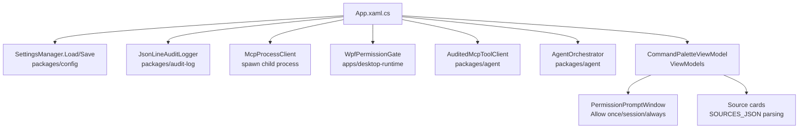
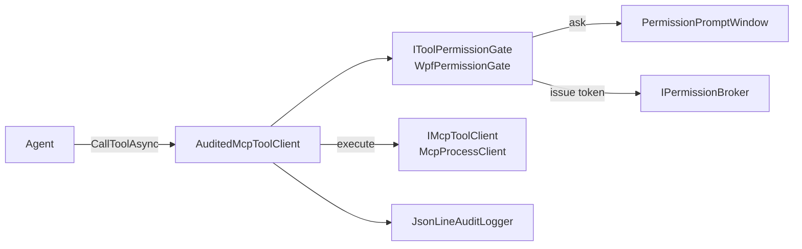
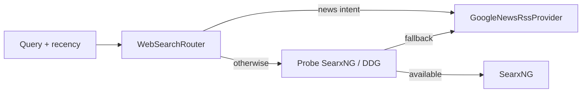
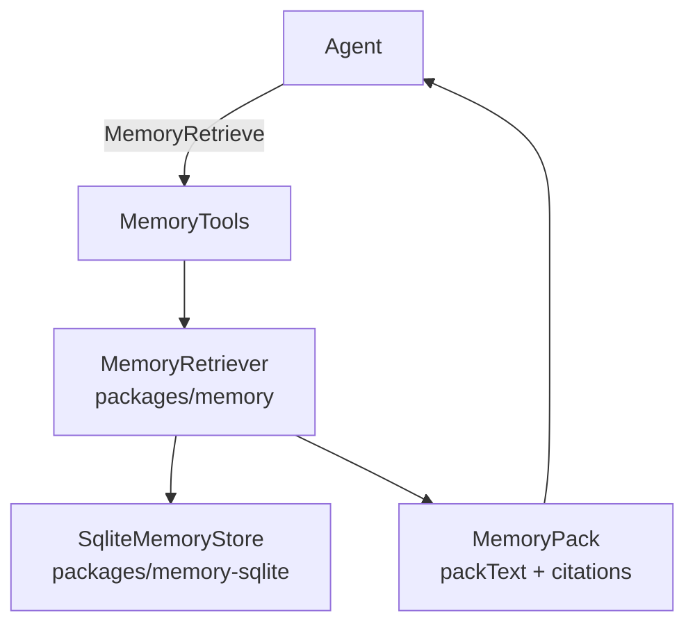
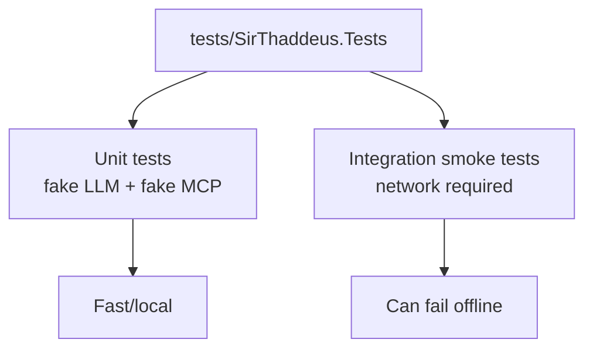

## Runtime Architecture — Nuts & Bolts

Audience: contributors who want to understand *where the code lives* and *what actually happens at runtime* (threads, processes, boundaries, and data shapes).

This doc is intentionally implementation-forward. For vision-level context, see `project-notes/architectural-design.md`.

---

## Contents

- System overview (processes + trust boundaries)
- Desktop runtime (UI + wiring)
- Agent orchestration (routing + tool loop)
- Permissions + audit (single enforcement point)
- MCP server (tools boundary)
- Web “pull the news” pipeline (deep dive)
- Memory system
- Settings/config
- Tests + common failure modes

---

## System overview (processes + trust boundary)

```mermaid
flowchart LR
  User[User] -->|typed/ptt| Desktop[Desktop runtime\napps/desktop-runtime]
  Desktop -->|in-process calls| Agent[Agent loop\npackages/agent]
  Agent -->|HTTP (OpenAI-style)| LLM[Local LLM server\nLM Studio etc]
  Agent -->|JSON-RPC over stdio| MCP[MCP tool server\napps/mcp-server]
  Agent --> Audit[Audit log\npackages/audit-log]
  Desktop --> Settings[settings.json\n%LOCALAPPDATA%]
  MCP -->|HTTP GET| Web[(Public web)]
  MCP -->|SQLite| MemDB[(memory.db)]
```

**Overview**
- **One UI process** (desktop runtime) hosts the agent and spawns a **separate tool process** (MCP server).
- All side effects and external I/O happen behind the **MCP boundary** (stdio JSON-RPC).
- The agent calls tools through a **single audited + permission-gated client**.

**Nuts & bolts**
- **Projects**
  - **Desktop runtime**: `apps/desktop-runtime/SirThaddeus.DesktopRuntime`
  - **Agent**: `packages/agent/SirThaddeus.Agent`
  - **LLM client**: `packages/llm-client/SirThaddeus.LlmClient`
  - **MCP server**: `apps/mcp-server/SirThaddeus.McpServer`
  - **Audit log**: `packages/audit-log/SirThaddeus.AuditLog`
  - **Settings**: `packages/config/SirThaddeus.Config`
  - **Web search providers**: `packages/web-search/SirThaddeus.WebSearch`
  - **Memory engine + store**: `packages/memory/*` and `packages/memory-sqlite/*`
- **Trust boundary**
  - Agent code **does not** call OS / filesystem / network APIs directly for “convenience”.
  - Tools are implemented in the MCP server process and reached via `McpProcessClient` (stdio JSON-RPC).

---

## Desktop runtime (UI + wiring)



**Overview**
- The desktop app is the **composition root**: it loads settings, starts audit logging, spawns the MCP server, and wires the agent with the audited + gated MCP client.
- The UI is responsible for **prompts** and **settings editing**, not tool execution.

**Nuts & bolts**
- **MCP server process**
  - Spawned by `apps/desktop-runtime/.../Services/McpProcessClient.cs`.
  - Protocol: JSON-RPC 2.0 on stdin/stdout; logs go to stderr.
  - `StartAsync()` sends `initialize` then `notifications/initialized`.
- **Agent wiring**
  - The desktop runtime wraps the raw MCP client with:
    - `AuditedMcpToolClient` (audit + redaction + permission gate)
    - `WpfPermissionGate` (ask/off/always enforcement + prompt)
  - Then constructs `AgentOrchestrator` using the audited client.
- **Settings persistence**
  - Settings shape is `packages/config/SirThaddeus.Config/AppSettings.cs`.
  - Loaded/saved via `packages/config/.../SettingsManager.cs`.
  - `memory.enabled` is a **master switch** (when false, the agent must not read/write memory).
- **Web search UI cards**
  - `CommandPaletteViewModel` parses the `<!-- SOURCES_JSON -->` section from `web_search` tool output and builds `SourceCardViewModel` items for the chat UI.
  - Key code: `apps/desktop-runtime/.../ViewModels/CommandPaletteViewModel.cs` (`TryAttachSourceCards`).

---

## Agent orchestration (routing + tool loop)

```mermaid
flowchart TD
  U[User message] --> H[Append to _history\ntrim window]
  H --> R[RouteMessageAsync\nheuristics + LLM classify]
  R -->|ChatOnly| Chat[LLM chat (no tools)]
  R -->|LookupSearch| Web[ExecuteWebSearchAsync\n(deterministic pipeline)]
  R -->|Tooling| Loop[Tool loop\nLLM tool_calls]
  Loop -->|call tool| MCP[MCP client\n(audited + gated)]
  MCP -->|result| Loop
  Web -->|web_search + summarize| Out[Assistant text]
  Chat --> Out
  Loop --> Out
```

**Overview**
- The agent keeps a **sliding window** of conversation history and routes each user message into one of a few deterministic paths.
- Web lookup is intentionally handled by a **specialized pipeline** so the model can’t “wing it” with random tool calls.

**Nuts & bolts**
- **Core file**: `packages/agent/SirThaddeus.Agent/AgentOrchestrator.cs`
- **History**
  - `_history` holds `ChatMessage` items (system/user/assistant/tool).
  - `TrimHistory()` keeps the last N non-system messages.
  - `ResetConversation()` clears history and resets to the system prompt.
- **Routing**
  - `RouteMessageAsync()` uses:
    - deterministic overrides (e.g., `/browse`)
    - heuristics (screen/file/system)
    - lightweight LLM intent classification for everything else
  - Follow-up “tell me more” requests with prior sources are routed back into `LookupSearch` to avoid context-free searches.
- **Tool loop**
  - When tools are enabled, the agent lets the LLM emit `tool_calls`, then executes them via the MCP client.
  - Safety valve: `MaxToolRoundTrips`.
- **Memory master toggle**
  - `MemoryEnabled` is set from settings.
  - When false, the orchestrator skips memory retrieval and filters out memory tools from definitions.

---

## Permissions + audit (single enforcement point)



**Overview**
- Every tool call flows through `AuditedMcpToolClient` first.
- Permission policy is **per tool-group** (`off | ask | always`) with a **developer override** for dangerous groups.
- Audit logging is **append-only** and always on.

**Nuts & bolts**
- **Settings model**
  - `AppSettings.Mcp.Permissions` (record `McpPermissionsSettings`) stores:
    - `screen`, `files`, `system`, `web`, `memoryRead`, `memoryWrite`
    - `developerOverride` (dangerous groups only)
  - “Off” is a **hard block** (no prompt).
- **Deterministic policy core**
  - `packages/agent/.../ToolGroupPolicy.cs`:
    - maps tool name → group
    - resolves effective policy (memory master off, developer override, unknown tool default)
    - builds **redacted** purpose strings for prompts
- **Runtime enforcement**
  - `apps/desktop-runtime/.../Services/WpfPermissionGate.cs`:
    - holds a `volatile PolicySnapshot`
    - session grants cached in-memory with epoch invalidation (clears on “New Chat”)
    - emits audit events for blocked/denied and “allow always”
    - raises `PersistGroupAsAlways` when the user clicks “Allow always” so the runtime updates `settings.json`
- **Prompt decisions**
  - `packages/invocation/.../IPermissionPrompter.cs`:
    - `AllowOnce()`, `AllowSession()`, `AllowAlways()` (persist)
  - UI: `apps/desktop-runtime/.../PermissionPromptWindow.xaml`
- **Audit**
  - `packages/audit-log/.../JsonLineAuditLogger.cs` writes JSONL to `%LOCALAPPDATA%/.../audit.jsonl`.
  - `AuditedMcpToolClient` writes:
    - `MCP_TOOL_CALL_START` (redacted input summary)
    - `MCP_TOOL_CALL_END` (redacted output summary + duration)

---

## MCP server (tools boundary)

```mermaid
flowchart TD
  Desktop[Desktop runtime] -->|stdio JSON-RPC| Host[MCP server host\nProgram.cs]
  Host --> Tools[Tools (reflection)\nTools/*.cs]
  Tools --> Extract[ContentExtractor\nHTTP + readability]
  Tools --> Mem[Memory tools\nSQLite]
  Tools --> FS[File tools]
  Tools --> Sys[System tools]
  Tools --> Screen[Screen tools]
```

**Overview**
- The MCP server is a **separate process** that exposes tools over stdin/stdout.
- Tool implementations are simple, bounded, and designed to be safe to retry.

**Nuts & bolts**
- Entry point: `apps/mcp-server/SirThaddeus.McpServer/Program.cs`
  - Uses `ModelContextProtocol.Server` with `.WithStdioServerTransport()` and `.WithToolsFromAssembly()`.
  - Logs are routed to stderr so stdout remains protocol-clean.
- Tool modules: `apps/mcp-server/.../Tools/*.cs`
  - Examples:
    - `WebSearchTools.cs` (web_search)
    - `BrowserTools.cs` (browser_navigate)
    - `FileTools.cs` (file_read / file_list)
    - `SystemTools.cs` (system_execute)
    - `ScreenTools.cs` (screen_capture)
    - `MemoryTools.cs` (memory_* tools)
- Naming: depending on MCP client, tools may appear as `web_search` or `WebSearch`; the agent canonicalizes names to snake_case for consistent policy + audit.

---

## Pulling the news (deep dive)

### A) WebSearch MCP tool (search → auto-read → format)

```mermaid
flowchart TD
  Agent -->|web_search(query, recency)| WebTool[WebSearchTools.WebSearch]
  WebTool --> Router[WebSearchRouter]
  Router --> Provider[Provider\nSearxNG / Google News RSS / DDG]
  Provider --> Results[SearchResult[]\n{title,url,snippet,source}]
  WebTool --> Extract[ContentExtractor.ExtractManyAsync\n(Top N URLs)]
  Extract --> Format[FormatResults\nLLM text + SOURCES_JSON]
  Format --> Agent
```

**Overview**
- One `web_search` call returns:
  - **LLM-friendly text** (titles + extracted excerpts, no raw URLs)
  - `<!-- SOURCES_JSON -->` + JSON source metadata for the UI (cards)

**Nuts & bolts**
- Implementation: `apps/mcp-server/.../Tools/WebSearchTools.cs`
- Phases
  - **Phase 1 (search)**: `WebSearchRouter.SearchAsync(query, options)`
  - **Phase 1.5 (dedup)**: keep one result per “domain key” (prefer provider source domain if present)
  - **Phase 2 (auto-read)**: `ContentExtractor.ExtractManyAsync` (bounded concurrency, per-page timeout)
  - **Phase 3 (format)**: build two sections (LLM text + SOURCES_JSON)
- Bounds (V0 defaults)
  - Search timeout: ~8s
  - Per-page extraction timeout: ~10s
  - Auto-read: up to 5 pages, 3 concurrent
  - Excerpts truncated (LLM + UI)
- “Strict news mode”
  - For generic news queries, the formatter prefers **actual article extractions** and avoids feeding homepages (“Breaking news…”) to the model.

### B) Provider routing (why “news” prefers RSS now)



**Overview**
- “News/headlines” queries often produce **homepage junk** from meta-search.
- For news intent, routing now prefers Google News RSS because it returns **article items** with publish dates.

**Nuts & bolts**
- Router: `packages/web-search/.../WebSearchRouter.cs`
  - Detects “news intent” phrases and attempts Google News first.
- Google News RSS: `packages/web-search/.../Providers/GoogleNewsRssProvider.cs`
  - Uses RSS feeds, extracts **real article URLs** from `<description>` HTML.
  - Recency:
    - For `recency != "any"`, uses the search endpoint and filters by `pubDate`.

### C) Content extraction (the “read the article” part)

```mermaid
flowchart TD
  URL --> GET[HTTP GET\n(browser-like headers)]
  GET --> Resolve[Resolve redirects\ncapture final URL]
  Resolve --> Unwrap[Unwrap Google News wrappers\n(if detected)]
  Unwrap --> Readability[SmartReader readability]
  Readability -->|fails| Fallback[HtmlAgilityPack strip-to-text]
  Readability --> Out[ExtractionResult\n{title, text, domain, wordcount, ...}]
  Fallback --> Out
```

**Overview**
- Extraction aims to return *useful article text* and avoid wrapper pages and cookie walls.

**Nuts & bolts**
- File: `apps/mcp-server/.../Tools/ContentExtractor.cs`
- Key behaviors
  - Captures final URL after redirects (important for redirect wrappers).
  - Detects Google News wrapper pages and attempts to resolve the real outbound URL (meta refresh / canonical / anchor unwrapping).
  - Uses SmartReader (readability) first, falls back to HTML stripping.
  - Extracts favicon + OG thumbnail (best effort, bounded).

### D) Agent-side news flow (query extraction + summarization)

```mermaid
flowchart TD
  U[User asks for news] --> Extract[ExtractSearchViaToolCallAsync\n(LLM emits web_search args)]
  Extract --> Call[Call web_search]
  Call --> Cache[Parse SOURCES_JSON\ncache _lastSearchSources]
  Cache --> Summ[Summarize results\n(WebSummaryInstruction)]
  Summ --> UI[Assistant text + cards]
```

**Overview**
- The agent doesn’t trust raw user text as a search query; it first extracts a concise topic + recency using a constrained tool-call step.
- Summarization is a separate LLM call with explicit “don’t invent facts” constraints.

**Nuts & bolts**
- File: `packages/agent/.../AgentOrchestrator.cs`
- Query extraction
  - `ExtractSearchViaToolCallAsync()` builds a special “query extractor” system prompt and expects a `web_search` tool call.
  - Includes fallback logic for vague follow-ups (“more info”, “that”) using the last assistant turn.
- Summarization
  - Tool output is fed back as a *User message* (avoids template/tool_call_id pitfalls in some local models).
  - Raw-dump responses trigger a rewrite pass.
  - Output is cleaned of template artifacts.

### E) Follow-ups (“tell me more about that story”) + related coverage

```mermaid
flowchart TD
  FollowUp[User follow-up] --> Detect[Follow-up detection]
  Detect --> Pick[Pick relevant prior sources\n(title keyword overlap)]
  Pick --> Browse[browser_navigate (primary article)]
  Browse --> Related[web_search (by story title)]
  Related --> Synthesize[Synthesize primary + related\n(WebFollowUpWithRelatedInstruction)]
```

**Overview**
- Follow-ups are handled as “deep dive”: open the actual article first, then expand with related coverage by title/entities.

**Nuts & bolts**
- Agent caches `_lastSearchSources` from the previous `web_search` output.
- Follow-up path (`TryAnswerFollowUpFromLastSourcesAsync`) does:
  - `browser_navigate` on the most relevant cached source(s)
  - then `web_search` using the story title (not “tell me more…”)
  - then synthesizes across both inputs
- Low-signal defense
  - BrowserNavigate stubs (tiny word count, wrapper pages) are treated as unusable so the agent can fall back to a normal search instead of confidently saying “no details”.

---

## Memory system



**Overview**
- Memory retrieval is deterministic: fetch candidates → score → gate → rank → format.
- Memory has a **master switch** (`memory.enabled`) that disables both read and write flows.

**Nuts & bolts**
- Retrieval: `packages/memory/SirThaddeus.Memory/MemoryRetriever.cs`
  - Optional embeddings rerank (graceful fallback to BM25-only).
  - Relevance gate filters out sensitive / creepy candidates.
- Storage: `packages/memory-sqlite/.../SqliteMemoryStore.cs`
  - SQLite-backed facts/events/chunks.

---

## Settings/config


**Overview**
- Settings are a single JSON file loaded at startup and updated via the Settings UI.
- Permission policies are persisted in settings and swapped atomically at runtime.

**Nuts & bolts**
- Shape: `packages/config/.../AppSettings.cs`
- Loader/saver: `packages/config/.../SettingsManager.cs`
- Key toggles relevant to “news”
  - `mcp.permissions.web` controls `web_search` + `browser_navigate`
  - `mcp.permissions.developerOverride` can force web tools to ask/off/always (dangerous groups only)

---

## Tests + common failure modes



**Overview**
- Most tests use fakes to keep things deterministic.
- Integration tests are marked with `[Trait(\"Category\", \"Integration\")]`.

**Nuts & bolts**
- Agent web-follow-up tests live in `tests/SirThaddeus.Tests/AgentOrchestratorTests.cs`.
- Common dev failure: **file locks** during build
  - Running `SirThaddeus.McpServer.exe` or desktop runtime can lock binaries and cause MSBuild copy failures.
  - Fix: stop the running process and rebuild.

