# MCP Tools Reference

A plain-language guide to every tool the assistant can use. Each tool runs in a separate process (the MCP server) — the assistant itself has no direct access to your files, screen, or the internet. It has to go through one of these tools, and every call is logged.

**Tool naming:** Depending on the MCP client, a tool may appear as `PascalCase` (e.g. `WebSearch`) or `snake_case` (e.g. `web_search`). The runtime/agent supports both. Each section lists the callable tool name(s).

---

## Runtime Guarantees

These guarantees are enforced by the **desktop runtime wrapper** (`AuditedMcpToolClient`), not by the MCP server itself. They apply to every tool call the agent makes.

### Audit Logging

Every tool call produces **two audit events**:

| Event | When | Contains |
|---|---|---|
| `MCP_TOOL_CALL_START` | Before execution | session_id, request_id, tool name, redacted input |
| `MCP_TOOL_CALL_END` | After execution | duration_ms, redacted output, permission outcome, error (if any) |

Events are written to `%LOCALAPPDATA%\SirThaddeus\audit.jsonl`. Append-only. Never silently skipped.

### Permission Gating

Some tools require explicit user permission before executing. The runtime prompts you with a dialog showing what the tool wants to do, and you approve or deny.

| Capability | Tools | What it means |
|---|---|---|
| Screen Reading | `screen_capture`, `get_active_window` | Read content visible on your screen |
| File Access | `file_read`, `file_list` | Read files or list directories |
| System Execute | `system_execute` | Run an allowlisted system command |

Permission tokens are **time-boxed** (60-second TTL) and **scope-boxed** (one capability). A granted token is cached so you aren't prompted repeatedly during a burst of related calls.

In headless mode: all permission-required tools are auto-denied (safe default).

### Redaction Policy

The audit log never stores raw sensitive data:

| Tool | Input logged | Output logged |
|---|---|---|
| `screen_capture` | Capture mode | Char count + SHA-256 hash (no OCR text) |
| `file_read` | File path | Char count + SHA-256 hash (no file content) |
| `browser_navigate` | URL | Title + content length (no body) |
| `web_search` | Query + recency | Result count + title list (no excerpts) |
| All others | Truncated to 200 chars | Truncated to 200 chars |

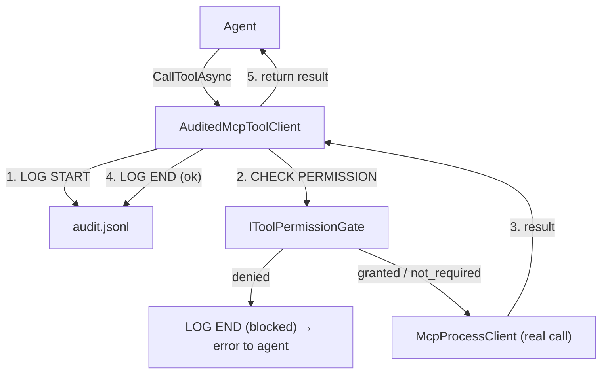

---

## Memory Tools

These tools let the assistant remember things about you and recall them later. Everything is stored locally in a small database on your computer — nothing is sent anywhere.

### MemoryRetrieve

**Tool name(s):** `MemoryRetrieve`, `memory_retrieve`

**What it does:** Looks through everything the assistant has been asked to remember — your facts, past events, conversation notes — and pulls back the most relevant bits for the current conversation.

**When it's used:** Automatically, at the start of every message you send. You don't have to ask for it. It runs quietly in the background so the assistant can give you more personalized answers.

**Special mode — "greet":** When you open a new conversation and say something like "hey" or "good morning," the assistant uses a lightweight version of this tool. It only grabs your name and a couple of quick personal facts (like your communication style preference) instead of digging through everything. Keeps the greeting snappy.

**What it returns:** A pre-built text block that gets injected into the assistant's context, plus your profile card and any relevant "nuggets" (small personal facts you've saved). Also returns metadata like how many facts, events, and nuggets were found.

**Safety:** Read-only. It can't change anything — it just looks things up.

**Quick flow:**

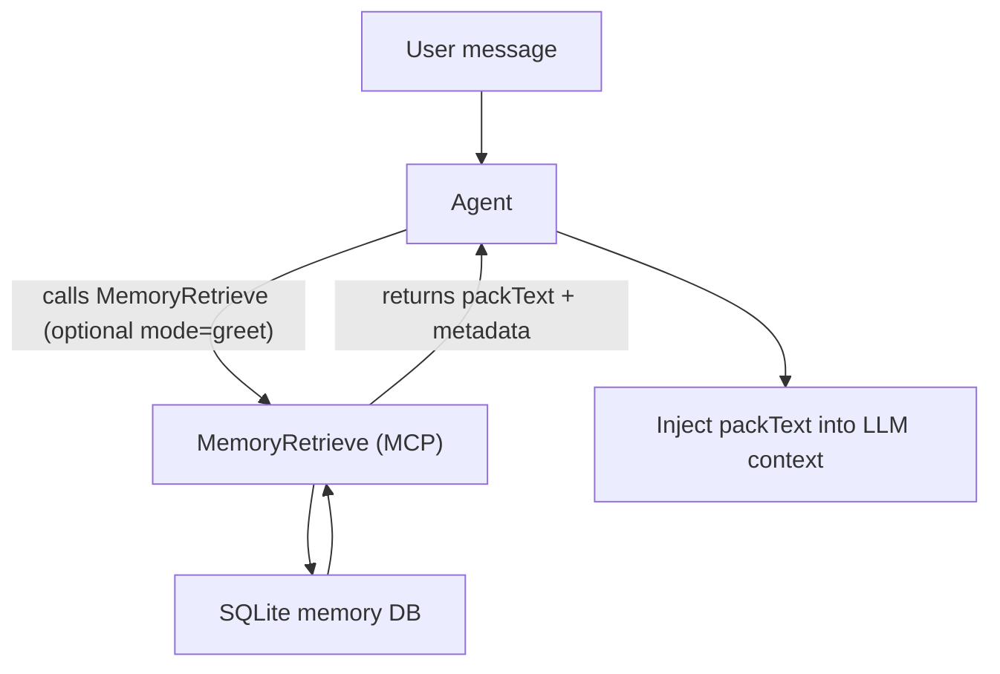

---

### MemoryStoreFacts

**Tool name(s):** `MemoryStoreFacts`, `memory_store_facts`

**What it does:** Saves a new fact you've told the assistant to remember. Facts are stored as simple three-part statements: **who** → **does/is what** → **the thing**. For example: *"user" → "likes" → "dark mode"*.

**When it's used:** When you say things like:
- "Remember that I prefer dark mode"
- "Note that my wife's name is Sarah"
- "I like pizza"
- "My favorite color is blue"

**Smart conflict handling:** Before saving anything, it checks for:
- **Duplicates** — if you already said "I like pizza," it won't save it again.
- **Contradictions** — if you already said "I like light mode" and now say "I prefer dark mode," it flags the conflict and asks you what to do instead of silently overwriting.
- **Opposite statements** — if you say "I hate pizza" but there's already a fact that says "I like pizza," it catches that too.

**What it returns:** A summary of what was saved, what was skipped (duplicates), and any conflicts that need your input.

**Safety:** Only runs when you explicitly ask the assistant to remember something. It never silently saves things on its own.

**Quick flow:**

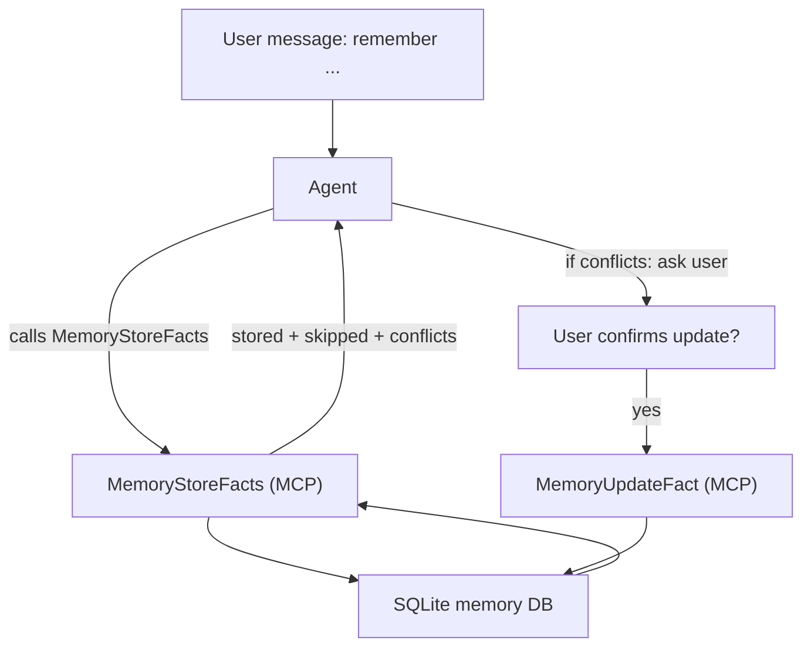

---

### MemoryUpdateFact

**Tool name(s):** `MemoryUpdateFact`, `memory_update_fact`

**What it does:** Changes an existing fact after you've confirmed a conflict resolution. This is the follow-up to `MemoryStoreFacts` when it finds a contradiction.

**When it's used:** After the assistant asks you something like: *"You previously said you like light mode, but now you're saying dark mode. Should I update it?"* — and you say yes.

**What it returns:** Confirmation that the old fact was updated with the new value.

**Safety:** Only runs after you explicitly confirm the change. The assistant can't update your memories without your say-so.

**Quick flow:**

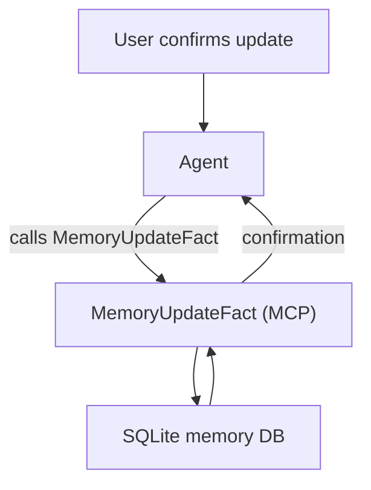

---

### MemoryListFacts

**Tool name(s):** `MemoryListFacts`, `memory_list_facts`

**What it does:** Lists all stored memory facts with optional text filtering and pagination. Each fact includes its stable `fact_id`, subject, predicate, object, confidence, and last-updated timestamp.

**When it's used:** When you ask things like:
- "What do you remember about me?"
- "List my stored facts"
- "What facts do you have about pizza?"

**Parameters:**
- `filter` — optional text to match against subject, predicate, or object
- `skip` — pagination offset (default 0)
- `limit` — max items per page (1–50, default 20)

**What it returns:** A JSON array of facts with metadata, total count, and `has_more` flag for pagination.

**Safety:** Read-only. Cannot modify or delete anything.

**Quick flow:**

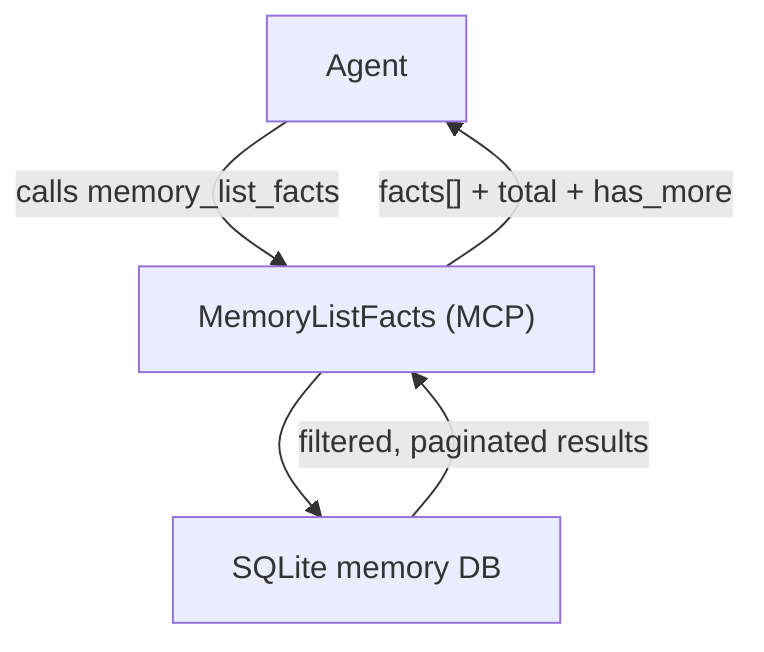

---

### MemoryDeleteFact

**Tool name(s):** `MemoryDeleteFact`, `memory_delete_fact`

**What it does:** Soft-deletes a specific memory fact by its `fact_id`. The fact is not permanently removed — it's marked as deleted and excluded from future retrievals. Reversible at the database level.

**When it's used:** When you say things like:
- "Forget that I like pizza"
- "Delete the fact about my old job"
- "Remove that memory"

The assistant uses `memory_list_facts` to find the `fact_id`, then calls this tool to delete it.

**What it returns:** Confirmation of what was deleted, including the fact's subject/predicate/object.

**Safety:** Only runs when you explicitly ask to forget something. Soft-delete only — nothing is permanently destroyed.

**Quick flow:**

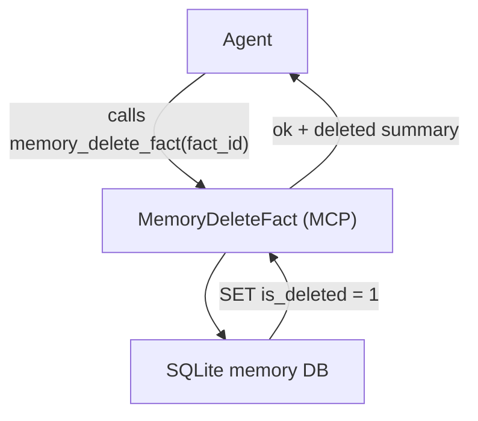

---

## Web Tools

### WebSearch

**Tool name(s):** `WebSearch`, `web_search`

**What it does:** Searches the internet and reads the top results for you. It doesn't just give you a list of links — it actually visits the top pages, extracts the article content, and gives the assistant the real text so it can summarize what it found.

**When it's used:** When you ask about anything that needs current information:
- "What happened in the news today?"
- "What's the weather like?"
- "How much does a PS5 cost right now?"

**How it works under the hood:**
1. Sends your query to a search engine (DuckDuckGo, Google News RSS, or SearXNG — whichever is available).
2. Grabs the top 5 results.
3. Actually visits each page and extracts the article text.
4. Removes junk (ads, cookie banners, navigation menus).
5. Gives the assistant clean article excerpts to summarize.

**What it returns:** Article summaries for the assistant to synthesize, plus structured data (titles, URLs, favicons) so the UI can show you clickable source cards.

**Limits:** Up to 10 results, 8-second search timeout, 10 seconds per page, auto-reads up to 5 pages, excerpts capped at ~1000 characters (LLM input), and UI card excerpts capped at ~250 characters.

**Audit retention:** Query + result count + title list are logged. Full excerpts are not stored in the audit log.

**Quick flow:**

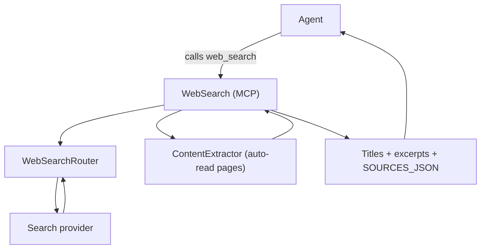

---

### BrowserNavigate

**Tool name(s):** `BrowserNavigate`, `browser_navigate`

**What it does:** Fetches a specific web page when you already have the URL. Think of it as "go read this page for me."

**When it's used:** When you paste a URL and say "read this" or "what does this page say?" — or when the assistant needs to follow up on a search result.

**What it returns:** The page title, author, publish date, and the article's full text (cleaned up, no ads or navigation junk). Truncated to ~4,000 characters to keep things focused.

**Limits:** 20-second timeout, single page only (no clicking around or crawling).

**Audit retention:** URL + title + content length are logged. Full page body is not stored.

**Quick flow:**

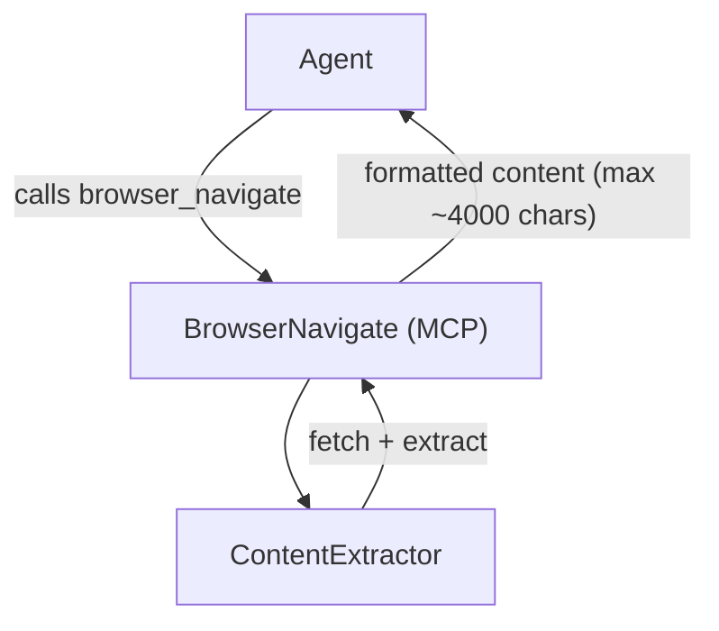

---

## File Tools

### FileRead

**Tool name(s):** `FileRead`, `file_read`

**What it does:** Reads the contents of a file on your computer and gives the text to the assistant.

**When it's used:** When you ask the assistant to look at a specific file — a log, a config, a document, etc.

**What it returns:** The full text content of the file.

**Limits:** Maximum file size is 1 MB. Anything bigger gets rejected with an error. This is a safety measure to prevent the assistant from accidentally loading a massive file and choking.

**Safety:** Read-only — it cannot modify, create, or delete files. Requires permission.

**Audit retention:** File path + size/hash are logged. File content is never stored in the audit log.

**Quick flow:**

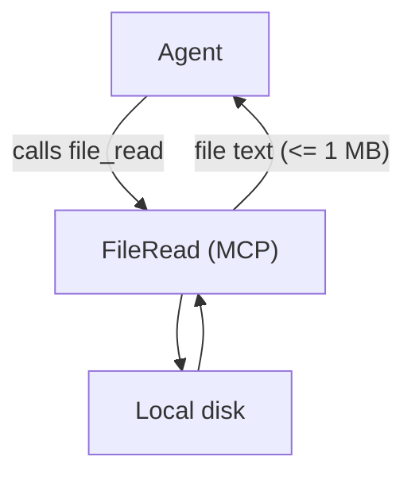

---

### FileList

**Tool name(s):** `FileList`, `file_list`

**What it does:** Lists the files and folders inside a directory on your computer. Like opening File Explorer and glancing at what's there.

**When it's used:** When the assistant needs to see what files exist in a folder — for example, to find a config file or see the structure of a project.

**What it returns:** A list of file and folder names, marked with `[FILE]` or `[DIR]` so it's clear which is which.

**Limits:** Maximum 100 entries per call. If a folder has more than 100 items, it only shows the first 100.

**Safety:** Read-only — it only looks, never touches. Requires permission.

**Quick flow:**

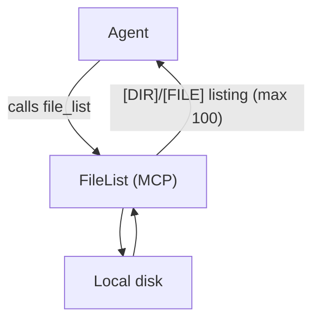

---

## System Tools

### SystemExecute

**Tool name(s):** `SystemExecute`, `system_execute`

**What it does:** Runs a command on your computer's command line (like typing something into Command Prompt) and returns the output.

**When it's used:** When you ask things like:
- "Who am I logged in as?" (runs `whoami`)
- "What's my computer name?" (runs `hostname`)
- "What's my IP address?" (runs `ipconfig`)

**Strict safety — allowlist only:** This tool can only run a small, pre-approved list of commands:

| Allowed Command | What It Does |
|---|---|
| `whoami` | Shows your Windows username |
| `hostname` | Shows your computer's name |
| `date` | Shows the current date |
| `time` | Shows the current time |
| `echo` | Repeats text back (used for simple checks) |
| `dir` / `ls` | Lists files in a directory |
| `type` | Shows file contents |
| `where` | Finds where a program is installed |
| `systeminfo` | Shows system details (OS version, RAM, etc.) |
| `ipconfig` | Shows network/IP information |
| `dotnet` | Runs .NET commands (**restricted verbs only**) |

If the assistant tries to run anything not on this list, the tool flat-out refuses and tells it what's allowed.

**Shell metacharacter blocking:** The following characters are rejected outright: `& | > < ; ` ` ` $ ( ) { }`. This prevents command injection and chaining. If you need complex operations, use structured tool calls instead.

**`dotnet` verb restrictions:** When using `dotnet`, only these subcommands are allowed:

| Allowed Verb | Example |
|---|---|
| `--info` | `dotnet --info` |
| `--version` | `dotnet --version` |
| `restore` | `dotnet restore` |
| `build` | `dotnet build` |
| `test` | `dotnet test` |

Blocked verbs: `tool`, `nuget`, `publish`, `run`, `exec`, etc.

**Working directory (`cwd`):** Optional parameter. When specified, the command runs in that directory. The path must exist or the call is rejected.

**Safety:** Cannot run arbitrary commands. No `del`, no `format`, no `powershell`, no `curl` — nothing dangerous. The allowlist is hard-coded. Requires permission.

**Quick flow:**

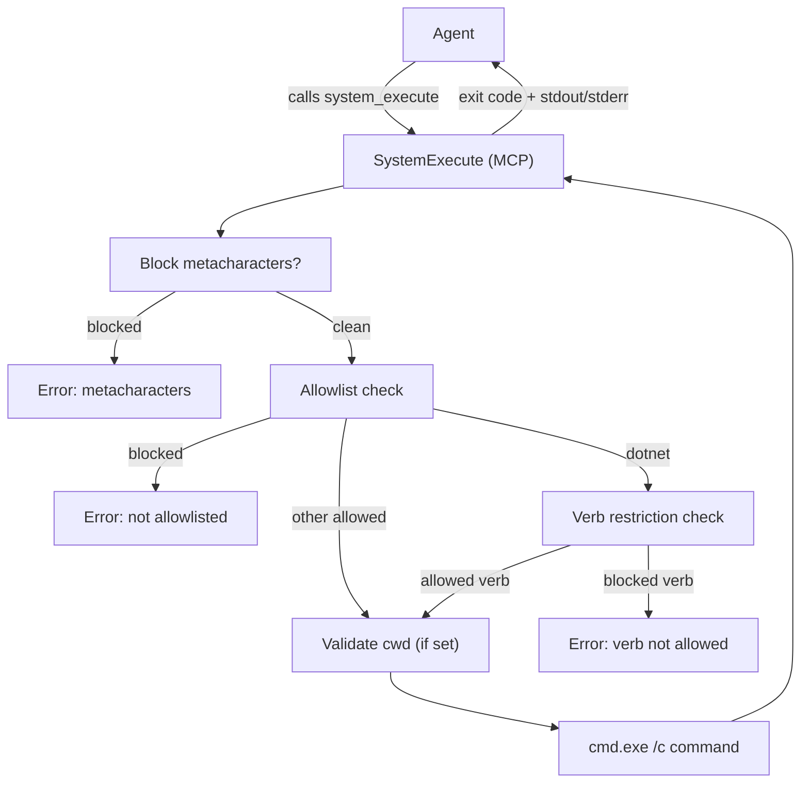

---

## Screen Tools

### ScreenCapture

**Tool name(s):** `ScreenCapture`, `screen_capture`

**What it does:** Takes a picture of your screen, then reads all the text it can see using built-in Windows OCR (text recognition). The assistant gets the extracted text — not the image itself.

**When it's used:** When you say things like:
- "Look at my screen"
- "What do you see?"
- "Can you read what's on my monitor?"

**Two capture modes:**
- **`full_screen`** (default) — captures your entire monitor. This is what's used almost always.
- **`active_window`** — captures only the currently focused window. Only used if you specifically say "this window" or "the active window."

**What it returns:** A text report with:
- What window is currently active (title + app name)
- Your screen resolution
- All readable text extracted from the screenshot via OCR

**Limits:** OCR text is capped at 8,000 characters. Single snapshot — no video or continuous capture.

**Safety:** Observation-only — it looks at the screen but can't click, type, or change anything. Requires permission.

**Audit retention:** Capture mode is logged. OCR text is never stored — only char count + SHA-256 hash.

**Quick flow:**

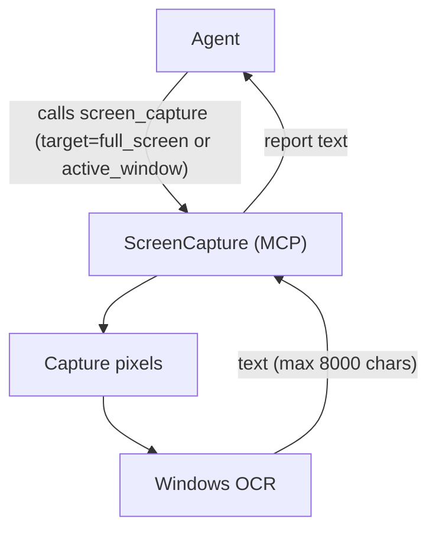

---

### GetActiveWindow

**Tool name(s):** `GetActiveWindow`, `get_active_window`

**What it does:** Tells the assistant which window you currently have in the foreground — the app name, window title, and process ID.

**When it's used:** As a lightweight alternative to full screen capture when the assistant just needs to know what app you're using, not what's on your screen.

**What it returns:** Three lines: the window title, the process name (like "chrome" or "code"), and the process ID.

**Safety:** Extremely lightweight, read-only. No screenshots, no OCR, no screen content. Requires permission (ScreenRead capability).

**Quick flow:**

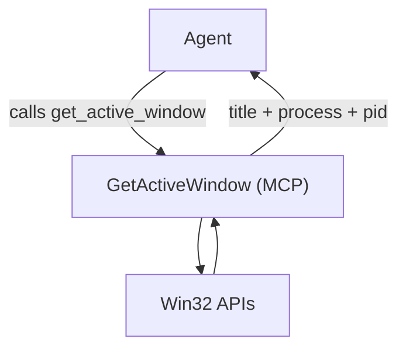

---

## Meta / Health Tools

These tools provide diagnostic information about the MCP server itself. No permission required, no side effects.

### ToolPing

**Tool name(s):** `ToolPing`, `tool_ping`

**What it does:** A health check for the MCP server. Returns basic status information to confirm the server is running and responsive.

**What it returns:** A JSON object with:
- `version` — server version string
- `uptime_ms` — milliseconds since server started
- `status` — always "ok" if the server is responding
- `host` — machine hostname
- `pid` — server process ID
- `tool_count` — number of registered tools

**Safety:** Read-only. No side effects. No permission required.

**Quick flow:**

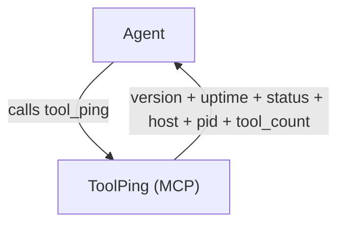

---

### ToolListCapabilities

**Tool name(s):** `ToolListCapabilities`, `tool_list_capabilities`

**What it does:** Returns the full tool manifest — a structured list of every tool the MCP server exposes, including aliases, categories, read/write classification, permission requirements, and limits.

**When it's used:** For diagnostic purposes, or when the agent needs to discover what tools are available and what constraints they have.

**What it returns:** A JSON array of tool descriptors. Each entry has: `name`, `aliases`, `category`, `read_write`, `permission`, `description`, `limits`.

**Safety:** Read-only. Deterministic output. No permission required.

**Quick flow:**

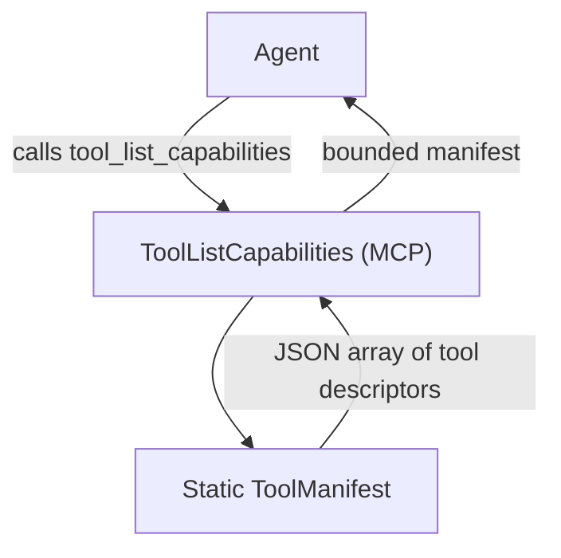

---

## Time Tool

### TimeNow

**Tool name(s):** `TimeNow`, `time_now`

**What it does:** Returns the current local time in a structured format useful for temporal reasoning. No parameters required.

**What it returns:** A JSON object with:
- `iso` — ISO 8601 local time with offset (e.g. `"2026-02-09T10:30:00.0000000-05:00"`)
- `unix_ms` — Unix timestamp in milliseconds
- `timezone` — Windows timezone ID (e.g. `"Eastern Standard Time"`)
- `offset` — UTC offset (e.g. `"-05:00"`)

**Safety:** Read-only. No side effects. No permission required.

**Quick flow:**

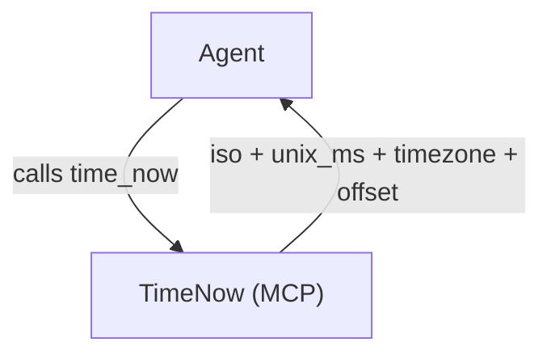

---

## Summary Table

| Tool | Category | Read or Write? | Needs Permission? |
|---|---|---|---|
| MemoryRetrieve / memory_retrieve | Memory | Read | No (runs automatically) |
| MemoryStoreFacts / memory_store_facts | Memory | Write | No (implicit — user asks to remember) |
| MemoryUpdateFact / memory_update_fact | Memory | Write | No (implicit — user confirms update) |
| MemoryListFacts / memory_list_facts | Memory | Read | No |
| MemoryDeleteFact / memory_delete_fact | Memory | Write | No (implicit — user asks to forget) |
| WebSearch / web_search | Web | Read | No (triggered by question) |
| BrowserNavigate / browser_navigate | Web | Read | No (triggered by question) |
| FileRead / file_read | Files | Read | **Yes** (FileAccess capability) |
| FileList / file_list | Files | Read | **Yes** (FileAccess capability) |
| SystemExecute / system_execute | System | Read | **Yes** (SystemExecute capability) |
| ScreenCapture / screen_capture | Screen | Read | **Yes** (ScreenRead capability) |
| GetActiveWindow / get_active_window | Screen | Read | **Yes** (ScreenRead capability) |
| ToolPing / tool_ping | Meta | Read | No |
| ToolListCapabilities / tool_list_capabilities | Meta | Read | No |
| TimeNow / time_now | Time | Read | No |

---

*Every tool call produces two audit events (`MCP_TOOL_CALL_START` + `MCP_TOOL_CALL_END`) written to `%LOCALAPPDATA%\SirThaddeus\audit.jsonl`. Sensitive outputs are redacted. Nothing happens in the dark.*
